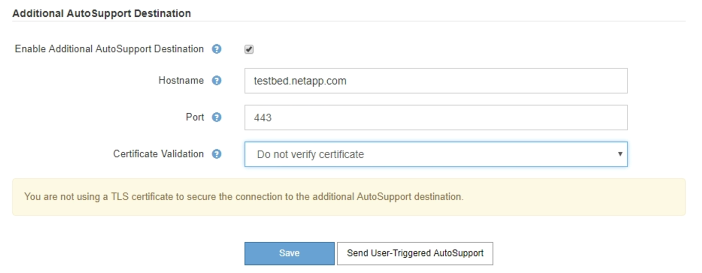

= Ajout d'une destination AutoSupport supplémentaire
:allow-uri-read: 
:icons: font
:imagesdir: ../media/

[role="lead"]
Lorsque vous activez AutoSupport, les messages d'état et d'état sont envoyés au support NetApp. Vous pouvez indiquer une destination supplémentaire pour tous les messages AutoSupport.

.Ce dont vous avez besoin
* Vous devez être connecté à Grid Manager à l'aide d'un navigateur pris en charge.
* Vous devez disposer de l'autorisation accès racine ou autre configuration grille.

.Description de la tâche
Pour vérifier ou modifier le protocole utilisé pour envoyer des messages AutoSupport, reportez-vous aux instructions de spécification d'un protocole AutoSupport.

NOTE: Vous ne pouvez pas utiliser le protocole SMTP pour envoyer des messages AutoSupport à une destination supplémentaire.

link:specifying-protocol-for-autosupport-messages.html["Spécification du protocole des messages AutoSupport"]

.Étapes
. Sélectionnez *support* > *Outils* > *AutoSupport*.
+
La page AutoSupport s'affiche avec l'onglet *Paramètres* sélectionné.

. Sélectionnez *Activer une destination AutoSupport supplémentaire*.
+
Les champs destination AutoSupport supplémentaire s'affichent.

+

. Entrez le nom d'hôte ou l'adresse IP du serveur d'un serveur de destination AutoSupport supplémentaire.
+

NOTE: Vous ne pouvez entrer qu'une destination supplémentaire.

. Entrez le port utilisé pour la connexion à un serveur de destination AutoSupport supplémentaire (le port par défaut est le port 80 pour HTTP ou le port 443 pour HTTPS).
. Pour envoyer vos messages AutoSupport avec validation de certificat, sélectionnez *utiliser le bundle de CA personnalisé* dans la liste déroulante *validation de certificat*. Puis, effectuez l'une des opérations suivantes :
+
** Utilisez un outil d'édition pour copier et coller tout le contenu de chacun des fichiers de certificat d'autorité de certification codés au PEM dans le champ *CA bundle*, concaténé dans l'ordre de la chaîne de certificats. Vous devez inclure `----BEGIN CERTIFICATE----` et `----END CERTIFICATE----` dans votre sélection.
+
image::../media/autosupport_certificate.png[Certificat AutoSupport]

** Sélectionnez *Parcourir*, naviguez jusqu'au fichier contenant les certificats, puis sélectionnez *Ouvrir* pour télécharger le fichier. La validation du certificat garantit que la transmission des messages AutoSupport est sécurisée.

. Pour envoyer vos messages AutoSupport sans validation de certificat, sélectionnez *ne pas vérifier le certificat* dans la liste déroulante *validation de certificat*.
+
Sélectionnez cette option uniquement si vous avez une bonne raison de ne pas utiliser la validation de certificat, par exemple en cas de problème temporaire avec un certificat.

+
Un message d'avertissement s'affiche : « vous n'utilisez pas de certificat TLS pour sécuriser la connexion à la destination AutoSupport supplémentaire. »

. Sélectionnez *Enregistrer*.
+
Tous les futurs messages AutoSupport hebdomadaires, déclenchés par les événements et déclenchés par l'utilisateur seront envoyés à la destination supplémentaire.

