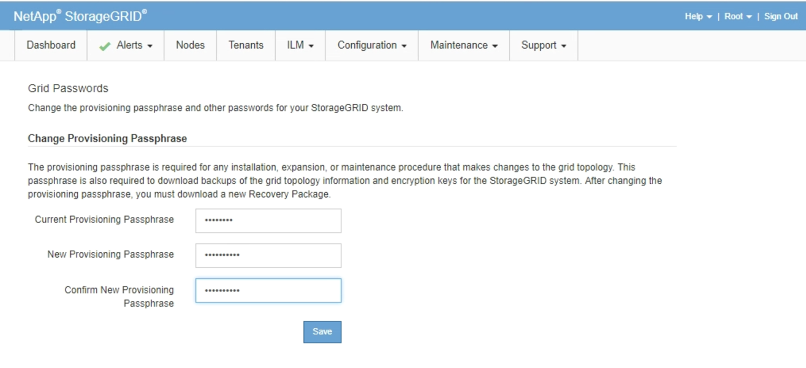

= Modification de la phrase secrète de provisionnement
:allow-uri-read: 
:icons: font
:imagesdir: ../media/

[role="lead"]
Utilisez cette procédure pour modifier la phrase secrète du provisionnement StorageGRID. La phrase de passe est requise pour les procédures de restauration, d'extension et de maintenance. La phrase de passe est également requise pour télécharger les sauvegardes du pack de récupération qui incluent les informations de topologie de la grille et les clés de chiffrement pour le système StorageGRID.

.Ce dont vous avez besoin
* Vous devez être connecté à Grid Manager à l'aide d'un navigateur pris en charge.
* Vous devez disposer d'autorisations Maintenance ou accès racine.
* Vous devez disposer de la phrase secrète de provisionnement actuelle.

.Description de la tâche
Le mot de passe de provisionnement est requis pour de nombreuses procédures d'installation et de maintenance, ainsi que pour le téléchargement du progiciel de restauration. La phrase de passe de provisionnement n'est pas répertoriée dans le `Passwords.txt` fichier. Veillez à documenter la phrase de passe de provisionnement et à la conserver dans un emplacement sûr et sécurisé.

.Étapes
. Sélectionnez *Configuration* > *contrôle d'accès* > *mots de passe de grille*.
+

. Saisissez votre phrase secrète pour le provisionnement.
. Saisissez la nouvelle phrase de passe. La phrase de passe doit contenir au moins 8 caractères et 32 caractères. Les phrases passe sont sensibles à la casse.
+

CAUTION: Stocker la nouvelle phrase secrète pour le provisionnement dans un emplacement sécurisé Elle est requise pour les procédures d'installation, d'extension et de maintenance.

. Saisissez à nouveau la nouvelle phrase de passe, puis cliquez sur *Enregistrer*.
+
Le système affiche une bannière verte de réussite lorsque la modification de la phrase de passe de provisionnement est terminée. Le changement devrait prendre moins d'une minute.

+
image::../media/change_provisioning_passphrase_success.png[la modification de la phrase secrète du provisionnement a réussi]

. Sélectionnez le lien *Recovery Package page* dans la bannière de réussite.
. Téléchargez le nouveau package de récupération depuis Grid Manager. Sélectionnez *Maintenance* > *Recovery Package* et saisissez la nouvelle phrase de passe d'approvisionnement.
+

CAUTION: Après avoir modifié la phrase de passe de provisionnement, vous devez télécharger immédiatement un nouveau progiciel de restauration. Le fichier du progiciel de récupération vous permet de restaurer le système en cas de défaillance.

