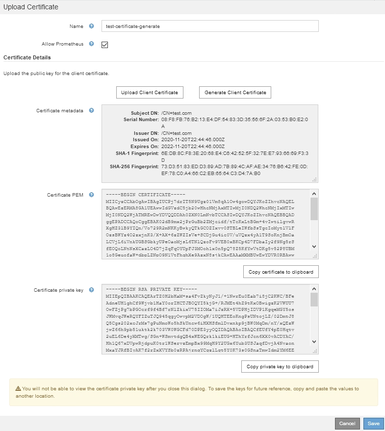

= Configuration des certificats client administrateur
:allow-uri-read: 
:icons: font
:imagesdir: ../media/

[role="lead"]
Vous pouvez utiliser les certificats client pour permettre aux clients externes autorisés d'accéder à la base de données StorageGRID Prometheus. Les certificats client constituent un moyen sécurisé d'utiliser des outils externes pour surveiller StorageGRID.

Si vous devez accéder à StorageGRID à l'aide d'un outil de surveillance externe, vous devez télécharger ou générer un certificat client à l'aide de Grid Manager et copier les informations de certificat dans l'outil externe.

== Ajout de certificats client administrateur

Pour ajouter un certificat client, vous pouvez fournir votre propre certificat ou en générer un à l'aide de Grid Manager.

.Ce dont vous avez besoin
* Vous devez disposer de l'autorisation accès racine.
* Vous devez être connecté à Grid Manager à l'aide d'un navigateur pris en charge.
* Vous devez connaître l'adresse IP ou le nom de domaine du nœud d'administration.
* Vous devez avoir configuré le certificat de serveur de l'interface de gestion StorageGRID et avoir le bundle CA correspondant
* Si vous souhaitez télécharger votre propre certificat, la clé publique et la clé privée du certificat doivent être disponibles sur votre ordinateur local.

.Étapes
. Dans Grid Manager, sélectionnez *Configuration* > *contrôle d'accès* > *certificats client*.
+
La page certificats client s'affiche.

+
image::../media/certificates_page_admin_client.png[Page certificats - clients d'administration]

. Sélectionnez *Ajouter*.
+
La page Télécharger le certificat s'affiche.

+
image::../media/certificate_admin_upload.png[Certificat -Admin - Téléchargement]

. Saisissez un nom entre 1 et 32 caractères pour le certificat.
. Pour accéder aux metrics Prometheus à l'aide de votre outil de surveillance externe, cochez la case *Autoriser Prometheus*.
. Télécharger ou générer un certificat :
+
.. Pour télécharger un certificat, accédez à <<upload_cert,ici>>.
.. Pour générer un certificat, accédez à <<generate_cert,ici>>.

. [[upload_cert]]pour télécharger un certificat :
+
.. Sélectionnez *Télécharger le certificat client*.
.. Recherchez la clé publique du certificat.
+
Une fois la clé publique chargée pour le certificat, les champs *métadonnées de certificat* et *PEM de certificat* sont renseignés.

+
image::../media/certificate_admin_upload_cert_file.png[Certificat - Admin - Télécharger le fichier de certificat]

.. Sélectionnez *Copier le certificat dans le presse-papiers* et collez le certificat dans votre outil de surveillance externe.
.. Utilisez un outil d'édition pour copier et coller la clé privée dans votre outil de surveillance externe.
.. Sélectionnez *Enregistrer* pour enregistrer le certificat dans Grid Manager.

. [[generate_cert]]pour générer un certificat :
+
.. Sélectionnez *générer certificat client*.
.. Entrez le nom de domaine ou l'adresse IP du nœud d'administration.
.. Vous pouvez également saisir un sujet X.509, également appelé Nom unique (DN), pour identifier l'administrateur qui possède le certificat.
.. Vous pouvez également sélectionner le nombre de jours pendant lesquels le certificat est valide. La valeur par défaut est 730 jours.
.. Sélectionnez *generate*.
+
Les champs *Certificate Metadata*, *Certificate PEM* et *Certificate Private Key* sont renseignés.

+

.. Sélectionnez *Copier le certificat dans le presse-papiers* et collez le certificat dans votre outil de surveillance externe.
.. Sélectionnez *Copier la clé privée dans le presse-papiers* et collez la clé dans votre outil de surveillance externe.
+

IMPORTANT: Vous ne pourrez pas afficher la clé privée après avoir fermé la boîte de dialogue. Copiez la clé dans un endroit sûr.

.. Sélectionnez *Enregistrer* pour enregistrer le certificat dans Grid Manager.

. Configurez les paramètres suivants sur votre outil de surveillance externe, tels que Grafana.
+
L'exemple de Grafana est présenté dans la capture d'écran suivante :

+
image::../media/grafana_add_url_and_auth.png[Grafana : Ajouter URL et Auth]

+
.. *Nom* : saisissez un nom pour la connexion.
+
StorageGRID ne requiert pas ces informations, mais vous devez fournir un nom pour tester la connexion.

.. *URL* : saisissez le nom de domaine ou l'adresse IP du noeud d'administration. Spécifiez HTTPS et le port 9091.
+
Par exemple : `+https://admin-node.example.com:9091+`

.. Activez *TLS client Authorization* et *avec CA Cert*.
.. Copiez et collez le certificat de serveur d'interface de gestion ou le paquet CA dans le fichier** CA Cert** sous TLS/SSL Auth Details.
.. *NomServeur* : saisissez le nom de domaine du noeud d'administration.
+
Le nom de serveur doit correspondre au nom de domaine tel qu'il apparaît dans le certificat de serveur de l'interface de gestion.

.. Enregistrez et testez le certificat et la clé privée que vous avez copiés à partir de StorageGRID ou d'un fichier local.
+
Vous avez désormais accès aux metrics Prometheus à partir de StorageGRID grâce à votre outil de surveillance externe.

+
Pour plus d'informations sur les mesures, reportez-vous aux instructions de contrôle et de dépannage de StorageGRID.

.Informations associées
link:using-storagegrid-security-certificates.html["Utilisation des certificats de sécurité StorageGRID"]

link:configuring-custom-server-certificate-for-grid-manager-tenant-manager.html["Configuration d'un certificat de serveur personnalisé pour le Grid Manager et le tenant Manager"]

link:../monitor/index.html["Moniteur et amp ; dépannage"]

== Modification des certificats du client administrateur

Vous pouvez modifier un certificat pour en changer le nom, activer ou désactiver l'accès Prometheus, ou télécharger un nouveau certificat lorsque celui actuel a expiré.

.Ce dont vous avez besoin
* Vous devez disposer de l'autorisation accès racine.
* Vous devez être connecté à Grid Manager à l'aide d'un navigateur pris en charge.
* Vous devez connaître l'adresse IP ou le nom de domaine du nœud d'administration.
* Si vous souhaitez télécharger un nouveau certificat et une nouvelle clé privée, ils doivent être disponibles sur votre ordinateur local.

.Étapes
. Sélectionnez *Configuration* > *contrôle d'accès* > *certificats client*.
+
La page certificats client s'affiche. Les certificats existants sont répertoriés.

+
Les dates d'expiration du certificat sont répertoriées dans le tableau. Si un certificat expire bientôt ou est déjà expiré, un message apparaît dans le tableau et une alerte est déclenchée.

+
image::../media/certificate_admin_list.png[Certificat - Admin - liste]

. Sélectionnez le bouton radio à gauche du certificat que vous souhaitez modifier.
. Sélectionnez *Modifier*.
+
La boîte de dialogue Modifier le certificat s'affiche.

+
image::../media/certificate_admin_edit.png[Certificat - Admin - Modifier]

. Apportez les modifications souhaitées au certificat.
. Sélectionnez *Enregistrer* pour enregistrer le certificat dans Grid Manager.
. Si vous avez téléchargé un nouveau certificat :
+
.. Sélectionnez *Copier le certificat dans le presse-papiers* pour coller le certificat dans votre outil de surveillance externe.
.. Utilisez un outil de modification pour copier et coller la nouvelle clé privée dans votre outil de surveillance externe.
.. Enregistrez et testez le certificat et la clé privée dans votre outil de surveillance externe.

. Si vous avez généré un nouveau certificat :
+
.. Sélectionnez *Copier le certificat dans le presse-papiers* pour coller le certificat dans votre outil de surveillance externe.
.. Sélectionnez *Copier la clé privée dans le presse-papiers* pour coller le certificat dans votre outil de surveillance externe.
+

IMPORTANT: Vous ne pourrez pas afficher ou copier la clé privée après avoir fermé la boîte de dialogue. Copiez la clé dans un endroit sûr.

.. Enregistrez et testez le certificat et la clé privée dans votre outil de surveillance externe.

== Suppression des certificats client administrateur

Si vous n'avez plus besoin d'un certificat, vous pouvez le supprimer.

.Ce dont vous avez besoin
* Vous devez disposer de l'autorisation accès racine.
* Vous devez être connecté à Grid Manager à l'aide d'un navigateur pris en charge.

.Étapes
. Sélectionnez *Configuration* > *contrôle d'accès* > *certificats client*.
+
La page certificats client s'affiche. Les certificats existants sont répertoriés.

+
image::../media/certificate_admin_list.png[Certificat - Admin - liste]

. Sélectionnez le bouton radio à gauche du certificat que vous souhaitez supprimer.
. Sélectionnez *Supprimer*.
+
Une boîte de dialogue de confirmation s'affiche.

+
image::../media/certificate_confirm_delete.png[Certificat - confirmer la suppression]

. Sélectionnez *OK*.
+
Le certificat a été supprimé.

