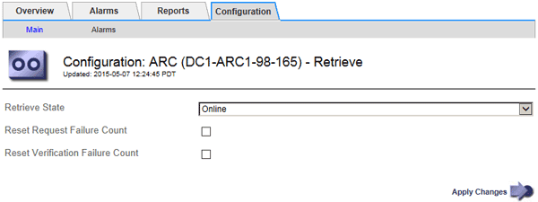

= Configuration des paramètres de récupération du nœud d'archivage
:allow-uri-read: 
:icons: font
:imagesdir: ../media/

[role="lead"]
Vous pouvez configurer les paramètres de récupération d'un nœud d'archivage pour définir l'état en ligne ou hors ligne, ou réinitialiser le nombre d'échecs en cours de suivi pour les alarmes associées.

.Ce dont vous avez besoin
* Vous devez être connecté à Grid Manager à l'aide d'un navigateur pris en charge.
* Vous devez disposer d'autorisations d'accès spécifiques.

.Étapes
. Sélectionnez *support* > *Outils* > *topologie de grille*.
. Sélectionnez *Archive Node* > *ARC* > *Retrieve*.
. Sélectionnez *Configuration* > *main*.
+

. Modifiez les paramètres suivants, si nécessaire :
+
** *Récupérer l'état* : définissez l'état du composant sur :
+
*** En ligne : le nœud de grille est disponible pour récupérer les données d'objet à partir du périphérique de support d'archivage.
*** Hors ligne : le nœud grid n'est pas disponible pour récupérer les données d'objet.

** Réinitialiser le nombre d'échecs de la demande : cochez la case pour réinitialiser le compteur pour les échecs de la demande. Il peut être utilisé pour effacer l'alarme ARRF (demandes d'échecs).
** Réinitialiser le nombre d'échecs de vérification : cochez cette case pour réinitialiser le compteur d'échecs de vérification sur les données d'objet récupérées. Il peut être utilisé pour effacer l'alarme ARRV (échecs de vérification).

. Cliquez sur *appliquer les modifications*.

