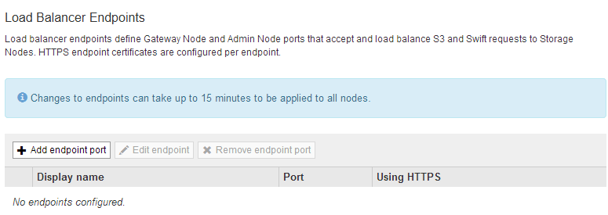

= Configuration des terminaux d'équilibrage de charge
:allow-uri-read: 
:icons: font
:imagesdir: ../media/

[role="lead"]
Vous pouvez créer, modifier et supprimer des noeuds finaux de l'équilibreur de charge.

== Création de terminaux d'équilibrage de charge

Chaque terminal de l'équilibreur de charge spécifie un port, un protocole réseau (HTTP ou HTTPS) et un type de service (S3 ou Swift). Si vous créez un noeud final HTTPS, vous devez télécharger ou générer un certificat de serveur.

.Ce dont vous avez besoin
* Vous devez disposer de l'autorisation accès racine.
* Vous devez être connecté à Grid Manager à l'aide d'un navigateur pris en charge.
* Si vous avez précédemment mappé des ports que vous souhaitez utiliser pour le service Load Balancer, vous devez avoir supprimé les mappages.
+

IMPORTANT: Si vous avez mappé de nouveau des ports, vous ne pouvez pas utiliser les mêmes ports pour configurer les points finaux de l'équilibreur de charge. Vous pouvez créer des noeuds finaux à l'aide de ports remappés, mais ces noeuds finaux seront remappés vers les ports et le service CLB d'origine, et non le service Load Balancer. Suivez les étapes des instructions de récupération et de maintenance pour supprimer les mappages de port.

+

NOTE: Le service CLB est obsolète.

.Étapes
. Sélectionnez *Configuration* > *Paramètres réseau* > *points d'extrémité Load Balancer*.
+
La page Load Balancer Endpoints s'affiche.

+

. Sélectionnez *Ajouter un noeud final*.
+
La boîte de dialogue Créer un point final s'affiche.

+
image::../media/load_balancer_endpoint_create_http.png[Créer UN point final LB]

. Entrez un nom d'affichage pour le noeud final, qui apparaîtra dans la liste de la page noeuds finaux Load Balancer.
. Entrez un numéro de port ou laissez le numéro de port pré-rempli tel quel.
+
Si vous entrez le numéro de port 80 ou 443, le noeud final est configuré uniquement sur les noeuds de passerelle, car ces ports sont réservés sur les noeuds d'administration.

+

NOTE: Les ports utilisés par d'autres services de réseau ne sont pas autorisés. Reportez-vous aux instructions de mise en réseau pour obtenir la liste des ports utilisés pour les communications internes et externes.

. Sélectionnez *HTTP* ou *HTTPS* pour spécifier le protocole réseau pour ce noeud final.
. Sélectionnez un mode de liaison de point final.
+
** *Global* (par défaut) : le noeud final est accessible sur tous les noeuds de passerelle et les noeuds d'administration sur le numéro de port spécifié.
+
image::../media/load_balancer_endpoint_global_binding_mode.png[Mode de liaison globale de point final]

** *VIP de groupe HA* : le noeud final est accessible uniquement via les adresses IP virtuelles définies pour les groupes HA sélectionnés. Les terminaux définis dans ce mode peuvent réutiliser le même numéro de port, tant que les groupes HA définis par ces terminaux ne se chevauchent pas.
+
Sélectionnez les groupes HA avec les adresses IP virtuelles où vous souhaitez que le noeud final apparaisse.

+
image::../media/load_balancer_endpoint_ha_group_vips_binding_mode.png[Mode de liaison VIP du groupe HA de terminaux]

** *Node interfaces* : le noeud final est accessible uniquement sur les noeuds désignés et les interfaces réseau. Les points d'extrémité définis dans ce mode peuvent réutiliser le même numéro de port tant que ces interfaces ne se chevauchent pas.
+
Sélectionnez les interfaces de nœud sur lesquelles vous souhaitez que le noeud final apparaisse.

+
image::../media/load_balancer_endpoint_node_interfaces_binding_mode.png[Mode de liaison des interfaces de nœud de point final]

. Sélectionnez *Enregistrer*.
+
La boîte de dialogue Modifier le point final s'affiche.

. Sélectionnez *S3* ou *Swift* pour spécifier le type de trafic que ce noeud final servira.
+
image::../media/load_balancer_endpoint_client_options.png[Client Load Balancer]

. Si vous avez sélectionné *HTTP*, sélectionnez *Enregistrer*.
+
Le point final non sécurisé est créé. Le tableau de la page des noeuds finaux Load Balancer répertorie le nom d'affichage, le numéro de port, le protocole et l'ID de noeud final du noeud final.

. Si vous avez sélectionné *HTTPS* et que vous souhaitez télécharger un certificat, sélectionnez *Télécharger le certificat*.
+
image::../media/load_balancer_endpoint_upload_cert.png[Télécharger le certificat]

+
.. Recherchez le certificat du serveur et la clé privée du certificat.
+
Pour permettre aux clients S3 de se connecter à l'aide d'un nom de domaine de terminal de l'API S3, utilisez un certificat multi-domaine ou avec caractère générique correspondant à tous les noms de domaine que le client peut utiliser pour se connecter à la grille. Par exemple, le certificat de serveur peut utiliser le nom de domaine `*._example_.com`.

+
link:configuring-s3-api-endpoint-domain-names.html["Configuration des noms de domaine de terminaux API S3"]

.. Vous pouvez également rechercher un ensemble CA.
.. Sélectionnez *Enregistrer*.
+
Les données de certificat codées PEM pour le noeud final apparaissent.

. Si vous avez sélectionné *HTTPS* et que vous souhaitez générer un certificat, sélectionnez *générer certificat*.
+
image::../media/load_balancer_endpoint_generate_cert.png[Générer un certificat]

+
.. Entrez un nom de domaine ou une adresse IP.
+
Vous pouvez utiliser des caractères génériques pour représenter les noms de domaine complets de tous les nœuds d'administration et de passerelle exécutant le service Load Balancer. Par exemple : `*.sgws.foo.com` utilise le caractère générique * pour représenter `gn1.sgws.foo.com` et `gn2.sgws.foo.com`.

+
link:configuring-s3-api-endpoint-domain-names.html["Configuration des noms de domaine de terminaux API S3"]

.. Sélectionnez image:../media/icon_plus_sign_black_on_white.gif["Signe plus"] Pour ajouter d'autres noms de domaine ou adresses IP.
+
Si vous utilisez des groupes haute disponibilité (HA), ajoutez les noms de domaine et les adresses IP des adresses IP virtuelles haute disponibilité.

.. Vous pouvez également saisir un sujet X.509, également appelé Nom unique (DN), pour identifier qui possède le certificat.
.. Vous pouvez également sélectionner le nombre de jours pendant lesquels le certificat est valide. La valeur par défaut est 730 jours.
.. Sélectionnez *generate*.
+
Les métadonnées du certificat et les données du certificat codées PEM du noeud final apparaissent.

. Cliquez sur *Enregistrer*.
+
Le noeud final est créé. Le tableau de la page des noeuds finaux Load Balancer répertorie le nom d'affichage, le numéro de port, le protocole et l'ID de noeud final du noeud final.

.Informations associées
link:../maintain/index.html["Maintenance et récupération"]

link:../network/index.html["Instructions réseau"]

link:managing-high-availability-groups.html["Gestion des groupes haute disponibilité"]

link:managing-untrusted-client-networks.html["Gestion des réseaux clients non fiables"]

== Modification des noeuds finaux de l'équilibreur de charge

Dans le cas d'un terminal HTTP non sécurisé, vous pouvez modifier le type de service de terminal entre S3 et Swift. Pour un noeud final sécurisé (HTTPS), vous pouvez modifier le type de service de noeud final et afficher ou modifier le certificat de sécurité.

.Ce dont vous avez besoin
* Vous devez disposer de l'autorisation accès racine.
* Vous devez être connecté à Grid Manager à l'aide d'un navigateur pris en charge.

.Étapes
. Sélectionnez *Configuration* > *Paramètres réseau* > *points d'extrémité Load Balancer*.
+
La page Load Balancer Endpoints s'affiche. Les noeuds finaux existants sont répertoriés dans le tableau.

+
Les noeuds finaux dont les certificats expireront bientôt sont identifiés dans le tableau.

+
image::../media/load_balancer_endpoint_edit_or_remove.png[Modifier le point final]

. Sélectionnez le point final que vous souhaitez modifier.
. Cliquez sur *Edit Endpoint*.
+
La boîte de dialogue Modifier le point final s'affiche.

+
Pour un noeud final non sécurisé (HTTP), seule la section Configuration du service de point final de la boîte de dialogue s'affiche. Pour un noeud final sécurisé (HTTPS), les sections Configuration du service de point final et certificats de la boîte de dialogue s'affichent, comme illustré dans l'exemple suivant.

+
image::../media/load_balancer_endpoint_edit.png[Modifiez le point d'extrémité de l'équilibreur de charge]

. Apportez les modifications souhaitées au noeud final.
+
Pour un point final non sécurisé (HTTP), vous pouvez :

+
** Changez le type de service de terminal entre S3 et Swift.
** Modifiez le mode de liaison du point final. Pour un point de terminaison sécurisé (HTTPS), vous pouvez :
** Changez le type de service de terminal entre S3 et Swift.
** Modifiez le mode de liaison du point final.
** Afficher le certificat de sécurité.
** Téléchargez ou générez un nouveau certificat de sécurité lorsque le certificat actuel a expiré ou est sur le point d'expirer.
+
Sélectionnez un onglet pour afficher des informations détaillées sur le certificat de serveur StorageGRID par défaut ou sur un certificat signé par l'autorité de certification qui a été téléchargé.

+

NOTE: Pour modifier le protocole d'un noeud final existant, par exemple de HTTP à HTTPS, vous devez créer un nouveau noeud final. Suivez les instructions de création des points d'extrémité de l'équilibreur de charge et sélectionnez le protocole souhaité.

. Cliquez sur *Enregistrer*.

.Informations associées
<<Création de terminaux d'équilibrage de charge>>

== Suppression des points finaux de l'équilibreur de charge

Si vous n'avez plus besoin d'un point final d'équilibreur de charge, vous pouvez le supprimer.

.Ce dont vous avez besoin
* Vous devez disposer de l'autorisation accès racine.
* Vous devez être connecté à Grid Manager à l'aide d'un navigateur pris en charge.

.Étapes
. Sélectionnez *Configuration* > *Paramètres réseau* > *points d'extrémité Load Balancer*.
+
La page Load Balancer Endpoints s'affiche. Les noeuds finaux existants sont répertoriés dans le tableau.

+
image::../media/load_balancer_endpoint_edit_or_remove.png[Modifier le point final]

. Sélectionnez le bouton radio à gauche du noeud final que vous souhaitez supprimer.
. Cliquez sur *Supprimer le noeud final*.
+
Une boîte de dialogue de confirmation s'affiche.

+
image::../media/load_balancer_endpoint_confirm_removal.png[Confirmez la suppression du point final]

. Cliquez sur *OK*.
+
Le noeud final est supprimé.

