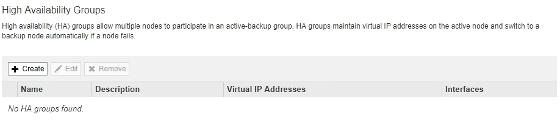

= Création d'un groupe haute disponibilité
:allow-uri-read: 
:icons: font
:imagesdir: ../media/

[role="lead"]
Vous pouvez créer un ou plusieurs groupes haute disponibilité pour fournir un accès hautement disponible aux services sur les nœuds d'administration ou les nœuds de passerelle.

.Ce dont vous avez besoin
* Vous devez être connecté à Grid Manager à l'aide d'un navigateur pris en charge.
* Vous devez disposer de l'autorisation accès racine.

.Description de la tâche
Une interface doit respecter les conditions suivantes pour être inclus dans un groupe haute disponibilité :

* L'interface doit être destinée à un nœud de passerelle ou à un nœud d'administration.
* L'interface doit appartenir au réseau Grid Network (eth0) ou au réseau client (eth2).
* L'interface doit être configurée avec un adressage IP fixe ou statique, et non avec DHCP.

.Étapes
. Sélectionnez *Configuration* > *Paramètres réseau* > *groupes haute disponibilité*.
+
La page groupes haute disponibilité s'affiche.

+

. Cliquez sur *Créer*.
+
La boîte de dialogue Créer un groupe haute disponibilité s'affiche.

. Saisissez un nom et, le cas échéant, une description pour le groupe HA.
. Cliquez sur *Sélectionner interfaces*.
+
La boîte de dialogue Ajouter des interfaces au groupe haute disponibilité s'affiche. Le tableau répertorie les nœuds, les interfaces et les sous-réseaux IPv4 éligibles.

+
image::../media/ha_group_add_interfaces.png[Les groupes HAUTE DISPONIBILITÉ ajoutent des interfaces]

+
Une interface n'apparaît pas dans la liste si son adresse IP est attribuée par DHCP.

. Dans la colonne *Ajouter au groupe HA*, cochez la case de l'interface que vous souhaitez ajouter au groupe HA.
+
Notez les consignes suivantes pour la sélection des interfaces :

+
** Vous devez sélectionner au moins une interface.
** Si vous sélectionnez plusieurs interfaces, toutes les interfaces doivent se trouver sur le réseau Grid (eth0) ou sur le réseau client (eth2).
** Toutes les interfaces doivent se trouver dans le même sous-réseau ou dans des sous-réseaux avec un préfixe commun.
+
Les adresses IP seront limitées au sous-réseau le plus petit (celui avec le plus grand préfixe).

** Si vous sélectionnez des interfaces sur différents types de nœuds et qu'un basculement se produit, seuls les services communs aux nœuds sélectionnés seront disponibles sur les adresses IP virtuelles.
+
*** Sélectionnez au moins deux nœuds d'administration pour protéger haute disponibilité le Grid Manager ou le tenant Manager.
*** Sélectionnez au moins deux nœuds d'administration et/ou plusieurs nœuds de passerelle pour la protection haute disponibilité du service Load Balancer.
*** Sélectionnez au moins deux nœuds de passerelle pour la protection haute disponibilité du service CLB.
+

NOTE: Le service CLB est obsolète.

+
image::../media/ha_groups_different_node_types.png[Groupes HAUTE DISPONIBILITÉ différents types de nœuds]

. Cliquez sur *appliquer*.
+
Les interfaces sélectionnées sont répertoriées dans la section interfaces de la page Créer un groupe haute disponibilité. Par défaut, la première interface de la liste est sélectionnée comme maître préféré.

+
image::../media/ha_group_select_virtual_ips.png[Groupes HAUTE DISPONIBILITÉ sélectionnez des adresses IP virtuelles]

. Si vous souhaitez qu'une interface différente soit le maître préféré, sélectionnez cette interface dans la colonne *Maître préféré*.
+
Le maître préféré est l'interface active, sauf en cas de défaillance qui entraîne la réaffectation des adresses VIP à une interface de sauvegarde.

+

NOTE: Si le groupe HA donne accès à Grid Manager, vous devez sélectionner une interface sur le nœud d'administration principal pour qu'il soit le maître préféré. Certaines procédures de maintenance peuvent uniquement être effectuées depuis le nœud d'administration principal.

. Dans la section adresses IP virtuelles de la page, entrez une à 10 adresses IP virtuelles pour le groupe HA. Cliquez sur le signe plus (image:../media/icon_plus_sign_black_on_white_old.png["Signe plus"]) Pour ajouter plusieurs adresses IP.
+
Vous devez fournir au moins une adresse IPv4. Vous pouvez éventuellement spécifier des adresses IPv4 et IPv6 supplémentaires.

+
Les adresses IPv4 doivent se trouver dans le sous-réseau IPv4 partagé par toutes les interfaces membres.

. Cliquez sur *Enregistrer*.
+
Le groupe haute disponibilité est créé et vous pouvez maintenant utiliser les adresses IP virtuelles configurées.

.Informations associées
link:../rhel/index.html["Installez Red Hat Enterprise Linux ou CentOS"]

link:../vmware/index.html["Installez VMware"]

link:../ubuntu/index.html["Installez Ubuntu ou Debian"]

link:managing-load-balancing.html["Gestion de l'équilibrage des charges"]
