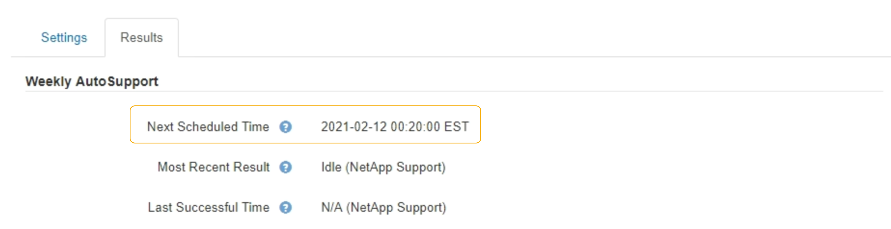

= Désactivation des messages AutoSupport hebdomadaires
:allow-uri-read: 
:icons: font
:imagesdir: ../media/

[role="lead"]
Par défaut, le système StorageGRID est configuré pour envoyer un message AutoSupport au support NetApp une fois par semaine.

.Ce dont vous avez besoin
* Vous devez être connecté à Grid Manager à l'aide d'un navigateur pris en charge.
* Vous devez disposer de l'autorisation accès racine ou autre configuration grille.

.Description de la tâche
Pour déterminer à quel moment le message AutoSupport hebdomadaire est envoyé, reportez-vous à la section *prochaine heure programmée* sous *AutoSupport hebdomadaire* de la page *AutoSupport* > *Résultats*. 

Vous pouvez désactiver l'envoi automatique d'un message AutoSupport à tout moment.

.Étapes
. Sélectionnez *support* > *Outils* > *AutoSupport*.
+
La page AutoSupport s'affiche avec l'onglet *Paramètres* sélectionné.

. Décochez la case *Activer AutoSupport hebdomadaire*.
+
image::../media/autosupport_disable_weekly.png[Page AutoSupport]

. Sélectionnez *Enregistrer*.

