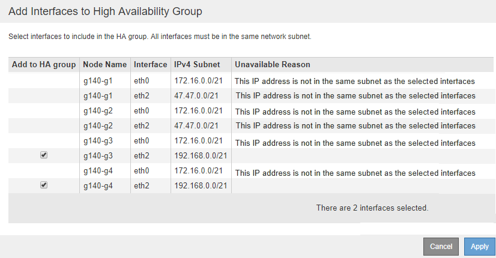

= Modification d'un groupe haute disponibilité
:allow-uri-read: 
:icons: font
:imagesdir: ../media/

[role="lead"]
Vous pouvez modifier un groupe haute disponibilité (HA) pour modifier son nom et sa description, ajouter ou supprimer des interfaces ou ajouter ou mettre à jour une adresse IP virtuelle.

.Ce dont vous avez besoin
* Vous devez être connecté à Grid Manager à l'aide d'un navigateur pris en charge.
* Vous devez disposer de l'autorisation accès racine.

.Description de la tâche
Voici quelques-unes des raisons justifiant la modification d'un groupe haute disponibilité :

* Ajout d'une interface à un groupe existant. L'adresse IP de l'interface doit se trouver dans le même sous-réseau que les autres interfaces déjà attribuées au groupe.
* Suppression d'une interface d'un groupe haute disponibilité. Par exemple, vous ne pouvez pas démarrer une procédure de mise hors service d'un site ou d'un nœud si l'interface d'un nœud pour le réseau Grid ou le réseau client est utilisée dans un groupe HA.

.Étapes
. Sélectionnez *Configuration* > *Paramètres réseau* > *groupes haute disponibilité*.
+
La page groupes haute disponibilité s'affiche.

+
image::../media/ha_groups_page_with_two_groups.png[PAGE groupes HAUTE DISPONIBILITÉ avec deux groupes]

. Sélectionnez le groupe HA que vous souhaitez modifier et cliquez sur *Modifier*.
+
La boîte de dialogue Modifier le groupe haute disponibilité s'affiche.

. Vous pouvez également mettre à jour le nom ou la description du groupe.
. Vous pouvez également cliquer sur *Select interfaces* pour modifier les interfaces du groupe HA.
+
La boîte de dialogue Ajouter des interfaces au groupe haute disponibilité s'affiche.

+

+
Une interface n'apparaît pas dans la liste si son adresse IP est attribuée par DHCP.

. Cocher ou décocher les cases pour ajouter ou supprimer des interfaces.
+
Notez les consignes suivantes pour la sélection des interfaces :

+
** Vous devez sélectionner au moins une interface.
** Si vous sélectionnez plusieurs interfaces, toutes les interfaces doivent se trouver sur le réseau Grid (eth0) ou sur le réseau client (eth2).
** Toutes les interfaces doivent se trouver dans le même sous-réseau ou dans des sous-réseaux avec un préfixe commun.
+
Les adresses IP seront limitées au sous-réseau le plus petit (celui avec le plus grand préfixe).

** Si vous sélectionnez des interfaces sur différents types de nœuds et qu'un basculement se produit, seuls les services communs aux nœuds sélectionnés seront disponibles sur les adresses IP virtuelles.
+
*** Sélectionnez au moins deux nœuds d'administration pour protéger haute disponibilité le Grid Manager ou le tenant Manager.
*** Sélectionnez au moins deux nœuds d'administration et/ou plusieurs nœuds de passerelle pour la protection haute disponibilité du service Load Balancer.
*** Sélectionnez au moins deux nœuds de passerelle pour la protection haute disponibilité du service CLB.
+

NOTE: Le service CLB est obsolète.

. Cliquez sur *appliquer*.
+
Les interfaces sélectionnées sont répertoriées dans la section interfaces de la page. Par défaut, la première interface de la liste est sélectionnée comme maître préféré.

+
image::../media/ha_group_edit_group.png[Groupe d'édition HAUTE DISPONIBILITÉ]

. Si vous souhaitez qu'une interface différente soit le maître préféré, sélectionnez cette interface dans la colonne *Maître préféré*.
+
Le maître préféré est l'interface active, sauf en cas de défaillance qui entraîne la réaffectation des adresses VIP à une interface de sauvegarde.

+

NOTE: Si le groupe HA donne accès à Grid Manager, vous devez sélectionner une interface sur le nœud d'administration principal pour qu'il soit le maître préféré. Certaines procédures de maintenance peuvent uniquement être effectuées depuis le nœud d'administration principal.

. Si vous le souhaitez, mettez à jour les adresses IP virtuelles pour le groupe haute disponibilité.
+
Vous devez fournir au moins une adresse IPv4. Vous pouvez éventuellement spécifier des adresses IPv4 et IPv6 supplémentaires.

+
Les adresses IPv4 doivent se trouver dans le sous-réseau IPv4 partagé par toutes les interfaces membres.

. Cliquez sur *Enregistrer*.
+
Le groupe haute disponibilité est mis à jour.

