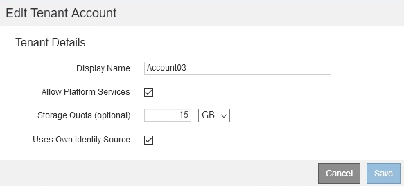

= Modification d'un compte de locataire
:allow-uri-read: 
:icons: font
:imagesdir: ../media/

[role="lead"]
Vous pouvez modifier un compte de tenant pour modifier le nom d'affichage, modifier le paramètre du référentiel d'identité, autoriser ou interdire les services de plate-forme, ou entrer un quota de stockage.

.Ce dont vous avez besoin
* Vous devez être connecté à Grid Manager à l'aide d'un navigateur pris en charge.
* Vous devez disposer d'autorisations d'accès spécifiques.

.Étapes
. Sélectionnez *locataires*.
+
La page comptes de tenant s'affiche et répertorie tous les comptes de tenant existants.

+
image::../media/tenant_accounts_page.png[Page comptes de tenant]

. Sélectionnez le compte de locataire à modifier.
+
Si votre système comprend plus de 20 éléments, vous pouvez spécifier le nombre de lignes affichées simultanément sur chaque page. Utilisez la zone de recherche pour rechercher un compte de tenant par nom d'affichage ou ID de tenant.

. Sélectionnez *Modifier*.
+
La page Modifier le compte de locataire s'affiche. Cet exemple concerne une grille qui n'utilise pas SSO (Single Sign-on). Ce compte de tenant n'a pas configuré son propre référentiel d'identité.

+

. Modifiez les valeurs des champs selon les besoins.
+
.. Modifier le nom d'affichage de ce compte de locataire.
.. Modifiez le paramètre de la case à cocher *Autoriser les services de plate-forme* pour déterminer si le compte de tenant peut utiliser les services de plate-forme pour ses compartiments S3.
+

IMPORTANT: Si vous désactivez les services de plateforme pour un locataire qui les utilise déjà, les services qu'ils ont configurés pour leurs compartiments S3 cessent de fonctionner. Aucun message d'erreur n'est envoyé au locataire. Par exemple, si le locataire a configuré la réplication CloudMirror pour un compartiment S3, il peut toujours stocker les objets dans le compartiment, mais les copies de ces objets ne sont plus effectuées dans le compartiment S3 externe qu'ils ont configuré en tant que terminal.

.. Pour *quota de stockage*, modifiez le nombre maximum de gigaoctets, de téraoctets ou de pétaoctets disponibles pour les objets de ce locataire, ou laissez le champ vide si vous souhaitez que ce locataire dispose d'un quota illimité.
+
Le quota de stockage d'un locataire représente une quantité logique (taille d'objet), et non une quantité physique (taille sur disque). Les copies ILM et le code d'effacement ne contribuent pas au volume de quotas utilisés.

+

NOTE: Pour surveiller l'utilisation du stockage de chaque compte locataire, sélectionnez *utilisation*. Ils peuvent également surveiller leur propre utilisation depuis le tableau de bord dans le Gestionnaire de locataires ou à l'aide de l'API de gestion des locataires. Les valeurs d'utilisation du stockage d'un locataire peuvent devenir obsolètes si les nœuds sont isolés des autres nœuds de la grille. Les totaux seront mis à jour lorsque la connectivité réseau sera restaurée.

.. Modifiez le paramètre de la case à cocher *utilise son propre référentiel d'identité* pour déterminer si le compte de tenant utilisera son propre référentiel d'identité ou le référentiel d'identité qui a été configuré pour le gestionnaire de grille.
+

NOTE: Si la case à cocher *utilise son propre référentiel d'identité* est :

+
*** Désactivé et coché, le locataire a déjà activé son propre référentiel d'identité. Un locataire doit désactiver son référentiel d'identité avant de pouvoir utiliser le référentiel d'identité configuré pour Grid Manager.
*** Désactivé et décoché, la fonctionnalité SSO est activée pour le système StorageGRID. Le locataire doit utiliser le référentiel d'identité qui a été configuré pour Grid Manager.

. Sélectionnez *Enregistrer*.

.Informations associées
link:managing-platform-services-for-s3-tenant-accounts.html["Gestion des services de plateforme pour les comptes de locataires S3"]

link:../tenant/index.html["Utilisez un compte de locataire"]
