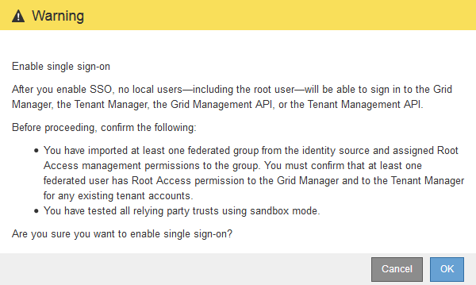

= Activation de l'authentification unique
:allow-uri-read: 
:icons: font
:imagesdir: ../media/

[role="lead"]
Après avoir utilisé le mode sandbox pour tester toutes vos approbations StorageGRID, vous êtes prêt à activer l'authentification unique (SSO).

.Ce dont vous avez besoin
* Vous devez avoir importé au moins un groupe fédéré du référentiel d'identité et affecté des autorisations de gestion de l'accès racine au groupe. Vous devez confirmer qu'au moins un utilisateur fédéré dispose d'une autorisation d'accès racine au gestionnaire de grille et au gestionnaire de locataires pour tout compte de locataire existant.
* Vous devez avoir testé toutes les approbations de parties utilisatrices à l'aide du mode sandbox.

.Étapes
. Sélectionnez *Configuration* > *contrôle d'accès* > *connexion unique*.
+
La page Single Sign-On s'affiche avec *Sandbox mode* sélectionné.

. Définissez l'état SSO sur *activé*.
. Cliquez sur *Enregistrer*.
+
Un message d'avertissement s'affiche.

+

. Vérifiez l'avertissement et cliquez sur *OK*.
+
L'authentification unique est désormais activée.

+

IMPORTANT: Tous les utilisateurs doivent utiliser l'authentification SSO pour accéder au Grid Manager, au Gestionnaire de locataires, à l'API de gestion Grid et à l'API de gestion des locataires. Les utilisateurs locaux ne peuvent plus accéder à StorageGRID.

