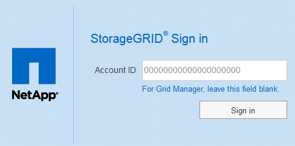

= Fonctionnement de l'authentification unique
:allow-uri-read: 
:icons: font
:imagesdir: ../media/

[role="lead"]
Avant d'activer l'authentification unique (SSO), vérifiez comment les processus de connexion et de déconnexion StorageGRID sont affectés lorsque l'authentification SSO est activée.

== Connexion lorsque SSO est activé

Lorsque l'authentification SSO est activée et que vous vous connectez à StorageGRID, vous êtes redirigé vers la page SSO de votre entreprise afin de valider vos identifiants.

.Étapes
. Entrez le nom de domaine complet ou l'adresse IP d'un nœud d'administration StorageGRID dans un navigateur Web.
+
La page de connexion StorageGRID s'affiche.

+
** S'il s'agit de la première fois que vous accédez à l'URL sur ce navigateur, vous êtes invité à entrer un ID de compte :
+

** Si vous avez déjà accédé au Grid Manager ou au tenant Manager, vous êtes invité à sélectionner un compte récent ou à saisir un ID de compte :
+
image::../media/sign_in_sso.gif[StorageGRID page de connexion si SSO est activé]

+

NOTE: La page de connexion StorageGRID n'apparaît pas lorsque vous saisissez l'URL complète d'un compte de locataire (c'est-à-dire un nom de domaine complet ou une adresse IP suivi de `/?accountId=_20-digit-account-id_`). Au lieu de cela, vous êtes immédiatement redirigé vers la page de connexion SSO de votre entreprise, où vous pouvez <<signin_sso,Connectez-vous à l'aide de vos identifiants SSO>>.

. Indiquez si vous souhaitez accéder au Grid Manager ou au tenant Manager :
+
** Pour accéder au Grid Manager, laissez le champ Identifiant de compte** vide, saisissez *0* comme ID de compte ou sélectionnez *Grid Manager* si celui-ci apparaît dans la liste des comptes récents.
** Pour accéder au Gestionnaire de locataires, entrez l'ID de compte de tenant à 20 chiffres ou sélectionnez un locataire par nom s'il apparaît dans la liste des comptes récents.

. Cliquez sur *connexion*
+
StorageGRID vous redirige vers la page de connexion SSO de votre entreprise. Par exemple :

+
image::../media/sso_organization_page.gif[Exemple de page de connexion de l'organisation pour SSO]

. [[Sign_sso]]Connectez-vous à l'aide de vos identifiants SSO.
+
Si vos informations d'identification SSO sont correctes :

+
.. Le fournisseur d'identités fournit une réponse d'authentification à StorageGRID.
.. StorageGRID valide la réponse d'authentification.
.. Si la réponse est valide et que vous appartenez à un groupe fédéré disposant d'une autorisation d'accès adéquate, vous êtes connecté au Grid Manager ou au tenant Manager, selon le compte que vous avez sélectionné.

. Accédez éventuellement à d'autres nœuds d'administration ou à Grid Manager ou au tenant Manager, si vous disposez des autorisations adéquates.
+
Il n'est pas nécessaire de saisir à nouveau vos identifiants SSO.

== Déconnexion lorsque SSO est activé

Lorsque l'authentification SSO est activée pour StorageGRID, le processus de déconnexion dépend de ce que vous êtes connecté et de l'endroit où vous vous déconnectez.

.Étapes
. Repérez le lien *Déconnexion* dans le coin supérieur droit de l'interface utilisateur.
. Cliquez sur *Déconnexion*.
+
La page de connexion StorageGRID s'affiche. La liste déroulante *comptes récents* est mise à jour pour inclure *Grid Manager* ou le nom du locataire, afin que vous puissiez accéder plus rapidement à ces interfaces utilisateur à l'avenir.

+
[cols="1a,1a,1a"]
|===
| Si vous êtes connecté à... | Et vous vous déconnectez de... | Vous êtes déconnecté de... 

 a| 
Grid Manager sur un ou plusieurs nœuds d'administration
 a| 
Grid Manager sur n'importe quel nœud d'administration
 a| 
Grid Manager sur tous les nœuds d'administration

 a| 
Gestionnaire de locataires sur un ou plusieurs nœuds d'administration
 a| 
Gestionnaire de locataires sur n'importe quel nœud d'administration
 a| 
Gestionnaire de locataires sur tous les nœuds d'administration

 a| 
Grid Manager et tenant Manager
 a| 
Gestionnaire de grille
 a| 
Le Grid Manager uniquement. Vous devez également vous déconnecter du tenant Manager pour vous déconnecter de SSO.

 a| 
Gestionnaire de locataires
 a| 
Le Gestionnaire de locataires uniquement. Vous devez également vous déconnecter de Grid Manager pour vous déconnecter de SSO.

|===

NOTE: Le tableau résume ce qui se passe lorsque vous vous déconnectez si vous utilisez une seule session de navigateur. Si vous êtes connecté à StorageGRID à travers plusieurs sessions de navigateur, vous devez vous déconnecter de toutes les sessions de navigateur séparément.
