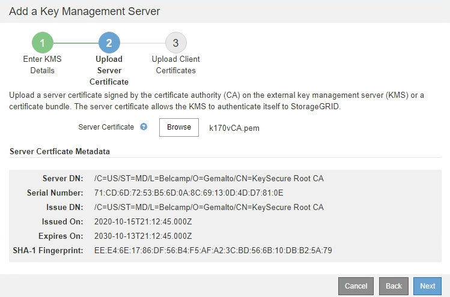

= Étape 2 : télécharger le certificat du serveur
:allow-uri-read: 
:icons: font
:imagesdir: ../media/

[role="lead"]
À l'étape 2 (Télécharger le certificat de serveur) de l'assistant Ajout d'un serveur de gestion de clés, vous téléchargez le certificat de serveur (ou le paquet de certificats) pour le KMS. Le certificat du serveur permet au KMS externe de s'authentifier auprès de StorageGRID.

.Étapes
. À partir de *Etape 2 (Télécharger le certificat du serveur)*, accédez à l'emplacement du certificat du serveur enregistré ou du groupe de certificats.
+
image::../media/kms_step_2_upload_server_certificate.png[KMS étape 2 Télécharger le certificat du serveur]

. Téléchargez le fichier de certificat.
+
Les métadonnées du certificat de serveur s'affichent.

+

+

NOTE: Si vous avez téléchargé un ensemble de certificats, les métadonnées de chaque certificat s'affichent sur son propre onglet.

. Sélectionnez *Suivant*.
+
L'étape 3 (Téléchargement de certificats client) de l'assistant Ajout d'un serveur de gestion de clés s'affiche.

