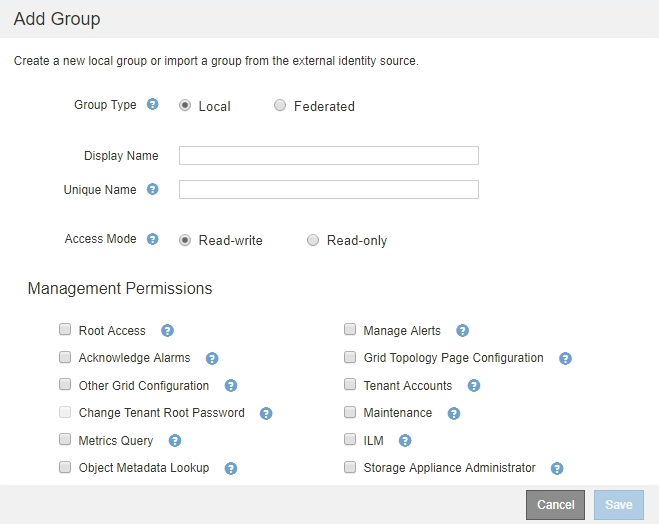

= Gestion des groupes d'administration
:allow-uri-read: 
:icons: font
:imagesdir: ../media/

[role="lead"]
Vous pouvez créer des groupes d'administration pour gérer les autorisations de sécurité d'un ou plusieurs utilisateurs administrateurs. Les utilisateurs doivent appartenir à un groupe pour pouvoir accéder au système StorageGRID.

== Création de groupes d'administration

Les groupes Admin vous permettent de déterminer quels utilisateurs peuvent accéder aux fonctions et opérations du gestionnaire de grille et de l'API Grid Management.

.Ce dont vous avez besoin
* Vous devez être connecté à Grid Manager à l'aide d'un navigateur pris en charge.
* Vous devez disposer d'autorisations d'accès spécifiques.
* Si vous envisagez d'importer un groupe fédéré, vous devez avoir configuré la fédération des identités et le groupe fédéré doit déjà exister dans le référentiel d'identité configuré.

.Étapes
. Sélectionnez *Configuration* > *contrôle d'accès* > *groupes d'administration*.
+
La page groupes d'administration s'affiche et répertorie tous les groupes d'administration existants.

+
image::../media/groups.png[Page groupes]

. Sélectionnez *Ajouter*.
+
La boîte de dialogue Ajouter un groupe s'affiche.

+

. Pour Type de groupe, sélectionnez *local* si vous souhaitez créer un groupe qui sera utilisé uniquement dans StorageGRID, ou sélectionnez *fédéré* si vous souhaitez importer un groupe à partir du référentiel d'identité.
. Si vous avez sélectionné *local*, entrez un nom d'affichage pour le groupe. Le nom affiché est le nom qui apparaît dans le gestionnaire de grille. Par exemple, « Maintenance Users » ou « ILM Administrators ».
. Entrez un nom unique pour le groupe.
+
** *Local* : saisissez le nom unique de votre choix. Par exemple, « administrateurs ILM ».
** *Fédéré* : saisissez le nom du groupe exactement tel qu'il apparaît dans le référentiel d'identité configuré.

. Dans *Access mode*, sélectionnez si les utilisateurs du groupe peuvent modifier les paramètres et effectuer des opérations dans le gestionnaire de grille et l'API de gestion de grille ou s'ils ne peuvent afficher que les paramètres et les fonctionnalités.
+
** *Lecture-écriture* (par défaut) : les utilisateurs peuvent modifier les paramètres et effectuer les opérations autorisées par leurs autorisations de gestion.
** *Lecture seule* : les utilisateurs peuvent uniquement afficher les paramètres et les fonctionnalités. Ils ne peuvent pas apporter de modifications ni effectuer d'opérations dans Grid Manager ou Grid Management API. Les utilisateurs locaux en lecture seule peuvent modifier leurs propres mots de passe.
+

NOTE: Si un utilisateur appartient à plusieurs groupes et qu'un groupe est défini sur *lecture seule*, l'utilisateur dispose d'un accès en lecture seule à tous les paramètres et fonctions sélectionnés.

. Sélectionnez une ou plusieurs autorisations de gestion.
+
Vous devez attribuer au moins une autorisation à chaque groupe ; sinon, les utilisateurs appartenant au groupe ne pourront pas se connecter à StorageGRID.

. Sélectionnez *Enregistrer*.
+
Le nouveau groupe est créé. S'il s'agit d'un groupe local, vous pouvez à présent ajouter un ou plusieurs utilisateurs. S'il s'agit d'un groupe fédéré, le référentiel d'identité gère quels utilisateurs appartiennent au groupe.

.Informations associées
link:managing-local-users.html["Gestion des utilisateurs locaux"]

== Autorisations de groupe d'administration

Lors de la création de groupes d'utilisateurs admin, vous sélectionnez une ou plusieurs autorisations pour contrôler l'accès à des fonctions spécifiques de Grid Manager. Vous pouvez ensuite affecter chaque utilisateur à un ou plusieurs de ces groupes d'administration pour déterminer les tâches que l'utilisateur peut effectuer.

Vous devez affecter au moins une autorisation à chaque groupe ; sinon, les utilisateurs appartenant à ce groupe ne pourront pas se connecter au gestionnaire de grille.

Par défaut, tout utilisateur appartenant à un groupe disposant d'au moins une autorisation peut effectuer les tâches suivantes :

* Connectez-vous au Grid Manager
* Afficher le tableau de bord
* Affichez les pages nœuds
* Surveiller la topologie de la grille
* Afficher les alertes actuelles et résolues
* Afficher les alarmes actuelles et historiques (système hérité)
* Modifier son propre mot de passe (utilisateurs locaux uniquement)
* Afficher certaines informations sur les pages Configuration et maintenance

Les sections suivantes décrivent les autorisations que vous pouvez attribuer lors de la création ou de la modification d'un groupe d'administration. Toute fonctionnalité qui n'est pas explicitement mentionnée requiert l'autorisation accès racine.

=== Accès racine

Cette autorisation donne accès à toutes les fonctions d'administration de la grille.

=== Gérer les alertes

Cette autorisation donne accès aux options de gestion des alertes. Les utilisateurs doivent disposer de cette autorisation pour gérer les silences, les notifications d'alerte et les règles d'alerte.

=== Accuser réception d'alarmes (système hérité)

Cette autorisation permet d'accuser réception et de répondre aux alarmes (système hérité). Tous les utilisateurs connectés peuvent afficher les alarmes actuelles et historiques.

Si vous souhaitez qu'un utilisateur surveille la topologie de la grille et accuse réception des alarmes uniquement, vous devez attribuer cette autorisation.

=== Configuration de la page topologie de la grille

Cette autorisation permet d'accéder aux options de menu suivantes :

* Onglets de configuration disponibles dans les pages *support* > *Outils* > *topologie de grille*.
* *Réinitialiser le nombre d'événements* sur l'onglet *noeuds* > *Evénements*.

=== Autre configuration de grille

Cette autorisation donne accès à d'autres options de configuration de grille.

IMPORTANT: Pour voir ces options supplémentaires, les utilisateurs doivent également disposer de l'autorisation Configuration de la page de topologie de la grille.

* *Alarmes* (système hérité) :
+
** Alarmes globales
** Configuration de l'ancien e-mail

* *ILM* :
+
** Pools de stockage
** Notes de stockage

* *Configuration* > *Paramètres réseau*
+
** Coût des liens

* *Configuration* > *Paramètres système* :
+
** Options d'affichage
** Options de grid
** Options de stockage

* *Configuration* > *surveillance* :
+
** Événements

* *Support*:
+
** AutoSupport

=== Comptes de locataires

Cette autorisation permet d'accéder à la page *locataires* > *tenant Accounts*.

NOTE: La version 1 de l'API de gestion du grid (obsolète) utilise cette autorisation pour gérer les règles de groupe de locataires, réinitialiser les mots de passe d'administration Swift et gérer les clés d'accès S3 des utilisateurs root.

=== Modifier le mot de passe racine du locataire

Cette autorisation donne accès à l'option *changer mot de passe racine* de la page comptes de tenant, ce qui vous permet de contrôler qui peut modifier le mot de passe de l'utilisateur racine local du locataire. Les utilisateurs qui ne disposent pas de cette autorisation ne peuvent pas voir l'option *Modifier le mot de passe racine*.

NOTE: Vous devez attribuer l'autorisation comptes de tenant au groupe avant de pouvoir attribuer cette autorisation.

=== Maintenance

Cette autorisation permet d'accéder aux options de menu suivantes :

* *Configuration* > *Paramètres système* :
+
** Noms de domaine*
** Certificats de serveur*

* *Configuration* > *surveillance* :
+
** Vérification*

* *Configuration* > *contrôle d'accès* :
+
** Mots de passe de grille

* *Maintenance* > *tâches de maintenance*
+
** Désaffectation
** De développement
** Reprise après incident

* *Maintenance* > *réseau* :
+
** Serveurs DNS*
** Réseau de grille*
** Serveurs NTP*

* *Maintenance* > *système* :
+
** Licence*
** Package de restauration
** Mise à jour logicielle

* *Support* > *Outils* :
+
** Journaux

* Les utilisateurs qui ne disposent pas de l'autorisation Maintenance peuvent afficher, mais pas modifier, les pages marquées d'un astérisque.

=== Requête de metrics

Cette autorisation permet d'accéder à la page *support* > *Outils* > *métriques*. Cette autorisation permet également d'accéder à des requêtes de metrics Prometheus personnalisées à l'aide de la section *Metrics* de l'API Grid Management.

=== ILM

Cette autorisation permet d'accéder aux options de menu *ILM* suivantes :

* *Codage d'effacement*
* *Règles*
* *Politiques*
* * Régions*

NOTE: L'accès aux options de menu *ILM* > *Storage pools* et *ILM* > *Storage Grapes* est contrôlé par les autres autorisations de configuration de la page de configuration de la grille et de la topologie de la grille.

=== Recherche des métadonnées d'objet

Cette autorisation permet d'accéder à l'option de menu *ILM* > *Object Metadata Lookup*.

=== Administrateur de l'appliance de stockage

Cette autorisation permet d'accéder à la gamme E-Series SANtricity System Manager sur les appliances de stockage via Grid Manager.

=== Interaction entre les autorisations et le mode d'accès

Pour toutes les autorisations, le paramètre mode d'accès du groupe détermine si les utilisateurs peuvent modifier les paramètres et effectuer des opérations ou s'ils ne peuvent afficher que les paramètres et les fonctions associés. Si un utilisateur appartient à plusieurs groupes et qu'un groupe est défini sur *lecture seule*, l'utilisateur dispose d'un accès en lecture seule à tous les paramètres et fonctions sélectionnés.

=== Désactivation des fonctions à partir de l'API Grid Management

Vous pouvez utiliser l'API de gestion de grille pour désactiver complètement certaines fonctions du système StorageGRID. Lorsqu'une fonction est désactivée, aucune autorisation ne peut être attribuée pour effectuer les tâches associées à cette fonctionnalité.

.Description de la tâche
Le système de fonctions désactivées vous permet d'empêcher l'accès à certaines fonctions du système StorageGRID. La désactivation d'une fonctionnalité est le seul moyen d'empêcher l'utilisateur racine ou les utilisateurs appartenant à des groupes admin disposant de l'autorisation accès racine d'utiliser cette fonctionnalité.

Pour comprendre l'utilité de cette fonctionnalité, prenez en compte le scénario suivant :

_La Société A est un fournisseur de services qui loue la capacité de stockage de son système StorageGRID en créant des comptes de tenant. Pour protéger la sécurité des objets de leurs détenteurs de bail, la Société A veut s'assurer que ses employés ne peuvent jamais accéder à un compte de locataire après le déploiement du compte._

_Société A peut atteindre cet objectif en utilisant le système Désactiver les fonctions dans l'API de gestion de grille. En désactivant complètement la fonction *Modifier le mot de passe racine du locataire* dans le gestionnaire de grille (à la fois l'interface utilisateur et l'API), la société A peut s'assurer qu'aucun utilisateur Admin, y compris l'utilisateur racine et les utilisateurs appartenant à des groupes avec l'autorisation accès racine, ne peut modifier le mot de passe de l'utilisateur racine d'un compte locataire._

==== Réactivation des fonctions désactivées

Par défaut, vous pouvez utiliser l'API Grid Management pour réactiver une fonction qui a été désactivée. Toutefois, si vous souhaitez empêcher la réactivation des fonctions désactivées, vous pouvez désactiver la fonction *activeFeatures* elle-même.

CAUTION: La fonction *activateFeatures* ne peut pas être réactivée. Si vous décidez de désactiver cette fonction, sachez que vous perdrez définitivement la capacité de réactiver les autres fonctions désactivées. Vous devez contacter le support technique pour restaurer toute fonctionnalité perdue.

Pour plus de détails, consultez les instructions d'implémentation des applications client S3 ou Swift.

.Étapes
. Accédez à la documentation de swagger pour l'API Grid Management.
. Localisez le point d'extrémité Désactiver les fonctions.
. Pour désactiver une fonction, telle que *changer le mot de passe racine du locataire*, envoyez un corps à l'API comme suit :
+
[listing]
----
{ "grid": {"changeTenantRootPassword": true} }
----
+
Une fois la demande terminée, la fonction Modifier le mot de passe racine du locataire est désactivée. L'autorisation de gestion du mot de passe racine de changement de locataire n'apparaît plus dans l'interface utilisateur et toute demande d'API qui tente de modifier le mot de passe racine d'un locataire échouera avec « 403 interdit ».

. Pour réactiver toutes les fonctions, envoyez un corps à l'API comme suit :
+
[listing]
----
{ "grid": null }
----
+
Lorsque cette demande est terminée, toutes les fonctions, y compris la fonction Modifier le mot de passe racine du locataire, sont réactivées. L'autorisation de gestion du mot de passe racine de locataire s'affiche maintenant dans l'interface utilisateur et toute demande d'API qui tente de modifier le mot de passe racine d'un locataire va réussir, à condition que l'utilisateur dispose de l'autorisation de gestion accès racine ou de modification du mot de passe racine de locataire.

+

NOTE: L'exemple précédent provoque la réactivation des fonctions _All_ DESACTIVE. Si d'autres fonctions doivent rester désactivées, vous devez les spécifier explicitement dans la demande PUT. Par exemple, pour réactiver la fonction Modifier le mot de passe racine du locataire et continuer à désactiver la fonction accusé de réception d'alarme, envoyez cette demande PUT :

+
[listing]
----
{ "grid": { "alarmAcknowledgment": true } }
----

.Informations associées
link:using-grid-management-api.html["Via l'API de gestion du grid"]

== Modification d'un groupe d'administration

Vous pouvez modifier un groupe d'administration pour modifier les autorisations associées au groupe. Pour les groupes d'administration locaux, vous pouvez également mettre à jour le nom d'affichage.

.Ce dont vous avez besoin
* Vous devez être connecté à Grid Manager à l'aide d'un navigateur pris en charge.
* Vous devez disposer d'autorisations d'accès spécifiques.

.Étapes
. Sélectionnez *Configuration* > *contrôle d'accès* > *groupes d'administration*.
. Sélectionnez le groupe.
+
Si votre système comprend plus de 20 éléments, vous pouvez spécifier le nombre de lignes affichées simultanément sur chaque page. Vous pouvez ensuite utiliser la fonction Rechercher de votre navigateur pour rechercher un élément spécifique dans les lignes affichées.

. Cliquez sur *Modifier*.
. Éventuellement, pour les groupes locaux, entrez le nom du groupe qui apparaîtra aux utilisateurs, par exemple "utilisateurs de maintenance".
+
Vous ne pouvez pas modifier le nom unique, qui est le nom du groupe interne.

. Vous pouvez également modifier le mode d'accès du groupe.
+
** *Lecture-écriture* (par défaut) : les utilisateurs peuvent modifier les paramètres et effectuer les opérations autorisées par leurs autorisations de gestion.
** *Lecture seule* : les utilisateurs peuvent uniquement afficher les paramètres et les fonctionnalités. Ils ne peuvent pas apporter de modifications ni effectuer d'opérations dans Grid Manager ou Grid Management API. Les utilisateurs locaux en lecture seule peuvent modifier leurs propres mots de passe.
+

NOTE: Si un utilisateur appartient à plusieurs groupes et qu'un groupe est défini sur *lecture seule*, l'utilisateur dispose d'un accès en lecture seule à tous les paramètres et fonctions sélectionnés.

. Vous pouvez éventuellement ajouter ou supprimer des autorisations de groupe.
+
Reportez-vous à la section informations sur les autorisations de groupe d'administration.

. Sélectionnez *Enregistrer*.

.Informations associées
<<Autorisations de groupe d'administration>>

== Suppression d'un groupe d'administration

Vous pouvez supprimer un groupe d'administration lorsque vous souhaitez supprimer le groupe du système et supprimer toutes les autorisations associées au groupe. La suppression d'un groupe admin supprime tous les utilisateurs admin du groupe, mais ne supprime pas les utilisateurs admin.

.Ce dont vous avez besoin
* Vous devez être connecté à Grid Manager à l'aide d'un navigateur pris en charge.
* Vous devez disposer d'autorisations d'accès spécifiques.

.Description de la tâche
Lorsque vous supprimez un groupe, les utilisateurs affectés à ce groupe perdront tous les privilèges d'accès au gestionnaire de grille, à moins qu'ils ne soient accordés par un autre groupe.

.Étapes
. Sélectionnez *Configuration* > *contrôle d'accès* > *groupes d'administration*.
. Sélectionnez le nom du groupe.
+
Si votre système comprend plus de 20 éléments, vous pouvez spécifier le nombre de lignes affichées simultanément sur chaque page. Vous pouvez ensuite utiliser la fonction Rechercher de votre navigateur pour rechercher un élément spécifique dans les lignes affichées.

. Sélectionnez *Supprimer*.
. Sélectionnez *OK*.

