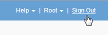

= Déconnexion du gestionnaire de grille
:allow-uri-read: 
:icons: font
:imagesdir: ../media/

[role="lead"]
Lorsque vous avez terminé de travailler avec le Gestionnaire de grille, vous devez vous déconnecter pour vous assurer que les utilisateurs non autorisés ne peuvent pas accéder au système StorageGRID. La fermeture de votre navigateur risque de ne pas vous déconnecter du système, en fonction des paramètres des cookies du navigateur.

.Étapes
. Repérez le lien *Déconnexion* dans le coin supérieur droit de l'interface utilisateur.
+

. Cliquez sur *Déconnexion*.
+
[cols="1a,1a"]
|===
| Option | Description 

 a| 
SSO non utilisé
 a| 
Vous êtes déconnecté du nœud d'administration.

La page de connexion de Grid Manager s'affiche.

*Remarque :* si vous vous êtes connecté à plusieurs nœuds d'administration, vous devez vous déconnecter de chaque nœud.

 a| 
SSO activé
 a| 
Vous êtes déconnecté de tous les nœuds d'administration auxquels vous accédiez. La page de connexion StorageGRID s'affiche. *Grid Manager* est répertorié comme valeur par défaut dans la liste déroulante *comptes récents* et le champ *ID compte* affiche 0.

*Remarque :* si SSO est activé et que vous êtes également connecté au Gestionnaire de tenant, vous devez également vous déconnecter du compte de tenant pour vous déconnecter de SSO.

|===

.Informations associées
link:configuring-sso.html["Configuration de l'authentification unique"]

link:../tenant/index.html["Utilisez un compte de locataire"]
