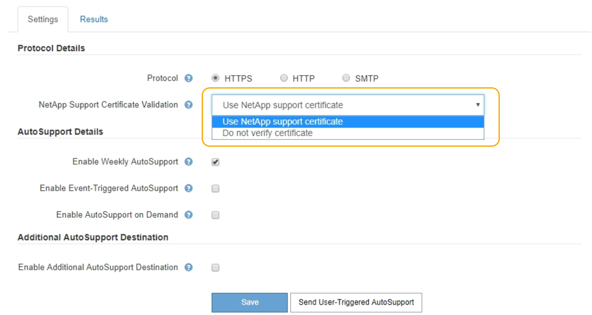

= Spécification du protocole des messages AutoSupport
:allow-uri-read: 
:icons: font
:imagesdir: ../media/

[role="lead"]
Vous pouvez utiliser l'un des trois protocoles pour envoyer des messages AutoSupport.

.Ce dont vous avez besoin
* Vous devez être connecté à Grid Manager à l'aide d'un navigateur pris en charge.
* Vous devez disposer de l'autorisation accès racine ou autre configuration grille.
* Si vous utilisez le protocole HTTPS ou HTTP pour l'envoi des messages AutoSupport, vous devez avoir fourni un accès Internet sortant au nœud d'administration principal, soit directement, soit à l'aide d'un serveur proxy (connexions entrantes non requises).
* Si vous utilisez le protocole HTTPS ou HTTP et que vous souhaitez utiliser un serveur proxy, vous devez avoir configuré un serveur proxy Admin.
* Si vous utilisez SMTP comme protocole pour les messages AutoSupport, vous devez avoir configuré un serveur de messagerie SMTP. La même configuration de serveur de messagerie est utilisée pour les notifications par e-mail d'alarme (système hérité).

.Description de la tâche
Vous pouvez envoyer des messages AutoSupport via l'un des protocoles suivants :

* *HTTPS* : il s'agit du paramètre par défaut et recommandé pour les nouvelles installations. Le protocole HTTPS utilise le port 443. Pour activer la fonctionnalité AutoSupport On Demand, vous devez utiliser le protocole HTTPS.
* *HTTP*: Ce protocole n'est pas sécurisé, sauf s'il est utilisé dans un environnement de confiance où le serveur proxy se convertit en HTTPS lors de l'envoi de données via Internet. Le protocole HTTP utilise le port 80.
* *SMTP*: Utilisez cette option si vous souhaitez que les messages AutoSupport soient envoyés par e-mail. Si vous utilisez SMTP comme protocole pour les messages AutoSupport, vous devez configurer un serveur de messagerie SMTP sur la page Configuration de l'e-mail héritée (*support* > *alarmes (hérité)* > *Configuration de l'e-mail héritée*).
+

NOTE: SMTP était le seul protocole disponible pour les messages AutoSupport avant la version de StorageGRID 11.2. Si vous avez installé une version antérieure de StorageGRID au départ, SMTP est peut-être le protocole sélectionné.

Le protocole que vous définissez permet d'envoyer tous les types de messages AutoSupport.

.Étapes
. Sélectionnez *support* > *Outils* > *AutoSupport*.
+
La page AutoSupport s'affiche et l'onglet *Paramètres* est sélectionné.

. Sélectionnez le protocole à utiliser pour envoyer des messages AutoSupport.
+

. Sélectionnez votre choix pour *validation de certificat de support NetApp*.
+
** Utilisez le certificat de support NetApp (par défaut) : la validation du certificat permet de sécuriser la transmission des messages AutoSupport. Le certificat de support NetApp est déjà installé avec le logiciel StorageGRID.
** Ne pas vérifier le certificat : sélectionnez cette option uniquement si vous avez une bonne raison de ne pas utiliser la validation de certificat, par exemple lorsqu'il y a un problème temporaire avec un certificat.

. Sélectionnez *Enregistrer*.
+
Tous les messages hebdomadaires, déclenchés par l'utilisateur et déclenchés par des événements sont envoyés à l'aide du protocole sélectionné.

.Informations associées
link:configuring-admin-proxy-settings.html["Configuration des paramètres du proxy d'administration"]
