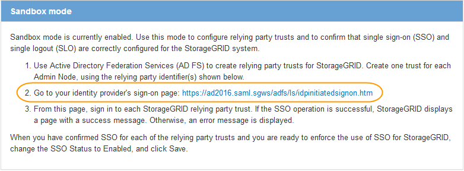

= Confiance de la partie qui fait confiance aux essais
:allow-uri-read: 
:icons: font
:imagesdir: ../media/

[role="lead"]
Avant d'appliquer l'utilisation de l'authentification unique (SSO) pour StorageGRID, vérifiez que l'authentification unique et la déconnexion unique (SLO) sont correctement configurées. Si vous avez créé une confiance en tiers pour chaque nœud d'administration, confirmez que vous pouvez utiliser SSO et SLO pour chaque nœud d'administration.

.Ce dont vous avez besoin
* Vous devez être connecté à Grid Manager à l'aide d'un navigateur pris en charge.
* Vous devez disposer d'autorisations d'accès spécifiques.
* Vous avez configuré une ou plusieurs fiducies de tiers de confiance dans AD FS.

.Étapes
. Sélectionnez *Configuration* > *contrôle d'accès* > *connexion unique*.
+
La page connexion unique s'affiche, avec l'option *Sandbox mode* sélectionnée.

. Dans les instructions pour le mode sandbox, recherchez le lien vers la page de connexion de votre fournisseur d'identités.
+
L'URL est dérivée de la valeur que vous avez saisie dans le champ *Nom du service fédéré*.

+

. Cliquez sur le lien ou copiez et collez l'URL dans un navigateur pour accéder à la page de connexion de votre fournisseur d'identités.
. Pour confirmer que vous pouvez utiliser l'authentification SSO pour vous connecter à StorageGRID, sélectionnez *connexion à l'un des sites suivants*, sélectionnez l'identifiant de partie de confiance pour votre nœud d'administration principal, puis cliquez sur *connexion*.
+
image::../media/sso_sandbox_mode_testing.gif[Test des approbations de parties utilisatrices en mode test SSO]

+
Vous devez entrer votre nom d'utilisateur et votre mot de passe.

. Entrez votre nom d'utilisateur et votre mot de passe fédérés.
+
** Si les opérations de connexion SSO et de déconnexion ont réussi, un message de réussite s'affiche.
+
image::../media/sso_sandbox_mode_sign_in_success.gif[Message de réussite de l'authentification SSO et du test de déconnexion]

** Si l'opération SSO échoue, un message d'erreur s'affiche. Corrigez le problème, effacez les cookies du navigateur et réessayez.

. Répétez les étapes précédentes pour confirmer que vous pouvez vous connecter à n'importe quel autre nœud d'administration.
+
Si toutes les opérations de connexion SSO et de déconnexion ont réussi, vous êtes prêt à activer SSO.

