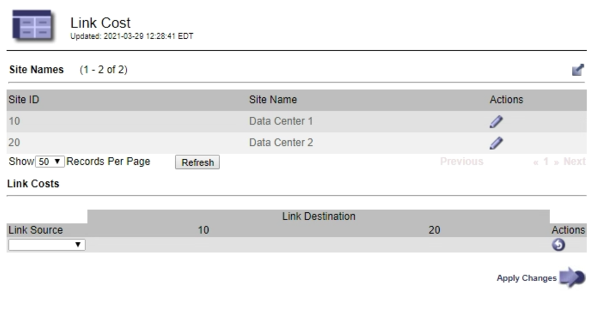

= Mise à jour des coûts de lien
:allow-uri-read: 
:icons: font
:imagesdir: ../media/

[role="lead"]
Vous pouvez mettre à jour les coûts de liaison entre les sites de data Center afin de refléter la latence entre les sites.

.Ce dont vous avez besoin
* Vous devez être connecté à Grid Manager à l'aide d'un navigateur pris en charge.
* Vous devez disposer de l'autorisation Configuration de la page de topologie de la grille.

.Étapes
. Sélectionnez *Configuration* > *Paramètres réseau* > *coût lien*.
+

. Sélectionnez un site sous *Link Source* et entrez une valeur de coût comprise entre 0 et 100 sous *Link destination*.
+
Vous ne pouvez pas modifier le coût du lien si la source est identique à la destination.

+
Pour annuler les modifications, cliquez sur *Retour*.

. Cliquez sur *appliquer les modifications*.

