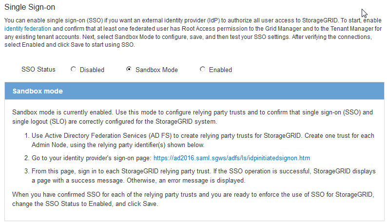

= Utilisation du mode sandbox
:allow-uri-read: 
:icons: font
:imagesdir: ../media/

[role="lead"]
Vous pouvez utiliser le mode sandbox pour configurer et tester les approbations de parties utilisatrices Active Directory Federation Services (AD FS) avant d'appliquer l'authentification unique (SSO) pour les utilisateurs StorageGRID. Une fois l'authentification SSO activée, vous pouvez réactiver le mode sandbox pour configurer ou tester les approbations nouvelles et existantes. La réactivation du mode sandbox désactive temporairement l'authentification SSO pour les utilisateurs StorageGRID.

.Ce dont vous avez besoin
* Vous devez être connecté à Grid Manager à l'aide d'un navigateur pris en charge.
* Vous devez disposer d'autorisations d'accès spécifiques.

.Description de la tâche
Lorsque SSO est activé et qu'un utilisateur tente de se connecter à un nœud d'administration, StorageGRID envoie une demande d'authentification à AD FS. À son tour, AD FS renvoie une réponse d'authentification à StorageGRID, indiquant si la demande d'autorisation a réussi. Pour les requêtes réussies, la réponse inclut un identificateur unique universel (UUID) pour l'utilisateur.

Pour permettre à StorageGRID (le fournisseur de services) et à AD FS (le fournisseur d'identité) de communiquer en toute sécurité au sujet des demandes d'authentification des utilisateurs, vous devez configurer certains paramètres dans StorageGRID. Ensuite, vous devez utiliser AD FS pour créer une confiance de partie de confiance pour chaque nœud d'administration. Enfin, vous devez revenir à StorageGRID pour activer le SSO.

Le mode sandbox facilite l'exécution de cette configuration et le test de tous vos paramètres avant l'activation de SSO.

NOTE: L'utilisation du mode sandbox est fortement recommandée, mais pas strictement nécessaire. Si vous êtes prêt à créer des approbations de tiers AD FS immédiatement après avoir configuré SSO dans StorageGRID, Vous n'avez pas besoin de tester les processus SSO et SLO (Single logout) pour chaque noeud d'administration, cliquez sur *Enabled*, saisissez les paramètres StorageGRID, créez une confiance de partie de confiance pour chaque noeud d'administration dans AD FS, puis cliquez sur *Save* pour activer SSO.

.Étapes
. Sélectionnez *Configuration* > *contrôle d'accès* > *connexion unique*.
+
La page connexion unique s'affiche, avec l'option *Disabled* sélectionnée.

+
image::../media/sso_status_disabled.gif[Page d'authentification unique avec statut SSO désactivé]

+

NOTE: Si les options d'état SSO ne s'affichent pas, confirmez que vous avez configuré Active Directory en tant que référentiel d'identité fédéré. Voir « exigences relatives à l'utilisation d'un seul signe ».

. Sélectionnez l'option *Sandbox mode*.
+
Les paramètres fournisseur d'identité et partie de confiance s'affichent. Dans la section Identity Provider, le champ *Service Type* est en lecture seule. Elle indique le type de service de fédération d'identités que vous utilisez (par exemple, Active Directory).

. Dans la section Identity Provider :
+
.. Entrez le nom du service de fédération, exactement tel qu'il apparaît dans AD FS.
+

NOTE: Pour localiser le nom du service de fédération, accédez à Windows Server Manager. Sélectionnez *Outils* > *AD FS Management*. Dans le menu action, sélectionnez *Modifier les propriétés du service de fédération*. Le nom du service de fédération est indiqué dans le second champ.

.. Indiquez si vous souhaitez utiliser TLS (transport Layer Security) pour sécuriser la connexion lorsque le fournisseur d'identité envoie des informations de configuration SSO en réponse aux requêtes StorageGRID.
+
*** *Utilisez le certificat CA du système d'exploitation* : utilisez le certificat CA par défaut installé sur le système d'exploitation pour sécuriser la connexion.
*** *Utilisez un certificat d'autorité de certification personnalisé* : utilisez un certificat d'autorité de certification personnalisé pour sécuriser la connexion.
+
Si vous sélectionnez ce paramètre, copiez et collez le certificat dans la zone de texte *certificat CA*.

*** *N'utilisez pas TLS*: N'utilisez pas de certificat TLS pour sécuriser la connexion.

. Dans la section partie utilisatrice, spécifiez l'identifiant de partie utilisatrice que vous utiliserez pour les nœuds Admin StorageGRID lorsque vous configurez des approbations de partie utilisatrice.
+
** Par exemple, si votre grid ne comporte qu'un seul nœud d'administration et que vous n'prévoyez pas d'ajouter de nœuds d'administration à l'avenir, entrez `SG` ou `StorageGRID`.
** Si votre grid inclut plusieurs nœuds d'administration, incluez la chaîne `[HOSTNAME]` dans l'identificateur. Par exemple : `SG-[HOSTNAME]`. Cela génère une table qui inclut un identifiant de partie de confiance pour chaque nœud d'administration, en fonction du nom d'hôte du nœud. + REMARQUE : vous devez créer une confiance en tiers pour chaque nœud d'administration de votre système StorageGRID. Le fait d'avoir une confiance de partie de confiance pour chaque nœud d'administration permet aux utilisateurs de se connecter et de se déconnecter en toute sécurité à n'importe quel nœud d'administration.

+
image::../media/sso_status_sandbox_mode.gif[Authentification unique,Sandbox mode enabled,Relying party identifiers shown for several Admin Nodes]

. Cliquez sur *Enregistrer*.
+
** Une coche verte apparaît sur le bouton *Save* pendant quelques secondes.
+
image::../media/save_button_green_checkmark.gif[Bouton Enregistrer avec une coche verte]

** L'avis de confirmation du mode Sandbox s'affiche, confirmant que le mode sandbox est à présent activé. Vous pouvez utiliser ce mode pendant que vous utilisez AD FS pour configurer une confiance de tiers de confiance pour chaque nœud d'administration et tester les processus d'ouverture de session unique (SSO) et de déconnexion unique (SLO).
+

.Informations associées
link:requirements-for-sso.html["Conditions requises pour l'utilisation de l'authentification unique"]
