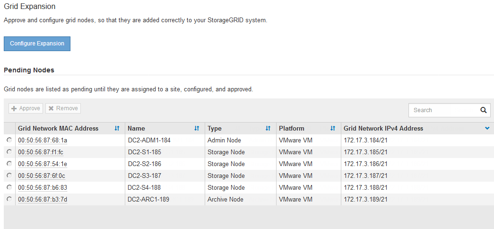
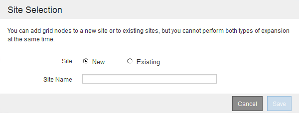

= Réalisation de l'extension
:allow-uri-read: 
:icons: font
:imagesdir: ../media/

[role="lead"]
Lorsque vous effectuez l'extension, des nœuds grid sont ajoutés à votre déploiement StorageGRID existant.

.Ce dont vous avez besoin
* Vous devez être connecté à Grid Manager à l'aide d'un navigateur pris en charge.
* Vous devez disposer de l'autorisation Maintenance ou accès racine.
* Vous devez disposer de la phrase secrète pour le provisionnement.
* Vous devez avoir déployé tous les nœuds grid qui sont ajoutés dans cette extension.
* Si vous ajoutez des nœuds de stockage, vous devez avoir vérifié que toutes les opérations de réparation de données sont terminées dans le cadre d'une restauration. Voir les étapes de vérification des travaux de réparation de données dans les instructions de récupération et de maintenance.
* Si vous ajoutez un site, vous devez vérifier et mettre à jour les règles ILM avant de lancer la procédure d'extension afin de vous assurer que les copies d'objets ne sont pas stockées sur le nouveau site tant que l'extension n'est pas terminée. Par exemple, si une règle utilise le pool de stockage par défaut (tous les nœuds de stockage), vous devez créer un nouveau pool de stockage contenant uniquement les nœuds de stockage existants et mettre à jour la règle ILM pour utiliser le nouveau pool de stockage. Sinon, les objets seront copiés sur le nouveau site dès que le premier nœud de ce site devient actif. Voir les instructions de gestion des objets avec la gestion du cycle de vie des informations.

.Description de la tâche
L'extension comprend les phases suivantes :

. Vous configurez l'extension en spécifiant si vous ajoutez de nouveaux nœuds de grille ou un nouveau site et en approuvant les nœuds de grille que vous souhaitez ajouter.
. Vous démarrez l'extension.
. Pendant que le processus d'extension est en cours d'exécution, vous téléchargez un nouveau fichier de progiciel de restauration.
. Vous surveillez l'état des tâches de configuration de la grille qui s'exécutent automatiquement. L'ensemble des tâches dépend des types de nœuds de grille ajoutés et de l'ajout ou non d'un nouveau site.
+

IMPORTANT: L'exécution de certaines tâches sur un grand réseau peut prendre beaucoup de temps. Par exemple, si la base de données Cassandra est relativement vide, vous pouvez transmettre Cassandra vers un nouveau nœud de stockage. Cependant, si la base de données Cassandra inclut un volume important de métadonnées d'objet, cette étape peut prendre plusieurs heures, voire plus. Vous pouvez examiner le pourcentage "en étoile" indiqué lors de l'étape "définir Cassandra et les données en streaming" afin de déterminer l'ensemble de l'opération de diffusion en continu Cassandra.

.Étapes
. Sélectionnez *Maintenance* > *tâches de maintenance* > *expansion*.
+
La page d'extension de la grille s'affiche. La section nœuds en attente répertorie tous les nœuds prêts à être ajoutés.

+

. Cliquez sur *configurer l'extension*.
+
La boîte de dialogue sélection du site s'affiche.

+

. Sélectionnez le type d'expansion que vous commencez :
+
** Si vous ajoutez un nouveau site, sélectionnez *Nouveau* et entrez le nom du nouveau site.
** Si vous ajoutez des nœuds de grille à un site existant, sélectionnez *existing*.

. Cliquez sur *Enregistrer*.
. Consultez la liste *nœuds en attente* et vérifiez qu'elle affiche tous les nœuds de la grille que vous avez déployés.
+
Si nécessaire, vous pouvez passer le curseur sur l'adresse MAC réseau * d'un nœud pour afficher des détails sur ce nœud.

+
image::../media/grid_node_details.gif[Capture d'écran des détails du nœud de grille]

+

NOTE: Si un nœud de grid n'est pas inclus, vérifiez qu'il a été déployé correctement.

. Dans la liste des nœuds en attente, approuvez les nœuds de la grille pour cette extension.
+
.. Sélectionnez le bouton radio à côté du premier nœud de grille en attente que vous souhaitez approuver.
.. Cliquez sur *approuver*.
+
Le formulaire de configuration des nœuds de la grille s'affiche.

+
image::../media/grid_node_configuration.gif[Formulaire Configuration du nœud de grille]

.. Si nécessaire, modifiez les paramètres généraux :
+
*** *Site* : nom du site auquel le nœud de la grille sera associé. Si vous ajoutez plusieurs nœuds, veillez à sélectionner le site approprié pour chaque nœud. Si vous ajoutez un site, tous les nœuds sont ajoutés au nouveau site.
*** *Nom* : le nom d'hôte qui sera affecté au nœud et le nom qui sera affiché dans le Gestionnaire de grille.
*** *NTP role* : rôle NTP (Network Time Protocol) du noeud de la grille. Les options sont *automatique*, *primaire* et *client*. Si vous sélectionnez *automatique*, le rôle principal est attribué aux nœuds d'administration, aux nœuds de stockage avec services ADC, aux nœuds de passerelle et à tous les nœuds de grille ayant des adresses IP non statiques. Le rôle client est attribué à tous les autres nœuds de la grille.
+

NOTE: Attribuez le rôle NTP principal à au moins deux nœuds de chaque site. Ceci fournit un accès système redondant aux sources de synchronisation externes.

*** *Service ADC* (nœuds de stockage uniquement) : indique si ce nœud de stockage exécutera le service contrôleur de domaine administratif (ADC). Le service ADC conserve le suivi de l'emplacement et de la disponibilité des services de réseau. Au moins trois nœuds de stockage de chaque site doivent inclure le service ADC. Vous ne pouvez pas ajouter le service ADC à un nœud après son déploiement.
+
**** Si vous ajoutez ce noeud pour remplacer un noeud de stockage, sélectionnez *Oui* si le noeud que vous remplacez inclut le service ADC. Comme vous ne pouvez pas désaffecter un nœud de stockage si trop peu de services ADC restent, cela garantit qu'un nouveau service ADC est disponible avant la suppression de l'ancien service.
**** Sinon, sélectionnez *automatique* pour permettre au système de déterminer si ce nœud nécessite le service ADC. Découvrez le quorum ADC dans les instructions de récupération et de maintenance.

.. Si nécessaire, modifiez les paramètres du réseau Grid, du réseau Admin et du réseau client.
+
*** *Adresse IPv4 (CIDR)* : adresse réseau CIDR pour l'interface réseau. Par exemple : 172.16.10.100/24
*** *Gateway* : passerelle par défaut du noeud de la grille. Par exemple : 172.16.10.1
*** *Sous-réseaux (CIDR)* : un ou plusieurs sous-réseaux pour le réseau Admin.

.. Cliquez sur *Enregistrer*.
+
Le nœud de grille approuvé passe à la liste nœuds approuvés.

+
image::../media/grid_expansion_approved_nodes.png[Capture d'écran affichant les nœuds approuvés]

+
*** Pour modifier les propriétés d'un nœud de grille approuvé, sélectionnez son bouton radio, puis cliquez sur *Modifier*.
*** Pour déplacer un nœud de grille approuvé vers la liste nœuds en attente, sélectionnez son bouton d'option, puis cliquez sur *Réinitialiser*.
*** Pour supprimer définitivement un nœud de grille approuvé, mettez le nœud hors tension. Sélectionnez ensuite son bouton radio, puis cliquez sur *Supprimer*.

.. Répétez ces étapes pour chaque nœud de grille en attente à approuver.
+

NOTE: Si possible, vous devez approuver toutes les notes de grille en attente et effectuer une extension unique. Plus de temps sera nécessaire si vous réalisez plusieurs petits expansions.

. Lorsque vous avez approuvé tous les nœuds de la grille, saisissez la phrase de passe *Provisioning*, puis cliquez sur *Expand*.
+
Au bout de quelques minutes, cette page se met à jour pour afficher l'état de la procédure d'extension. Lorsque des tâches affectant un nœud de grille individuel sont en cours, la section État du nœud de grille répertorie l'état actuel de chaque nœud de grille.

+

NOTE: Au cours de ce processus, le programme d'installation de l'appliance StorageGRID indique que l'installation passe de la phase 3 à la phase 4, finalise l'installation. Une fois l'étape 4 terminée, le contrôleur est redémarré.

+

+

NOTE: L'extension de site inclut une tâche supplémentaire pour configurer Cassandra pour le nouveau site.

. Dès que le lien *Download Recovery Package* apparaît, téléchargez le fichier Recovery Package.
+
Vous devez télécharger une copie mise à jour du fichier du pack de récupération dès que possible après avoir apporté des modifications de topologie de grille au système StorageGRID. Le fichier du progiciel de récupération vous permet de restaurer le système en cas de défaillance.

+
.. Cliquez sur le lien de téléchargement.
.. Saisissez le mot de passe de provisionnement, puis cliquez sur *Démarrer le téléchargement*.
.. Une fois le téléchargement terminé, ouvrez le `.zip` et confirmer qu'il inclut un `gpt-backup` et a `_SAID.zip` fichier. Ensuite, extrayez le `_SAID.zip` fichier, accédez à `/GID*_REV*` et confirmez que vous pouvez ouvrir le `passwords.txt` fichier.
.. Copiez le fichier téléchargé du package de récupération (.zip) dans deux emplacements sécurisés et distincts.
+

IMPORTANT: Le fichier du progiciel de récupération doit être sécurisé car il contient des clés de cryptage et des mots de passe qui peuvent être utilisés pour obtenir des données du système StorageGRID.

. Si vous ajoutez un ou plusieurs nœuds de stockage, surveillez la progression de l'étape « envoi de Cassandra et de données en streaming » en consultant le pourcentage affiché dans le message d'état.
+
image::../media/grid_expansion_starting_cassandra.png[Extension de grille > démarrage de Cassandra et du streaming de données]

+
Ce pourcentage estime que le streaming Cassandra est complet, en fonction du volume total de données Cassandra disponibles et du volume qui a déjà été écrit sur le nouveau nœud.

+

IMPORTANT: Ne redémarrez aucun nœud de stockage au cours de l'étape 4 (démarrage des services sur les nouveaux nœuds de la grille). L'étape « Enregistrer Cassandra et transmettre des données » peut prendre des heures pour chaque nouveau nœud de stockage, en particulier si les nœuds de stockage existants contiennent une grande quantité de métadonnées d'objet.

. Continuez à surveiller l'extension jusqu'à ce que toutes les tâches soient terminées et que le bouton *Configure expansion* réapparaît.

.Une fois que vous avez terminé
En fonction des types de nœuds de la grille que vous avez ajoutés, vous devez effectuer des étapes d'intégration et de configuration supplémentaires.

.Informations associées
link:../ilm/index.html["Gestion des objets avec ILM"]

link:../maintain/index.html["Maintenance et récupération"]

link:configuring-expanded-storagegrid-system.html["Configuration de votre système StorageGRID étendu"]
