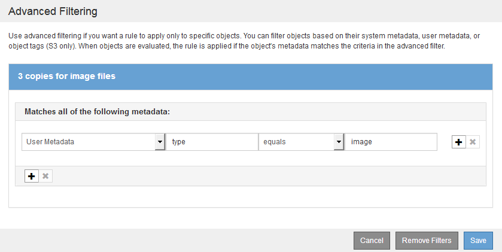

= Exemple 3 : règles et règles ILM pour une meilleure protection des fichiers image
:allow-uri-read: 
:icons: font
:imagesdir: ../media/

[role="lead"]
Vous pouvez utiliser les exemples de règles et de règles suivants pour vous assurer que les images de plus de 200 Ko sont codées par effacement et que trois copies sont faites d'images plus petites.

CAUTION: Les règles et règles ILM suivantes ne sont que des exemples. Les règles ILM sont nombreuses. Avant d'activer une nouvelle stratégie, simulez la stratégie proposée pour confirmer qu'elle fonctionnera comme destinée à protéger le contenu contre la perte.

== Règle ILM 1 par exemple 3 : utilisez le code d'effacement pour des fichiers image de plus de 200 Ko

Cet exemple de règle ILM utilise un filtrage avancé pour code d'effacement de tous les fichiers image de plus de 200 Ko.

[cols="1a,2a"]
|===
| Définition de règle | Exemple de valeur 

 a| 
Nom de la règle
 a| 
Fichiers image EC > 200 Ko

 a| 
Heure de référence
 a| 
Temps d'ingestion

 a| 
Filtrage avancé pour les métadonnées utilisateur
 a| 
Le type de métadonnées utilisateur est égal aux fichiers image

 a| 
Filtrage avancé pour la taille de l'objet
 a| 
Taille de l'objet (Mo) supérieure à 0.2

 a| 
Placement de contenu
 a| 
Créez une copie avec code d'effacement 2+1 sur trois sites

|===
image:../media/policy_3_rule_1_ec_images_adv_filtering.gif["Règle ILM 1 par exemple 3 : utilisez le code d'effacement pour des fichiers image de plus de 200 Ko"]

Comme cette règle est configurée comme première règle de la règle, l'instruction de placement de code d'effacement s'applique uniquement aux images dont la taille est supérieure à 200 Ko.

image::../media/policy_2_rule_1_ec_objects_placements.png[Règle ILM 1 par exemple 3 : utilisez le code d'effacement pour des fichiers image de plus de 200 Ko]

== Règle ILM 2, par exemple 3 : réplication de 3 copies pour tous les fichiers d'image restants

Cet exemple de règle ILM utilise un filtrage avancé pour spécifier la réplication des fichiers images.

[cols="1a,2a"]
|===
| Définition de règle | Exemple de valeur 

 a| 
Nom de la règle
 a| 
3 copies pour les fichiers image

 a| 
Heure de référence
 a| 
Temps d'ingestion

 a| 
Filtrage avancé pour les métadonnées utilisateur
 a| 
Le type de métadonnées utilisateur est égal aux fichiers image

 a| 
Placement de contenu
 a| 
Créez 3 copies répliquées dans tous les nœuds de stockage

|===

Comme la première règle de la stratégie a déjà comparé des fichiers d'images de plus de 200 Ko, ces instructions de positionnement s'appliquent uniquement aux fichiers d'images de 200 Ko ou moins.

image::../media/policy_3_rule_2_copies_for_images_placements.png[Règle ILM 2, par exemple 3 : réplication de 3 copies pour tous les fichiers d'image restants]

== Règle ILM, par exemple 3 : meilleure protection des fichiers image

Dans cet exemple, la règle ILM utilise trois règles ILM pour créer une règle qui code d'effacement des fichiers images de plus de 200 Ko (0.2 Mo), crée des copies répliquées pour les fichiers image de 200 Ko ou plus et crée deux copies répliquées pour les fichiers non images.

Cet exemple de politique ILM comprend des règles qui effectuent les tâches suivantes :

* Code d'effacement tous les fichiers image de plus de 200 Ko.
* Créez trois copies de tous les fichiers d'image restants (c'est-à-dire des images de 200 Ko ou moins).
* Appliquez la règle par défaut à tous les objets restants (c'est-à-dire tous les fichiers non images).

image::../media/policy_3_configured_policy.gif[Règle ILM, par exemple 3 : meilleure protection des fichiers image]
