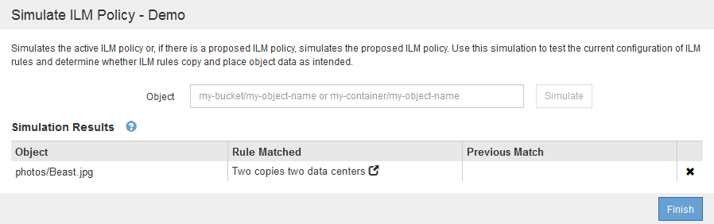

= Exemples de simulation des règles ILM
:allow-uri-read: 
:icons: font
:imagesdir: ../media/

[role="lead"]
Ces exemples montrent comment vérifier les règles ILM en simulant la règle ILM avant de l'activer.

== Exemple 1 : vérification des règles lors de la simulation d'une politique ILM proposée

Cet exemple montre comment vérifier des règles lors de la simulation d'une règle proposée.

Dans cet exemple, la *exemple de règle ILM* est simulée contre les objets ingérés dans deux compartiments. La politique comprend trois règles, comme suit :

* La première règle, *deux copies, deux ans pour le compartiment a*, ne s'applique qu'aux objets du compartiment a.
* La seconde règle, menu:EC objects[1 Mo], s'applique à tous les compartiments, mais aux filtres sur des objets supérieurs à 1 Mo.
* La troisième règle est la règle par défaut et n'inclut aucun filtre.

image::../media/saved_policy_for_simulation.png[Stratégie enregistrée pour la simulation]

.Étapes
. Après avoir ajouté les règles et enregistré la stratégie, cliquez sur *Simulate*.
+
La boîte de dialogue Simulate ILM Policy s'affiche.

. Dans le champ *Object*, saisissez la clé de rubrique/objet S3 ou le nom-objet/conteneur Swift pour un objet test, puis cliquez sur *Simulate*.
+
Les résultats de la simulation s'affichent, indiquant quelle règle dans la stratégie correspond à chaque objet testé.

+
image::../media/simulate_policy_screen.png[Écran simuler la police]

. Confirmez que chaque objet a été mis en correspondance par la règle correcte.
+
Dans cet exemple :

+
.. `bucket-a/bucket-a object.pdf` correspondance correcte de la première règle, qui filtre les objets dans `bucket-a`.
.. `bucket-b/test object greater than 1 MB.pdf` est dans `bucket-b`, il ne correspond donc pas à la première règle. Au lieu de cela, il a été correctement mis en correspondance par la deuxième règle, qui filtre les objets de plus de 1 Mo.
.. `bucket-b/test object less than 1 MB.pdf` ne correspond pas aux filtres des deux premières règles. il sera donc placé par la règle par défaut, qui ne comprend aucun filtre.

== Exemple 2 : réorganisation des règles lors de la simulation d'une politique ILM proposée

Cet exemple montre comment vous pouvez réorganiser les règles pour modifier les résultats lors de la simulation d'une règle.

Dans cet exemple, la politique *Demo* est en cours de simulation. Cette règle, qui vise à trouver des objets qui ont des métadonnées utilisateur série=x-men, comprend trois règles, comme suit :

* La première règle, *PNG*, filtre les noms de clé qui se terminent dans `.png`.
* La deuxième règle, *X-men*, ne s'applique qu'aux objets pour le locataire A et les filtres pour `series=x-men` métadonnées d'utilisateur.
* La dernière règle, *deux copies deux centres de données*, est la règle par défaut, qui correspond à tous les objets qui ne correspondent pas aux deux premières règles.

image::../media/simulate_reorder_rules_pngs_rule.png[Exemple 2 : réorganisation des règles lors de la simulation d'une politique ILM proposée]

.Étapes
. Après avoir ajouté les règles et enregistré la stratégie, cliquez sur *Simulate*.
. Dans le champ *Object*, saisissez la clé de rubrique/objet S3 ou le nom-objet/conteneur Swift pour un objet test, puis cliquez sur *Simulate*.
+
Les résultats de la simulation s'affichent, indiquant que `Havok.png` L'objet a été associé à la règle *PNG*.

+
image::../media/simulate_reorder_rules_pngs_result.gif[Exemple 2 : réorganisation des règles lors de la simulation d'une politique ILM proposée]

+
Toutefois, la règle que le `Havok.png` L'objet était destiné à tester était la règle *X-Men*.

. Pour résoudre le problème, réorganisez les règles.
+
.. Cliquez sur *Terminer* pour fermer la page simuler la politique ILM.
.. Cliquez sur *Modifier* pour modifier la stratégie.
.. Faites glisser la règle *X-men* en haut de la liste.
+
image::../media/simulate_reorder_rules_correct_rule.png[Simuler - Réordonner les règles - règle correcte]

.. Cliquez sur *Enregistrer*.

. Cliquez sur *Simulate*.
+
Les objets que vous avez testés précédemment sont réévalués par rapport à la règle mise à jour et les nouveaux résultats de simulation sont affichés. Dans l'exemple, la colonne règle mise en correspondance indique que `Havok.png` L'objet correspond désormais à la règle des métadonnées X-men, comme prévu. La colonne comparaison précédente indique que la règle des CNG correspond à l'objet dans la simulation précédente.

+
image::../media/simulate_reorder_rules_correct_result.gif[Exemple 2 : réorganisation des règles lors de la simulation d'une politique ILM proposée]

+

NOTE: Si vous restez sur la page configurer les stratégies, vous pouvez simuler une stratégie après avoir effectué des modifications sans avoir à saisir à nouveau les noms des objets de test.

== Exemple 3 : correction d'une règle lors de la simulation d'une politique ILM proposée

Cet exemple montre comment simuler une stratégie, corriger une règle dans la règle et poursuivre la simulation.

Dans cet exemple, la politique *Demo* est en cours de simulation. Cette politique a pour but de trouver des objets qui ont `series=x-men` métadonnées d'utilisateur. Toutefois, des résultats inattendus se sont produits lors de la simulation de cette politique contre le `Beast.jpg` objet. Au lieu de faire correspondre la règle de métadonnées X-Men, l'objet correspond à la règle par défaut, deux copies de deux centres de données.

Lorsqu'un objet test n'est pas associé à la règle attendue de la stratégie, vous devez examiner chaque règle de la stratégie et corriger les erreurs éventuelles.

.Étapes
. Pour chaque règle de la stratégie, affichez les paramètres de la règle en cliquant sur le nom de la règle ou sur l'icône plus de détails image:../media/icon_nms_more_details.gif["icône plus de détails"] dans n'importe quelle boîte de dialogue où la règle est affichée.
. Vérifiez le compte de locataire de la règle, l'heure de référence et les critères de filtrage.
+
Dans cet exemple, les métadonnées de la règle X-men comportent une erreur. La valeur des métadonnées a été saisie comme « x-men1 » au lieu de « x-men ».

+
image::../media/simulate_rules_select_rule_popup_with_wrong_metadata.png[Exemple 3 : correction d'une règle lors de la simulation d'une politique ILM proposée]

. Pour résoudre l'erreur, corrigez la règle comme suit :
+
** Si la règle fait partie de la stratégie proposée, vous pouvez soit cloner la règle, soit supprimer la règle de la stratégie, puis la modifier.
** Si la règle fait partie de la stratégie active, vous devez cloner la règle. Vous ne pouvez pas modifier ou supprimer une règle de la stratégie active.
+
[cols="1a,3a"]
|===
| Option | Description 

 a| 
Clonage de la règle
 a| 
... Sélectionnez *ILM* > *règles*.
... Sélectionnez la règle incorrecte, puis cliquez sur *Clone*.
... Modifiez les informations incorrectes, puis cliquez sur *Enregistrer*.
... Sélectionnez *ILM* > *stratégies*.
... Sélectionnez la stratégie proposée, puis cliquez sur *Modifier*.
... Cliquez sur *Sélectionner les règles*.
... Cochez la case de la nouvelle règle, décochez la case de la règle d'origine et cliquez sur *appliquer*.
... Cliquez sur *Enregistrer*.

 a| 
Modification de la règle
 a| 
... Sélectionnez la stratégie proposée, puis cliquez sur *Modifier*.
... Cliquez sur l'icône Supprimer image:../media/icon_nms_delete_new.gif["icône supprimer"] Pour supprimer la règle incorrecte, puis cliquez sur *Enregistrer*.
... Sélectionnez *ILM* > *règles*.
... Sélectionnez la règle incorrecte, puis cliquez sur *Modifier*.
... Modifiez les informations incorrectes, puis cliquez sur *Enregistrer*.
... Sélectionnez *ILM* > *stratégies*.
... Sélectionnez la stratégie proposée, puis cliquez sur *Modifier*.
... Sélectionnez la règle corrigée, cliquez sur *appliquer* et cliquez sur *Enregistrer*.

|===

. Exécuter à nouveau la simulation.
+

NOTE: Comme vous avez navigué loin de la page ILM Policies pour modifier la règle, les objets que vous avez précédemment saisis pour la simulation ne sont plus affichés. Vous devez saisir à nouveau les noms des objets.

+
Dans cet exemple, la règle X-men corrigée correspond maintenant à l' `Beast.jpg` objet basé sur `series=x-men` les métadonnées d'utilisateur, comme prévu.

+
image::../media/simulate_results_for_object_corrected_metadata.gif[Exemple 3 : correction d'une règle lors de la simulation d'une politique ILM proposée]

