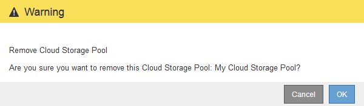

= Suppression d'un pool de stockage cloud
:allow-uri-read: 
:icons: font
:imagesdir: ../media/

[role="lead"]
Vous pouvez supprimer un pool de stockage cloud qui n'est pas utilisé dans une règle ILM et qui ne contient pas de données d'objet.

.Ce dont vous avez besoin
* Vous devez être connecté à Grid Manager à l'aide d'un navigateur pris en charge.
* Vous devez disposer d'autorisations d'accès spécifiques.
* Vous avez confirmé que le compartiment S3 ou le conteneur Azure ne contient aucun objet. Une erreur se produit si vous tentez de supprimer un pool de stockage cloud s'il contient des objets. Voir « Dépannage des pools de stockage cloud ».
+

NOTE: Lorsque vous créez un pool de stockage cloud, StorageGRID écrit un fichier de marqueur vers le compartiment ou le conteneur pour l'identifier comme un pool de stockage cloud. Ne supprimez pas ce fichier, qui est nommé `x-ntap-sgws-cloud-pool-uuid`.

* Vous avez déjà supprimé toutes les règles ILM susceptibles d'avoir utilisé le pool.

.Étapes
. Sélectionnez *ILM* > *pools de stockage*.
+
La page Storage pools s'affiche.

. Sélectionnez le bouton radio d'un pool de stockage cloud qui n'est pas actuellement utilisé dans une règle ILM.
+
Vous ne pouvez pas supprimer un pool de stockage cloud s'il est utilisé dans une règle ILM. Le bouton *Supprimer* est désactivé.

+
image::../media/cloud_storage_pool_used_in_ilm_rule.png[Pool de stockage cloud utilisé dans la règle ILM]

. Cliquez sur *Supprimer*.
+
Un avertissement de confirmation s'affiche.

+

. Cliquez sur *OK*.
+
Le pool de stockage cloud est supprimé.

.Informations associées
link:troubleshooting-cloud-storage-pools.html["Résolution des problèmes avec les pools de stockage cloud"]
