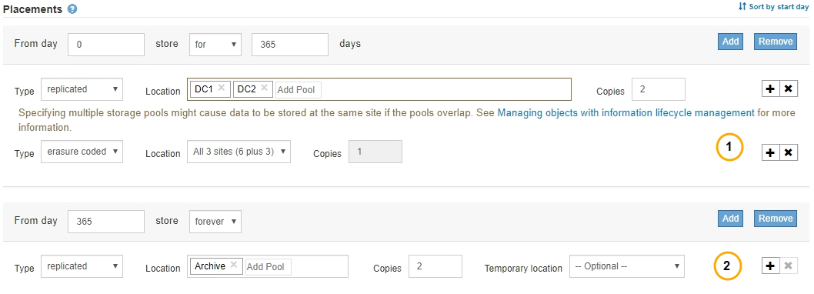

= Instructions de placement de règles ILM
:allow-uri-read: 
:icons: font
:imagesdir: ../media/

[role="lead"]
Les instructions de placement déterminent l'emplacement, le moment et le mode de stockage des données objet. Une règle ILM peut inclure une ou plusieurs instructions de placement. Chaque instruction de placement s'applique à une seule période de temps.

Lorsque vous créez une instruction de placement, vous indiquez quand le placement s'applique (période), quel type de copies créer (répliquées ou code d'effacement) et où stocker les copies (un ou plusieurs emplacements de stockage). Dans une seule règle, vous pouvez spécifier plusieurs placements pour une période et des instructions de placement pour plusieurs périodes :

* Pour spécifier plusieurs emplacements d'objets au cours d'une période unique, cliquez sur l'icône plus image:../media/icon_plus_sign_black_on_white.gif["Icône signe plus Noir sur blanc"] pour ajouter plusieurs lignes pour cette période.
* Pour spécifier les placements d'objets pour plusieurs périodes, cliquez sur le bouton *Ajouter* pour ajouter la période suivante. Spécifiez ensuite une ou plusieurs lignes dans la période.

L'exemple montre la page définir des Placements de l'assistant Créer une règle ILM.

[cols="1a,3a"]
|===

 a| 
image:../media/icon_number_1.png["icône numéro 1"]
 a| 
La première instruction de placement comporte deux lignes pour la première année :

. La première ligne crée deux copies d'objets répliquées sur deux sites de data Center.
. La seconde ligne crée une copie avec code d'effacement de 6 + 3 sur trois sites de data Center.

 a| 
image:../media/icon_number_2.png["icône numéro 2"]
 a| 
La seconde instruction de placement crée deux copies archivées au bout d'un an et les conserve indéfiniment.

|===
Lorsque vous définissez l'ensemble des instructions de placement pour une règle, vous devez vous assurer qu'au moins une instruction de placement commence au jour 0, qu'il n'y a pas d'écart entre les périodes que vous avez définies, et que l'instruction de placement final continue soit indéfiniment ou jusqu'à ce que vous n'ayez plus besoin de copies d'objet.

À chaque expiration de la règle, les instructions de placement de contenu pour la période suivante sont appliquées. De nouvelles copies d'objet sont créées et les copies inutiles sont supprimées.
