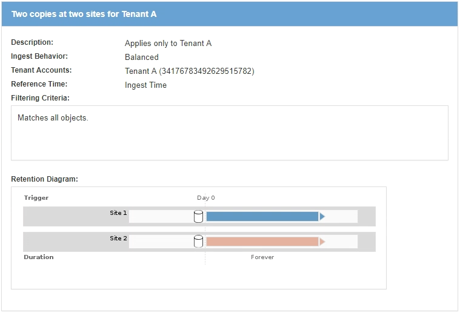

= Définition d'une règle ILM
:allow-uri-read: 
:icons: font
:imagesdir: ../media/

[role="lead"]
Pour gérer les objets, vous créez un ensemble de règles de gestion du cycle de vie des informations (ILM) et vous les organisez en une règle ILM. Chaque objet ingéré dans le système est évalué par rapport à la règle active. Lorsqu'une règle de règle correspond aux métadonnées d'un objet, les instructions de la règle déterminent les actions qu'effectue StorageGRID pour copier et stocker cet objet.

Les règles ILM définissent :

* Les objets à stocker. Une règle peut s'appliquer à tous les objets ou vous pouvez spécifier des filtres pour identifier les objets auxquels une règle s'applique. Par exemple, une règle ne peut s'appliquer qu'aux objets associés à certains comptes de locataire, à des compartiments S3 spécifiques, à des conteneurs Swift ou à des valeurs de métadonnées spécifiques.
* Type et emplacement de stockage. Les objets peuvent être stockés sur des nœuds de stockage, dans des pools de stockage cloud ou sur des nœuds d'archivage.
* Le type de copie d'objet effectuée. Les copies peuvent être répliquées ou codées en fonction de l'effacement.
* Pour les copies répliquées, le nombre de copies effectuées.
* Pour les copies avec code d'effacement, le schéma de code d'effacement utilisé.
* Évolution au fil du temps vers l'emplacement de stockage et le type de copies d'un objet
* La protection des données objet lors de l'ingestion des objets dans la grille (placement synchrone ou double allocation).

Les métadonnées d'objet ne sont pas gérées par les règles ILM. Les métadonnées d'objet sont stockées dans la base de données Cassandra, dans ce qu'on appelle un magasin de métadonnées. Trois copies des métadonnées des objets sont automatiquement conservées sur chaque site afin de protéger les données contre les pertes. Les copies sont réparties de manière homogène entre tous les nœuds de stockage.

== Éléments d'une règle ILM

Une règle ILM comporte trois éléments :

* *Critères de filtrage* : les filtres de base et avancés d'une règle définissent les objets auxquels la règle s'applique. Si un objet correspond à tous les filtres, StorageGRID applique la règle et crée les copies d'objet spécifiées dans les instructions de placement de la règle.
* *Instructions de placement* : les instructions de placement d'une règle définissent le nombre, le type et l'emplacement des copies d'objet. Chaque règle peut inclure une séquence d'instructions de placement pour modifier le nombre, le type et l'emplacement des copies d'objet au fil du temps. À l'expiration de la période de temps pour un placement, les instructions du placement suivant sont automatiquement appliquées par l'évaluation ILM suivante.
* *Comportement d'ingestion* : le comportement d'entrée d'une règle définit ce qui se passe lorsqu'un client S3 ou Swift enregistre un objet dans la grille. Le comportement d'ingestion détermine si les copies d'objet sont immédiatement placées conformément aux instructions de la règle, ou si des copies intermédiaires sont effectuées et que les instructions de placement sont appliquées ultérieurement.

== Exemple de règle ILM

Cet exemple de règle ILM s'applique aux objets appartenant au locataire A. Il effectue deux copies répliquées de ces objets et stocke chaque copie sur un autre site. Les deux copies sont conservées « pour toujours », ce qui signifie que StorageGRID ne les supprimera pas automatiquement. À la place, StorageGRID les conserve jusqu'à leur suppression par une demande de suppression de client ou avant l'expiration d'un cycle de vie de compartiment.

Cette règle utilise l'option équilibrée pour le comportement d'ingestion : l'instruction de placement sur deux sites est appliquée dès que le locataire A enregistre un objet dans StorageGRID, à moins qu'il ne soit pas possible de faire immédiatement les deux copies nécessaires. Par exemple, si le site 2 est injoignable lorsque le locataire A enregistre un objet, StorageGRID effectue deux copies provisoires sur les nœuds de stockage du site 1. Dès que le site 2 sera disponible, StorageGRID effectuera la copie requise sur ce site.

.Informations associées
link:data-protection-options-for-ingest.html["Options de protection des données pour l'ingestion"]

link:what-storage-pool-is.html["Qu'est-ce qu'un pool de stockage"]

link:what-cloud-storage-pool-is.html["Définition d'un pool de stockage cloud"]

link:how-objects-are-stored-replication-erasure-coding.html["Le mode de stockage des objets (réplication ou code d'effacement)"]

link:what-ilm-rule-filtering-is.html["Définition du filtrage des règles ILM"]

link:what-ilm-placement-instructions-are.html["Instructions de placement de règles ILM"]
