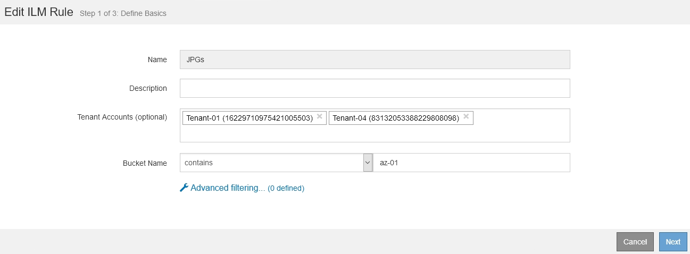

= Utilisation des règles ILM et des règles ILM
:allow-uri-read: 
:icons: font
:imagesdir: ../media/

[role="lead"]
Une fois que vous avez créé des règles ILM et une règle ILM, vous pouvez continuer à travailler avec elles, en modifiant leur configuration au fur et à mesure de l'évolution de vos besoins en stockage.

== Suppression d'une règle ILM

Pour que la liste des règles ILM actuelles puisse être gérée, supprimez les règles ILM que vous ne pensez pas utiliser.

.Ce dont vous avez besoin
* Vous devez être connecté à Grid Manager à l'aide d'un navigateur pris en charge.
* Vous devez disposer d'autorisations d'accès spécifiques.

[NOTE]
====
Vous ne pouvez pas supprimer une règle ILM si elle est actuellement utilisée dans la politique active ou la politique proposée. Si vous avez besoin de supprimer une règle ILM utilisée, vous devez d'abord effectuer la procédure suivante :

. Clonez la règle active ou modifiez la règle proposée.
. Supprimez la règle ILM de la règle.
. Enregistrez, simulez et activez la nouvelle stratégie pour vous assurer que les objets sont protégés comme prévu.

====
.Étapes
. Sélectionnez *ILM* > *règles*.
. Vérifiez l'entrée de la table pour la règle que vous souhaitez supprimer.
+
Vérifiez que la règle n'est pas utilisée dans la politique ILM active ou la politique ILM proposée.

. Si la règle que vous souhaitez supprimer n'est pas utilisée, sélectionnez le bouton radio et sélectionnez *Supprimer*.
. Sélectionnez *OK* pour confirmer que vous souhaitez supprimer la règle ILM.
+
La règle ILM est supprimée.

+
[NOTE]
====
Si vous supprimez une règle utilisée dans une stratégie historique, un  cette icône apparaît pour la règle lorsque vous affichez la stratégie, ce qui indique que la règle est devenue une règle historique.

image::../media/ilm_rule_historical.png[Historique des règles ILM]

====

.Informations associées
link:creating-ilm-policy.html["Création d'une règle ILM"]

== Modification d'une règle ILM

Vous devrez peut-être modifier une règle ILM pour modifier une instruction de filtre ou de placement.

.Ce dont vous avez besoin
* Vous devez être connecté à Grid Manager à l'aide d'un navigateur pris en charge.
* Vous devez disposer d'autorisations d'accès spécifiques.

.Description de la tâche
Une règle ne peut pas être modifiée s'il est utilisé dans la politique ILM proposée ou la politique ILM active. Vous pouvez plutôt cloner ces règles et apporter les modifications nécessaires à la copie clonée. Vous ne pouvez pas non plus modifier la règle ILM (réalisation de 2 copies) ou les règles ILM créées avant la version 10.3 d'StorageGRID.

NOTE: Avant d'ajouter une règle modifiée à la règle ILM active, notez que toute modification des instructions de placement d'un objet peut entraîner une charge croissante sur le système.

.Étapes
. Sélectionnez *ILM* > *règles*.
+
La page règles ILM s'affiche. Cette page affiche toutes les règles disponibles et indique les règles utilisées dans la stratégie active ou la règle proposée.

+
image::../media/ilm_rules_page_with_edit_and_clone_enabled.png[La page règles ILM]

. Sélectionnez une règle qui n'est pas utilisée, puis cliquez sur *Modifier*.
+
L'assistant Modifier la règle ILM s'ouvre.

+

. Complétez les pages de l'assistant Modifier les règles ILM en suivant les étapes de création d'une règle ILM et d'utilisation des filtres avancés, si nécessaire.
+
Lors de la modification d'une règle ILM, vous ne pouvez pas modifier son nom.

. Cliquez sur *Enregistrer*.
+
[NOTE]
====
Si vous modifiez une règle utilisée dans une stratégie historique, un  cette icône apparaît pour la règle lorsque vous affichez la stratégie, ce qui indique que la règle est devenue une règle historique.

image::../media/ilm_rule_historical.png[Historique des règles ILM]

====

.Informations associées
link:creating-ilm-rule.html["Création d'une règle ILM"]

link:using-advanced-filters-in-ilm-rules.html["À l'aide de filtres avancés dans les règles ILM"]

== Clonage d'une règle ILM

Une règle ne peut pas être modifiée s'il est utilisé dans la politique ILM proposée ou la politique ILM active. Vous pouvez plutôt cloner une règle et apporter les modifications nécessaires à la copie clonée. Ensuite, si nécessaire, vous pouvez supprimer la règle d'origine de la stratégie proposée et la remplacer par la version modifiée. Cette règle ne peut pas être clonées s'il a été créée à l'aide de la version 10.2 de StorageGRID ou antérieure.

.Ce dont vous avez besoin
* Vous devez être connecté à Grid Manager à l'aide d'un navigateur pris en charge.
* Vous devez disposer d'autorisations d'accès spécifiques.

.Description de la tâche
Avant d'ajouter une règle clonée à la règle ILM active, veuillez noter que la modification des instructions de placement d'un objet peut augmenter la charge appliquée au système.

.Étapes
. Sélectionnez *ILM* > *règles*.
+
La page règles ILM s'affiche.

+
image::../media/ilm_rules_page_with_edit_and_clone_enabled.png[La page règle ILM]

. Sélectionnez la règle ILM à cloner et cliquez sur *Clone*.
+
L'assistant Créer une règle ILM s'ouvre.

. Mettez à jour la règle clonée en suivant les étapes de modification d'une règle ILM et d'utilisation des filtres avancés.
+
Lors du clonage d'une règle ILM, vous devez entrer un nouveau nom.

. Cliquez sur *Enregistrer*.
+
La nouvelle règle ILM est créée.

.Informations associées
link:working-with-ilm-rules-and-ilm-policies.html["Utilisation des règles ILM et des règles ILM"]

link:using-advanced-filters-in-ilm-rules.html["À l'aide de filtres avancés dans les règles ILM"]

== Affichage de la file d'attente d'activité de la politique ILM

Vous pouvez à tout moment afficher le nombre d'objets de la file d'attente à évaluer par rapport à la règle ILM. Vous pouvez être susceptible de surveiller la file d'attente de traitement ILM pour déterminer les performances du système. Une grande file d'attente peut indiquer que le système n'est pas en mesure de suivre le taux d'entrée, que la charge des applications client est trop élevée ou qu'il existe un problème anormal.

.Ce dont vous avez besoin
* Vous devez être connecté à Grid Manager à l'aide d'un navigateur pris en charge.
* Vous devez disposer d'autorisations d'accès spécifiques.

.Étapes
. Sélectionnez *Tableau de bord*.
+
image::../media/grid_manager_dashboard.png[Tableau de bord dans l'interface de gestion du grid]

. Surveillez la section gestion du cycle de vie de l'information (ILM).
+
Vous pouvez cliquer sur le point d'interrogation image:../media/icon_nms_question.gif["icône point d'interrogation"] pour voir une description des éléments de cette section.

