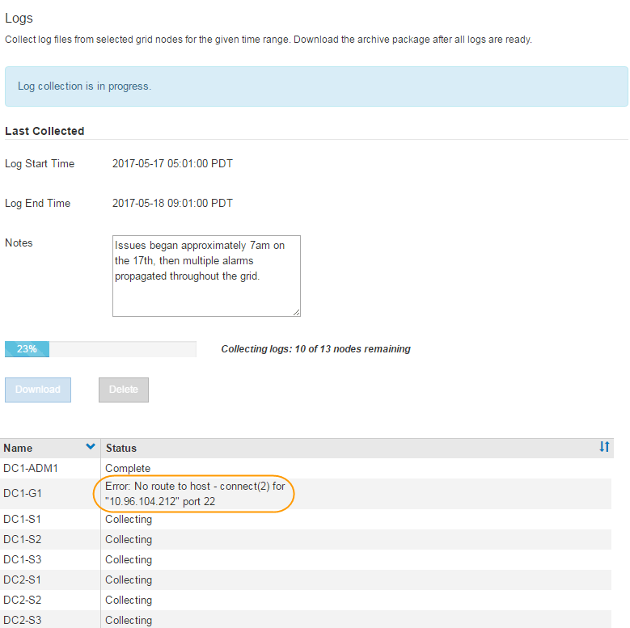

= Collecte des fichiers journaux et des données système
:allow-uri-read: 
:icons: font
:imagesdir: ../media/

[role="lead"]
Vous pouvez utiliser le Gestionnaire de grille pour récupérer les fichiers journaux et les données système (y compris les données de configuration) de votre système StorageGRID.

.Ce dont vous avez besoin
* Vous devez être connecté à Grid Manager à l'aide d'un navigateur pris en charge.
* Vous devez disposer d'autorisations d'accès spécifiques.
* Vous devez disposer de la phrase secrète pour le provisionnement.

.À propos de ce taak
Vous pouvez utiliser Grid Manager pour recueillir des fichiers journaux, des données système et des données de configuration à partir de n'importe quel nœud de la grille pour la période sélectionnée. Les données sont collectées et archivées dans un fichier .tar.gz que vous pouvez ensuite télécharger sur votre ordinateur local.

Étant donné que les fichiers journaux d'application peuvent être très volumineux, le répertoire de destination où vous téléchargez les fichiers journaux archivés doit disposer d'au moins 1 Go d'espace libre.

.Étapes
. Sélectionnez *support* > *Outils* > *journaux*.
+
image::../media/support_logs_select_nodes.gif[Capture d'écran de l'interface de collecte de journaux]

. Sélectionnez les nœuds de grille pour lesquels vous souhaitez collecter les fichiers journaux.
+
Si nécessaire, vous pouvez collecter des fichiers journaux pour l'intégralité de la grille ou un site de data Center.

. Sélectionnez une *heure de début* et *heure de fin* pour définir la plage horaire des données à inclure dans les fichiers journaux.
+
Si vous sélectionnez une période très longue ou que vous collectez des journaux de tous les nœuds d'un grand grid, l'archivage des journaux risque de devenir trop volumineux pour être stocké sur un nœud, ou trop volumineux pour être collecté sur le nœud d'administration principal pour le téléchargement. Dans ce cas, vous devez redémarrer la collecte de journaux avec un jeu de données plus petit.

. Vous pouvez également saisir des notes sur les fichiers journaux que vous recueillez dans la zone de texte *Notes*.
+
Vous pouvez utiliser ces notes pour fournir des informations de support technique sur le problème qui vous a demandé de collecter les fichiers journaux. Vos notes sont ajoutées à un fichier appelé `info.txt`, avec d'autres informations sur la collecte de fichier journal. Le `info.txt` le fichier est enregistré dans le package d'archivage du fichier journal.

. Saisissez le mot de passe de provisionnement de votre système StorageGRID dans la zone de texte *phrase de passe de provisionnement*.
. Cliquez sur *collecter les journaux*.
+
Lorsque vous soumettez une nouvelle demande, la collection précédente de fichiers journaux est supprimée.

+

+
Vous pouvez utiliser la page journaux pour surveiller la progression de la collecte des fichiers journaux pour chaque nœud de la grille.

+
Si vous recevez un message d'erreur sur la taille du journal, essayez de collecter les journaux pour une période plus courte ou pour moins de nœuds.

. Cliquez sur *Télécharger* lorsque la collecte des fichiers journaux est terminée.
+
Le fichier _.tar.gz_ contient tous les fichiers journaux de tous les nœuds de la grille où la collecte des journaux a réussi. Dans le fichier combiné _.tar.gz_, il y a une archive de fichier journal pour chaque nœud de la grille.

.Une fois que vous avez terminé
Vous pouvez télécharger à nouveau le package d'archivage des fichiers journaux ultérieurement si nécessaire.

Vous pouvez également cliquer sur *Supprimer* pour supprimer le paquet d'archives de fichiers journaux et libérer de l'espace disque. Le progiciel d'archivage du fichier journal actuel est automatiquement supprimé lors de la prochaine collecte de fichiers journaux.

.Informations associées
link:../monitor/logs-files-reference.html["Référence des fichiers journaux"]
