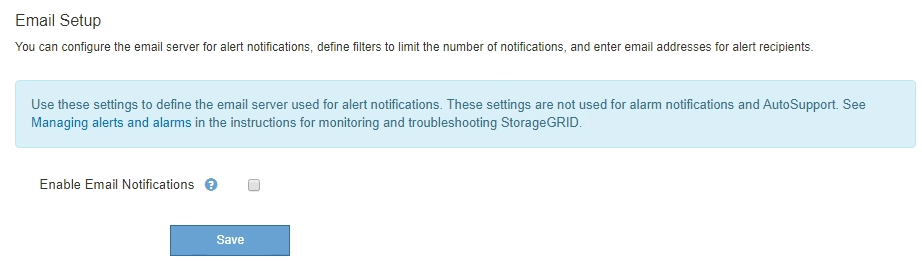

= Gestion des alertes
:allow-uri-read: 
:icons: font
:imagesdir: ../media/

[role="lead"]
Les alertes vous permettent de surveiller différents événements et conditions au sein de votre système StorageGRID. Vous pouvez gérer les alertes en créant des alertes personnalisées, en modifiant ou en désactivant les alertes par défaut, en configurant des notifications par e-mail pour les alertes et en désactivant les notifications d'alertes.

.Informations associées
link:viewing-current-alerts.html["Affichage des alertes en cours"]

link:viewing-resolved-alerts.html["Affichage des alertes résolues"]

link:viewing-specific-alert.html["Affichage d'une alerte spécifique"]

link:alerts-reference.html["Référence des alertes"]

== Quelles sont les alertes

Le système d'alerte offre une interface facile à utiliser pour détecter, évaluer et résoudre les problèmes susceptibles de se produire lors du fonctionnement de StorageGRID.

* Le système d'alerte est axé sur des problèmes exploitables dans le système. Contrairement à certaines alarmes du système hérité, des alertes sont déclenchées pour les événements nécessitant votre attention immédiate, et non pour les événements qui peuvent être ignorés en toute sécurité.
* La page alertes en cours fournit une interface conviviale permettant d'afficher les problèmes actuels. Vous pouvez trier la liste par alerte individuelle et par groupe d'alertes. Par exemple, il peut être nécessaire de trier toutes les alertes par nœud/site pour afficher les alertes qui affectent un nœud spécifique. Vous pouvez également trier les alertes d'un groupe par heure déclenchée pour trouver l'instance la plus récente d'une alerte spécifique.
* La page alertes résolues fournit des informations similaires à celles de la page alertes en cours, mais elle vous permet de rechercher et d'afficher l'historique des alertes qui ont été résolues, notamment lorsque l'alerte a été déclenchée et quand elle a été résolue.
* Plusieurs alertes du même type sont regroupées en un seul e-mail afin de réduire le nombre de notifications. De plus, plusieurs alertes du même type sont affichées sous forme de groupe sur la page alertes. Vous pouvez développer et réduire les groupes d'alertes pour afficher ou masquer les alertes individuelles. Par exemple, si plusieurs nœuds indiquent l'alerte *Impossible de communiquer avec le nœud* en même temps, un seul e-mail est envoyé et l'alerte est affichée comme un groupe sur la page alertes.
* Les alertes utilisent des noms et des descriptions intuitifs pour vous aider à comprendre rapidement le problème. Les notifications d'alerte incluent des informations détaillées sur le nœud et le site concernés, la gravité de l'alerte, le moment où la règle d'alerte a été déclenchée et la valeur actuelle des mesures relatives à l'alerte.
* Les notifications par e-mail d'alerte et les listes d'alertes figurant sur les pages alertes en cours et alertes résolues fournissent des actions recommandées pour résoudre une alerte. Ces actions recommandées incluent souvent des liens directs vers le centre de documentation StorageGRID pour faciliter l'accès aux procédures de dépannage plus détaillées.
* Si vous avez besoin de supprimer temporairement les notifications pour une alerte à un ou plusieurs niveaux de sévérité, vous pouvez facilement désactiver une règle d'alerte spécifique pendant une durée spécifiée et pour la grille dans son ensemble, un seul site ou un seul nœud. Vous pouvez également désactiver toutes les règles d'alerte, par exemple, lors d'une procédure de maintenance planifiée telle qu'une mise à niveau logicielle.
* Vous pouvez modifier les règles d'alerte par défaut si nécessaire. Vous pouvez désactiver complètement une règle d'alerte ou modifier ses conditions et sa durée de déclenchement.
* Vous pouvez créer des règles d'alerte personnalisées afin de cibler les conditions spécifiques qui sont pertinentes pour votre situation et de proposer vos propres actions recommandées. Pour définir les conditions d'une alerte personnalisée, vous créez des expressions à l'aide des metrics Prometheus disponibles dans la section Metrics de l'API de gestion du grid.

== Gestion des règles d'alerte

Les règles d'alerte définissent les conditions qui déclenchent des alertes spécifiques. StorageGRID inclut un ensemble de règles d'alerte par défaut que vous pouvez utiliser en l'état ou en modifier, ou vous pouvez créer des règles d'alerte personnalisées.

=== Affichage des règles d'alerte

Vous pouvez afficher la liste de toutes les règles d'alerte par défaut et personnalisées pour savoir quelles conditions déclenchent chaque alerte et pour déterminer si les alertes sont désactivées.

.Ce dont vous avez besoin
* Vous devez être connecté à Grid Manager à l'aide d'un navigateur pris en charge.
* Vous devez disposer de l'autorisation gérer les alertes ou accès racine.

.Étapes
. Sélectionnez *alertes* > *règles d'alerte*.
+
La page règles d'alerte s'affiche.

+
image::../media/alert_rules_page.png[Page règles d'alerte]

. Vérifiez les informations du tableau des règles d'alerte :
+
|===
| En-tête de colonne | Description 

 a| 
Nom
 a| 
Nom et description uniques de la règle d'alerte. Les règles d'alerte personnalisées sont répertoriées en premier, suivies des règles d'alerte par défaut. Le nom de la règle d'alerte est l'objet des notifications par e-mail.

 a| 
Conditions
 a| 
Expressions Prometheus qui déterminent le moment où cette alerte est déclenchée. Une alerte peut être déclenchée à un ou plusieurs des niveaux de sévérité suivants, mais une condition pour chaque gravité n'est pas requise.

** *Critique* image:../media/icon_alert_red_critical.png["Icône alerte rouge critique"]: Il existe une condition anormale qui a arrêté les opérations normales d'un nœud ou service StorageGRID. Vous devez immédiatement résoudre le problème sous-jacent. Une interruption du service et une perte de données peuvent se produire si le problème n'est pas résolu.
** *Majeur* image:../media/icon_alert_orange_major.png["Icône alerte Orange majeur"]: Il existe une condition anormale affectant les opérations en cours ou approchant le seuil d'une alerte critique. Vous devez examiner les alertes majeures et résoudre tous les problèmes sous-jacents pour vérifier que leur condition anormale n'arrête pas le fonctionnement normal d'un nœud ou d'un service StorageGRID.
** *Mineur* image:../media/icon_alert_yellow_miinor.png["Icône alerte jaune mineure"]: Le système fonctionne normalement, mais il existe une condition anormale qui pourrait affecter la capacité du système à fonctionner s'il continue. Vous devez surveiller et résoudre les alertes mineures qui ne sont pas claires par elles-mêmes pour vous assurer qu'elles n'entraînent pas un problème plus grave.

 a| 
Type
 a| 
Type de règle d'alerte :

** *Default* : règle d'alerte fournie avec le système. Vous pouvez désactiver une règle d'alerte par défaut ou modifier les conditions et la durée d'une règle d'alerte par défaut. Vous ne pouvez pas supprimer une règle d'alerte par défaut.
** *Par défaut** : règle d'alerte par défaut qui inclut une condition ou une durée modifiée. Si nécessaire, vous pouvez facilement rétablir une condition modifiée par défaut.
** *Custom* : une règle d'alerte que vous avez créée. Vous pouvez désactiver, modifier et supprimer des règles d'alerte personnalisées.

 a| 
État
 a| 
Si cette règle d'alerte est actuellement activée ou désactivée. Les conditions des règles d'alerte désactivées ne sont pas évaluées. Aucune alerte n'est donc déclenchée.

|===

.Informations associées
link:alerts-reference.html["Référence des alertes"]

=== Création de règles d'alerte personnalisées

Vous pouvez créer des règles d'alerte personnalisées afin de définir vos propres conditions pour déclencher des alertes.

.Ce dont vous avez besoin
* Vous devez être connecté à Grid Manager à l'aide d'un navigateur pris en charge.
* Vous devez disposer de l'autorisation gérer les alertes ou accès racine.

.Description de la tâche
StorageGRID ne valide pas les alertes personnalisées. Si vous décidez de créer des règles d'alerte personnalisées, suivez les consignes générales suivantes :

* Consultez les conditions des règles d'alerte par défaut et utilisez-les comme exemples pour vos règles d'alerte personnalisées.
* Si vous définissez plusieurs conditions pour une règle d'alerte, utilisez la même expression pour toutes les conditions. Modifiez ensuite la valeur seuil pour chaque condition.
* Vérifier soigneusement chaque condition pour détecter les fautes de frappe et les erreurs logiques.
* Utilisez uniquement les metrics répertoriées dans l'API Grid Management.
* Lors du test d'une expression à l'aide de l'API Grid Management, sachez qu'une réponse « nécessite » peut simplement être un corps de réponse vide (aucune alerte déclenchée). Pour vérifier si l'alerte est déclenchée, vous pouvez définir temporairement une valeur de seuil sur laquelle vous vous attendez à ce que la valeur soit vraie actuellement.
+
Par exemple, pour tester l'expression `node_memory_MemTotal_bytes < 24000000000`, première exécution `node_memory_MemTotal_bytes >= 0` et assurez-vous d'obtenir les résultats attendus (tous les nœuds renvoient une valeur). Ensuite, remplacez l'opérateur et le seuil par les valeurs prévues et recommencez. Aucun résultat n'indique qu'il n'y a pas d'alerte en cours pour cette expression.

* Ne supposez pas qu'une alerte personnalisée fonctionne, sauf si vous avez validé que l'alerte est déclenchée quand vous y êtes attendu.

.Étapes
. Sélectionnez *alertes* > *règles d'alerte*.
+
La page règles d'alerte s'affiche.

. Sélectionnez *Créer règle personnalisée*.
+
La boîte de dialogue Créer une règle personnalisée s'affiche.

+
image::../media/alerts_create_custom_rule.png[Alertes > Créer une règle personnalisée]

. Cochez ou désélectionnez la case *Enabled* pour déterminer si cette règle d'alerte est actuellement activée.
+
Si une règle d'alerte est désactivée, ses expressions ne sont pas évaluées et aucune alerte n'est déclenchée.

. Saisissez les informations suivantes :
+
|===
| Champ | Description 

 a| 
Nom unique
 a| 
Un nom unique pour cette règle. Le nom de la règle d'alerte s'affiche sur la page alertes et est également l'objet des notifications par e-mail. Les noms des règles d'alerte peuvent comporter entre 1 et 64 caractères.

 a| 
Description
 a| 
Description du problème. La description est le message d'alerte affiché sur la page alertes et dans les notifications par e-mail. Les descriptions des règles d'alerte peuvent comporter entre 1 et 128 caractères.

 a| 
Actions recommandées
 a| 
En option, les actions recommandées à effectuer lorsque cette alerte est déclenchée. Saisissez les actions recommandées en texte brut (aucun code de mise en forme). Les actions recommandées pour les règles d'alerte peuvent comporter entre 0 et 1,024 caractères.

|===
. Dans la section Conditions, entrez une expression Prometheus pour un ou plusieurs niveaux de gravité d'alerte.
+
Une expression de base est généralement de la forme :

+
[listing]
----
[metric] [operator] [value]
----
+
Les expressions peuvent être de toute longueur, mais apparaissent sur une seule ligne dans l'interface utilisateur. Au moins une expression est requise.

+
Pour afficher les metrics disponibles et tester les expressions Prometheus, cliquez sur l'icône d'aide image:../media/icon_nms_question.gif["icône point d'interrogation"] Et suivez le lien vers la section Metrics de l'API de gestion du grid.

+
Pour en savoir plus sur l'utilisation de l'API de gestion de grille, reportez-vous aux instructions d'administration de StorageGRID. Pour plus d'informations sur la syntaxe des requêtes Prometheus, consultez la documentation Prometheus.

+
Cette expression déclenche une alerte si la quantité de RAM installée pour un nœud est inférieure à 24,000,000,000 octets (24 Go).

+
[listing]
----
node_memory_MemTotal_bytes < 24000000000
----
. Dans le champ *durée*, entrez la durée pendant laquelle une condition doit rester en vigueur en continu avant le déclenchement de l'alerte et sélectionnez une unité de temps.
+
Pour déclencher une alerte immédiatement lorsqu'une condition devient vraie, entrez *0*. Augmentez cette valeur pour éviter que des conditions temporaires ne déclenchent des alertes.

+
La valeur par défaut est 5 minutes.

. Cliquez sur *Enregistrer*.
+
La boîte de dialogue se ferme et la nouvelle règle d'alerte personnalisée apparaît dans le tableau règles d'alerte.

.Informations associées
link:../admin/index.html["Administrer StorageGRID"]

link:commonly-used-prometheus-metrics.html["Metrics Prometheus couramment utilisés"]

https://prometheus.io/docs/querying/basics/["Prometheus : notions de base sur les requêtes"]

=== Modification d'une règle d'alerte

Vous pouvez modifier une règle d'alerte pour modifier les conditions de déclenchement, pour une règle d'alerte personnalisée, vous pouvez également mettre à jour le nom de la règle, sa description et les actions recommandées.

.Ce dont vous avez besoin
* Vous devez être connecté à Grid Manager à l'aide d'un navigateur pris en charge.
* Vous devez disposer de l'autorisation gérer les alertes ou accès racine.

.Description de la tâche
Lorsque vous modifiez une règle d'alerte par défaut, vous pouvez modifier les conditions pour les alertes mineures, majeures et critiques, ainsi que la durée. Lorsque vous modifiez une règle d'alerte personnalisée, vous pouvez également modifier le nom, la description et les actions recommandées de la règle.

IMPORTANT: Soyez prudent lorsque vous décidez de modifier une règle d'alerte. Si vous modifiez les valeurs de déclenchement, il est possible que vous ne déteciez pas de problème sous-jacent tant qu'elle n'empêche pas l'exécution d'une opération critique.

.Étapes
. Sélectionnez *alertes* > *règles d'alerte*.
+
La page règles d'alerte s'affiche.

. Sélectionnez le bouton radio correspondant à la règle d'alerte que vous souhaitez modifier.
. Sélectionnez *Modifier la règle*.
+
La boîte de dialogue Modifier la règle s'affiche. Cet exemple montre une règle d'alerte par défaut - les champs Nom unique, Description et actions recommandées sont désactivés et ne peuvent pas être modifiés.

+
image::../media/alert_rules_edit_rule.png[Alertes > Modifier la règle]

. Cochez ou désélectionnez la case *Enabled* pour déterminer si cette règle d'alerte est actuellement activée.
+
Si une règle d'alerte est désactivée, ses expressions ne sont pas évaluées et aucune alerte n'est déclenchée.

+

NOTE: Si vous désactivez la règle d'alerte pour une alerte en cours, vous devez attendre quelques minutes que l'alerte n'apparaisse plus comme une alerte active.

+

IMPORTANT: En général, la désactivation d'une règle d'alerte par défaut n'est pas recommandée. Si une règle d'alerte est désactivée, vous risquez de ne pas détecter un problème sous-jacent tant qu'elle n'empêche pas l'exécution d'une opération critique.

. Pour les règles d'alerte personnalisées, mettez à jour les informations suivantes si nécessaire.
+

NOTE: Vous ne pouvez pas modifier ces informations pour les règles d'alerte par défaut.

+
|===
| Champ | Description 

 a| 
Nom unique
 a| 
Un nom unique pour cette règle. Le nom de la règle d'alerte s'affiche sur la page alertes et est également l'objet des notifications par e-mail. Les noms des règles d'alerte peuvent comporter entre 1 et 64 caractères.

 a| 
Description
 a| 
Description du problème. La description est le message d'alerte affiché sur la page alertes et dans les notifications par e-mail. Les descriptions des règles d'alerte peuvent comporter entre 1 et 128 caractères.

 a| 
Actions recommandées
 a| 
En option, les actions recommandées à effectuer lorsque cette alerte est déclenchée. Saisissez les actions recommandées en texte brut (aucun code de mise en forme). Les actions recommandées pour les règles d'alerte peuvent comporter entre 0 et 1,024 caractères.

|===
. Dans la section Conditions, entrez ou mettez à jour l'expression Prometheus pour un ou plusieurs niveaux de gravité d'alerte.
+

NOTE: Si vous souhaitez restaurer une condition pour une règle d'alerte par défaut modifiée à sa valeur d'origine, cliquez sur les trois points à droite de la condition modifiée.

+
image::../media/alert_rules_edit_revert_to_default.png[Règles d'alerte : rétablissement d'une condition modifiée en valeur par défaut]

+

NOTE: Si vous mettez à jour les conditions d'une alerte en cours, vos modifications risquent de ne pas être appliquées tant que la condition précédente n'est pas résolue. La prochaine fois que l'une des conditions de la règle est remplie, l'alerte reflète les valeurs mises à jour.

+
Une expression de base est généralement de la forme :

+
[listing]
----
[metric] [operator] [value]
----
+
Les expressions peuvent être de toute longueur, mais apparaissent sur une seule ligne dans l'interface utilisateur. Au moins une expression est requise.

+
Pour afficher les metrics disponibles et tester les expressions Prometheus, cliquez sur l'icône d'aide image:../media/icon_nms_question.gif["icône point d'interrogation"] Et suivez le lien vers la section Metrics de l'API de gestion du grid.

+
Pour en savoir plus sur l'utilisation de l'API de gestion de grille, reportez-vous aux instructions d'administration de StorageGRID. Pour plus d'informations sur la syntaxe des requêtes Prometheus, consultez la documentation Prometheus.

+
Cette expression déclenche une alerte si la quantité de RAM installée pour un nœud est inférieure à 24,000,000,000 octets (24 Go).

+
[listing]
----
node_memory_MemTotal_bytes < 24000000000
----
. Dans le champ *durée*, entrez la durée pendant laquelle une condition doit rester en vigueur en continu avant le déclenchement de l'alerte et sélectionnez l'unité de temps.
+
Pour déclencher une alerte immédiatement lorsqu'une condition devient vraie, entrez *0*. Augmentez cette valeur pour éviter que des conditions temporaires ne déclenchent des alertes.

+
La valeur par défaut est 5 minutes.

. Cliquez sur *Enregistrer*.
+
Si vous avez modifié une règle d'alerte par défaut, *default** apparaît dans la colonne Type. Si vous avez désactivé une règle d'alerte par défaut ou personnalisée, *Disabled* apparaît dans la colonne *Status*.

.Informations associées
link:../admin/index.html["Administrer StorageGRID"]

link:commonly-used-prometheus-metrics.html["Metrics Prometheus couramment utilisés"]

https://prometheus.io/docs/querying/basics/["Prometheus : notions de base sur les requêtes"]

=== Désactivation d'une règle d'alerte

Vous pouvez modifier l'état activé/désactivé pour une règle d'alerte par défaut ou personnalisée.

.Ce dont vous avez besoin
* Vous devez être connecté à Grid Manager à l'aide d'un navigateur pris en charge.
* Vous devez disposer de l'autorisation gérer les alertes ou accès racine.

.Description de la tâche
Lorsqu'une règle d'alerte est désactivée, ses expressions ne sont pas évaluées et aucune alerte n'est déclenchée.

IMPORTANT: En général, la désactivation d'une règle d'alerte par défaut n'est pas recommandée. Si une règle d'alerte est désactivée, vous risquez de ne pas détecter un problème sous-jacent tant qu'elle n'empêche pas l'exécution d'une opération critique.

.Étapes
. Sélectionnez *alertes* > *règles d'alerte*.
+
La page règles d'alerte s'affiche.

. Sélectionnez le bouton radio de la règle d'alerte que vous souhaitez désactiver ou activer.
. Sélectionnez *Modifier la règle*.
+
La boîte de dialogue Modifier la règle s'affiche.

. Cochez ou désélectionnez la case *Enabled* pour déterminer si cette règle d'alerte est actuellement activée.
+
Si une règle d'alerte est désactivée, ses expressions ne sont pas évaluées et aucune alerte n'est déclenchée.

+

NOTE: Si vous désactivez la règle d'alerte pour une alerte en cours, vous devez attendre quelques minutes que l'alerte ne s'affiche plus comme alerte active.

. Cliquez sur *Enregistrer*.
+
*Disabled* apparaît dans la colonne *Status*.

=== Suppression d'une règle d'alerte personnalisée

Vous pouvez supprimer une règle d'alerte personnalisée si vous ne souhaitez plus l'utiliser.

.Ce dont vous avez besoin
* Vous devez être connecté à Grid Manager à l'aide d'un navigateur pris en charge.
* Vous devez disposer de l'autorisation gérer les alertes ou accès racine.

.Étapes
. Sélectionnez *alertes* > *règles d'alerte*.
+
La page règles d'alerte s'affiche.

. Sélectionnez le bouton radio de la règle d'alerte personnalisée que vous souhaitez supprimer.
+
Vous ne pouvez pas supprimer une règle d'alerte par défaut.

. Cliquez sur *Supprimer la règle personnalisée*.
+
Une boîte de dialogue de confirmation s'affiche.

. Cliquez sur *OK* pour supprimer la règle d'alerte.
+
Toutes les instances actives de l'alerte seront résolues dans un délai de 10 minutes.

== Gestion des notifications d'alertes

Lorsqu'une alerte est déclenchée, StorageGRID peut envoyer des notifications par e-mail et des notifications SNMP (simple Network Management Protocol) (traps).

=== Configuration des notifications SNMP pour les alertes

Si vous souhaitez que StorageGRID envoie des notifications SNMP lorsque des alertes se produisent, vous devez activer l'agent SNMP StorageGRID et configurer une ou plusieurs destinations d'interruption.

.Description de la tâche
Vous pouvez utiliser l'option *Configuration* > *surveillance* > *agent SNMP* dans le Gestionnaire de grille ou les noeuds finaux SNMP pour l'API de gestion de grille pour activer et configurer l'agent SNMP StorageGRID. L'agent SNMP prend en charge les trois versions du protocole SNMP.

Pour savoir comment configurer l'agent SNMP, reportez-vous à la section utilisation de la surveillance SNMP.

Après avoir configuré l'agent SNMP StorageGRID, deux types de notifications basées sur les événements peuvent être envoyées :

* Les interruptions sont des notifications envoyées par l'agent SNMP qui ne nécessitent pas d'accusé de réception par le système de gestion. Les interruptions servent à signaler au système de gestion qu'une alerte s'est produite au sein de StorageGRID, par exemple. Les traps sont pris en charge dans les trois versions de SNMP
* Les informations sont similaires aux pièges, mais elles nécessitent une reconnaissance par le système de gestion. Si l'agent SNMP ne reçoit pas d'accusé de réception dans un certain temps, il renvoie l'information jusqu'à ce qu'un accusé de réception soit reçu ou que la valeur de nouvelle tentative maximale ait été atteinte. Les informations sont prises en charge dans SNMPv2c et SNMPv3.

Des notifications d'interruption et d'information sont envoyées lorsqu'une alerte par défaut ou personnalisée est déclenchée à n'importe quel niveau de gravité. Pour supprimer les notifications SNMP pour une alerte, vous devez configurer un silence pour l'alerte. Les notifications d'alerte sont envoyées par n'importe quel nœud d'administration configuré pour être l'expéditeur préféré. Par défaut, le nœud d'administration principal est sélectionné. Pour plus de détails, reportez-vous aux instructions d'administration de StorageGRID.

NOTE: Des notifications de déroutement et d'information sont également envoyées lorsque certaines alarmes (système hérité) sont déclenchées à des niveaux de gravité spécifiés ou supérieurs ; cependant, les notifications SNMP ne sont pas envoyées pour chaque alarme ou chaque gravité d'alarme.

.Informations associées
link:using-snmp-monitoring.html["Utilisation de la surveillance SNMP"]

link:managing-alerts.html["Neutralisation des notifications d'alerte"]

link:../admin/index.html["Administrer StorageGRID"]

link:alarms-that-generate-snmp-notifications.html["Alarmes générant des notifications SNMP (système hérité)"]

=== Configuration des notifications par e-mail pour les alertes

Si vous souhaitez que des notifications par e-mail soient envoyées lorsque des alertes se produisent, vous devez fournir des informations sur votre serveur SMTP. Vous devez également saisir des adresses e-mail pour les destinataires des notifications d'alerte.

.Ce dont vous avez besoin
* Vous devez être connecté à Grid Manager à l'aide d'un navigateur pris en charge.
* Vous devez disposer de l'autorisation gérer les alertes ou accès racine.

.Ce dont vous avez besoin
Comme les alarmes et les alertes sont des systèmes indépendants, la configuration des e-mails utilisée pour les notifications d'alerte n'est pas utilisée pour les notifications d'alarme et les messages AutoSupport. Cependant, vous pouvez utiliser le même serveur de messagerie pour toutes les notifications.

Si votre déploiement StorageGRID inclut plusieurs nœuds d'administration, vous pouvez sélectionner le nœud d'administration qui doit être l'expéditeur préféré des notifications d'alerte. Le même « expéditeur privilégié » est également utilisé pour les notifications d'alarme et les messages AutoSupport. Par défaut, le nœud d'administration principal est sélectionné. Pour plus de détails, reportez-vous aux instructions d'administration de StorageGRID.

.Étapes
. Sélectionnez *alertes* > *Configuration email*.
+
La page Configuration de l'e-mail s'affiche.

+

. Cochez la case *Activer les notifications par e-mail* pour indiquer que vous souhaitez que les e-mails de notification soient envoyés lorsque les alertes atteignent les seuils configurés.
+
Les sections serveur d'e-mail (SMTP), sécurité de la couche de transport (TLS), adresses e-mail et filtres s'affichent.

. Dans la section serveur de messagerie (SMTP), entrez les informations dont StorageGRID a besoin pour accéder à votre serveur SMTP.
+
Si votre serveur SMTP nécessite une authentification, vous devez fournir à la fois un nom d'utilisateur et un mot de passe. Vous devez également exiger TLS et fournir un certificat CA.

+
|===
| Champ | Entrez 

 a| 
Serveur de messagerie
 a| 
Nom de domaine complet (FQDN) ou adresse IP du serveur SMTP.

 a| 
Port
 a| 
Port utilisé pour accéder au serveur SMTP. Doit être compris entre 1 et 65535.

 a| 
Nom d'utilisateur (facultatif)
 a| 
Si votre serveur SMTP nécessite une authentification, entrez le nom d'utilisateur à authentifier.

 a| 
Mot de passe (facultatif)
 a| 
Si votre serveur SMTP nécessite une authentification, entrez le mot de passe à authentifier auprès de.

|===
+
image:../media/alerts_email_smtp_server.png["Alerte serveur SMTP de messagerie"]

. Dans la section adresses e-mail, entrez les adresses e-mail de l'expéditeur et de chaque destinataire.
+
.. Pour l'adresse électronique *expéditeur*, spécifiez une adresse e-mail valide à utiliser comme adresse de pour les notifications d'alerte.
+
Par exemple : `storagegrid-alerts@example.com`

.. Dans la section destinataires, entrez une adresse e-mail pour chaque liste d'e-mails ou personne devant recevoir un e-mail lorsqu'une alerte se produit.
+
Cliquez sur l'icône plus image:../media/icon_plus_sign_black_on_white.gif["icône plus"] pour ajouter des destinataires.

+
image::../media/alerts_email_recipients.png[Alertes destinataires e-mail]

. Dans la section transport Layer Security (TLS), cochez la case *exiger TLS* si transport Layer Security (TLS) est requis pour les communications avec le serveur SMTP.
+
.. Dans le champ *certificat CA*, indiquez le certificat CA qui sera utilisé pour vérifier l'identification du serveur SMTP.
+
Vous pouvez copier et coller le contenu dans ce champ ou cliquer sur *Parcourir* et sélectionner le fichier.

+
Vous devez fournir un seul fichier contenant les certificats de chaque autorité de certification intermédiaire (AC). Le fichier doit contenir chacun des fichiers de certificat d'autorité de certification codés au PEM, concaténés dans l'ordre de la chaîne de certificats.

.. Cochez la case *Envoyer certificat client* si votre serveur de messagerie SMTP nécessite des expéditeurs de messagerie pour fournir des certificats client pour l'authentification.
.. Dans le champ *certificat client*, fournissez le certificat client codé PEM à envoyer au serveur SMTP.
+
Vous pouvez copier et coller le contenu dans ce champ ou cliquer sur *Parcourir* et sélectionner le fichier.

.. Dans le champ *Private Key*, saisissez la clé privée du certificat client dans le codage PEM non chiffré.
+
Vous pouvez copier et coller le contenu dans ce champ ou cliquer sur *Parcourir* et sélectionner le fichier.

+

NOTE: Si vous devez modifier la configuration de la messagerie, cliquez sur l'icône représentant un crayon pour mettre à jour ce champ.

+
image::../media/alerts_email_tls.png[Alertes Email TLS]

. Dans la section filtres, sélectionnez les niveaux de gravité des alertes qui doivent donner lieu à des notifications par e-mail, sauf si la règle d'une alerte spécifique a été mise en silence.
+
|===
| Gravité | Description 

 a| 
Mineur, majeur, critique
 a| 
Une notification par e-mail est envoyée lorsque la condition mineure, majeure ou critique d'une règle d'alerte est remplie.

 a| 
Important, critique
 a| 
Une notification par e-mail est envoyée lorsque la condition principale ou critique d'une règle d'alerte est remplie. Les notifications ne sont pas envoyées pour les alertes mineures.

 a| 
Critique uniquement
 a| 
Une notification par e-mail est envoyée uniquement lorsque la condition critique d'une règle d'alerte est remplie. Les notifications ne sont pas envoyées pour les alertes mineures ou majeures.

|===
+
image:../media/alerts_email_filters.png["Filtres d'e-mail des alertes"]

. Lorsque vous êtes prêt à tester vos paramètres de messagerie, procédez comme suit :
+
.. Cliquez sur *Envoyer un e-mail de test*.
+
Un message de confirmation s'affiche, indiquant qu'un e-mail de test a été envoyé.

.. Cochez les cases de tous les destinataires d'e-mail et confirmez qu'un e-mail de test a été reçu.
+

NOTE: Si l'e-mail n'est pas reçu dans quelques minutes ou si l'alerte *échec de notification par e-mail* est déclenchée, vérifiez vos paramètres et réessayez.

.. Connectez-vous à tout autre nœud d'administration et envoyez un e-mail de test pour vérifier la connectivité de tous les sites.
+

NOTE: Lorsque vous testez les notifications d'alertes, vous devez vous connecter à chaque nœud d'administration pour vérifier la connectivité. Cela contraste avec le test des notifications d'alarme et des messages AutoSupport, où tous les nœuds d'administration envoient l'e-mail de test.

. Cliquez sur *Enregistrer*.
+
L'envoi d'un e-mail de test n'enregistre pas vos paramètres. Vous devez cliquer sur *Enregistrer*.

+
Les paramètres de messagerie sont enregistrés.

.Informations associées
link:managing-alerts.html["Dépannage des notifications par e-mail d'alerte"]

link:../maintain/index.html["Maintenance et récupération"]

=== Informations incluses dans les notifications par e-mail d'alerte

Après avoir configuré le serveur de messagerie SMTP, des notifications par e-mail sont envoyées aux destinataires désignés lorsqu'une alerte est déclenchée, à moins que la règle d'alerte ne soit supprimée par un silence.

Les notifications par e-mail incluent les informations suivantes :

image::../media/alerts_email_notification.png[Notification d'alertes par e-mail]

[cols="1a,5a"]
|===
|  | Description 

 a| 
1
 a| 
Nom de l'alerte, suivi du nombre d'instances actives de cette alerte.

 a| 
2
 a| 
Description de l'alerte.

 a| 
3
 a| 
Toutes les actions recommandées pour l'alerte.

 a| 
4
 a| 
Détails sur chaque instance active de l'alerte, y compris le nœud et le site affectés, la gravité de l'alerte, l'heure UTC au moment où la règle d'alerte a été déclenchée, ainsi que le nom du travail et du service affectés.

 a| 
5
 a| 
Nom d'hôte du nœud d'administration qui a envoyé la notification.

|===
.Informations associées
link:managing-alerts.html["Neutralisation des notifications d'alerte"]

=== Comment StorageGRID groupe les alertes dans les notifications par e-mail

Pour empêcher l'envoi d'un nombre excessif de notifications par e-mail lorsque des alertes sont déclenchées, StorageGRID tente de regrouper plusieurs alertes dans la même notification.

Reportez-vous au tableau suivant pour obtenir des exemples de la manière dont StorageGRID regroupe plusieurs alertes dans les notifications par e-mail.

|===
| Comportement | Exemple 

 a| 
Chaque notification d'alerte s'applique uniquement aux alertes portant le même nom. Si deux alertes avec des noms différents sont déclenchées en même temps, deux notifications par e-mail sont envoyées.
 a| 
* L'alerte A est déclenchée en même temps sur deux nœuds. Une seule notification est envoyée.
* L'alerte A est déclenchée sur le nœud 1 et l'alerte B est déclenchée simultanément sur le nœud 2. Deux notifications sont envoyées : une pour chaque alerte.

 a| 
Pour une alerte spécifique sur un nœud spécifique, si les seuils sont atteints pour plus d'un degré de sévérité, une notification est envoyée uniquement pour l'alerte la plus grave.
 a| 
* L'alerte A est déclenchée et le seuil d'alerte secondaire, majeur et critique est atteint. Une notification est envoyée pour l'alerte critique.

 a| 
La première fois qu'une alerte est déclenchée, StorageGRID attend 2 minutes avant d'envoyer une notification. Si d'autres alertes du même nom sont déclenchées pendant ce temps, StorageGRID regroupe toutes les alertes de la notification initiale.​
 a| 
. L'alerte A est déclenchée sur le nœud 1 à 08:00. Aucune notification n'a été envoyée.
. L'alerte A est déclenchée sur le nœud 2 à 08:01. Aucune notification n'a été envoyée.
. À 08 h 02, une notification est envoyée pour signaler les deux instances de l'alerte.

 a| 
Si une autre alerte du même nom est déclenchée, StorageGRID attend 10 minutes avant d'envoyer une nouvelle notification. La nouvelle notification signale toutes les alertes actives (alertes en cours qui n'ont pas été désactivées), même si elles ont été signalées précédemment.
 a| 
. L'alerte A est déclenchée sur le nœud 1 à 08:00. Une notification est envoyée à 08:02.
. L'alerte A est déclenchée sur le nœud 2 à 08:05. Une seconde notification est envoyée à 08:15 (10 minutes plus tard). Les deux nœuds sont signalés.

 a| 
Si plusieurs alertes en cours portent le même nom et que l'une de ces alertes est résolue, une nouvelle notification n'est pas envoyée si l'alerte se reproduit sur le nœud pour lequel l'alerte a été résolue.
 a| 
. L'alerte A est déclenchée pour le nœud 1. Une notification est envoyée.
. L'alerte A est déclenchée pour le nœud 2. Une seconde notification est envoyée.
. L'alerte A est résolue pour le nœud 2, mais elle reste active pour le nœud 1.
. L'alerte A est à nouveau déclenchée pour le nœud 2. Aucune nouvelle notification n'est envoyée, car l'alerte est toujours active pour le nœud 1.

 a| 
StorageGRID continue à envoyer des notifications par e-mail tous les 7 jours jusqu'à ce que toutes les instances de l'alerte soient résolues ou que la règle d'alerte soit désactivée.
 a| 
. L'alerte A est déclenchée pour le nœud 1 le 8 mars. Une notification est envoyée.
. L'alerte A n'est pas résolue ou arrêtée. Des notifications supplémentaires sont envoyées le 15 mars, le 22 mars, le 29 mars, etc.

|===

=== Dépannage des notifications par e-mail d'alerte

Si l'alerte *échec de notification par e-mail* est déclenchée ou si vous ne parvenez pas à recevoir la notification par e-mail d'alerte de test, procédez comme suit pour résoudre le problème.

.Ce dont vous avez besoin
* Vous devez être connecté à Grid Manager à l'aide d'un navigateur pris en charge.
* Vous devez disposer de l'autorisation gérer les alertes ou accès racine.

.Étapes
. Vérifiez vos paramètres.
+
.. Sélectionnez *alertes* > *Configuration email*.
.. Vérifiez que les paramètres du serveur de messagerie (SMTP) sont corrects.
.. Vérifiez que vous avez spécifié des adresses e-mail valides pour les destinataires.

. Vérifiez votre filtre de spam et assurez-vous que l'e-mail n'a pas été envoyé à un dossier indésirable.
. Demandez à votre administrateur de messagerie de confirmer que les e-mails de l'adresse de l'expéditeur ne sont pas bloqués.
. Collectez un fichier journal pour le nœud d'administration, puis contactez le support technique.
+
Le support technique peut utiliser les informations contenues dans les journaux pour vous aider à déterminer ce qui s'est mal passé. Par exemple, le fichier prometheus.log peut afficher une erreur lors de la connexion au serveur spécifié.

.Informations associées
link:collecting-log-files-and-system-data.html["Collecte des fichiers journaux et des données système"]

== Neutralisation des notifications d'alerte

Si vous le souhaitez, vous pouvez configurer des silences pour supprimer temporairement les notifications d'alerte.

.Ce dont vous avez besoin
* Vous devez être connecté à Grid Manager à l'aide d'un navigateur pris en charge.
* Vous devez disposer de l'autorisation gérer les alertes ou accès racine.

.Description de la tâche
Vous pouvez désactiver les règles d'alerte sur toute la grille, sur un seul site ou sur un seul nœud et pour une ou plusieurs niveaux de gravité. Chaque silence supprime toutes les notifications d'une règle d'alerte unique ou de toutes les règles d'alerte.

Si vous avez activé l'agent SNMP, les silences suppriment également les interruptions SNMP et informent.

IMPORTANT: Soyez prudent lorsque vous décidez de désactiver une règle d'alerte. Si vous neutralisez une alerte, il est possible que vous ne détectez pas un problème sous-jacent tant qu'elle n'empêche pas l'exécution d'une opération critique.

NOTE: Les alarmes et les alertes étant des systèmes indépendants, vous ne pouvez pas utiliser cette fonctionnalité pour supprimer les notifications d'alarme.

.Étapes
. Sélectionnez *alertes* > *silences*.
+
La page silences s'affiche.

+
image::../media/alerts_silences_page.png[Page alertes > silences]

. Sélectionnez *Créer*.
+
La boîte de dialogue Créer une Silence s'affiche.

+
image::../media/alerts_create_silence.png[Alertes > Créer Silence]

. Sélectionnez ou entrez les informations suivantes :
+
[cols="1a,3a"]
|===
| Champ | Description 

 a| 
Règle d'alerte
 a| 
Le nom de la règle d'alerte que vous souhaitez désactiver. Vous pouvez sélectionner n'importe quelle règle d'alerte par défaut ou personnalisée, même si la règle d'alerte est désactivée.

*Remarque :* sélectionnez *toutes les règles* si vous voulez désactiver toutes les règles d'alerte en utilisant les critères spécifiés dans cette boîte de dialogue.

 a| 
Description
 a| 
Éventuellement, une description du silence. Par exemple, décrivez le but de ce silence.

 a| 
Durée
 a| 
Combien de temps vous voulez que ce silence reste en vigueur, en minutes, heures ou jours. Un silence peut être en vigueur de 5 minutes à 1,825 jours (5 ans).

*Remarque:* vous ne devez pas désactiver une règle d'alerte pour une durée prolongée. Si une règle d'alerte est mise en mode silencieux, il est possible que vous ne détectiez pas un problème sous-jacent tant qu'elle n'empêche pas l'exécution d'une opération critique. Cependant, vous devrez peut-être utiliser un silence étendu si une alerte est déclenchée par une configuration intentionnelle spécifique, par exemple pour les alertes *liaison appliance Services Down* et les alertes *liaison appliance Storage Down*.

 a| 
Gravité
 a| 
Quelle alerte de gravité ou de gravité doit être neutralisée. Si l'alerte est déclenchée à l'un des niveaux de gravité sélectionnés, aucune notification n'est envoyée.

 a| 
Nœuds
 a| 
À quel nœud ou nœud vous souhaitez que ce silence s'applique. Vous pouvez supprimer une règle d'alerte ou toutes les règles de la grille dans son ensemble, un seul site ou un seul nœud. Si vous sélectionnez l'ensemble de la grille, le silence s'applique à tous les sites et à tous les nœuds. Si vous sélectionnez un site, le silence s'applique uniquement aux nœuds de ce site.

*Remarque :* vous ne pouvez pas sélectionner plus d'un nœud ou plus d'un site pour chaque silence. Vous devez créer des silences supplémentaires si vous souhaitez supprimer la même règle d'alerte sur plusieurs nœuds ou plusieurs sites à la fois.

|===
. Cliquez sur *Enregistrer*.
. Si vous souhaitez modifier ou mettre fin à un silence avant son expiration, vous pouvez le modifier ou le supprimer.
+
[cols="1a,3a"]
|===
| Option | Description 

 a| 
Modifier un silence
 a| 
.. Sélectionnez *alertes* > *silences*.
.. Dans le tableau, sélectionnez le bouton radio correspondant au silence que vous souhaitez modifier.
.. Cliquez sur *Modifier*.
.. Modifiez la description, le temps restant, les niveaux de gravité sélectionnés ou le nœud affecté.
.. Cliquez sur *Enregistrer*.

 a| 
Supprimer un silence
 a| 
.. Sélectionnez *alertes* > *silences*.
.. Dans le tableau, sélectionnez le bouton radio correspondant au silence que vous souhaitez supprimer.
.. Cliquez sur *Supprimer*.
.. Cliquez sur *OK* pour confirmer que vous souhaitez supprimer ce silence.
+
*Remarque* : les notifications sont maintenant envoyées lorsque cette alerte est déclenchée (sauf si elle est supprimée par un autre silence). Si cette alerte est déclenchée, l'envoi de notifications par e-mail ou SNMP peut prendre quelques minutes et la mise à jour de la page alertes.

|===

.Informations associées
link:configuring-snmp-agent.html["Configuration de l'agent SNMP"]
