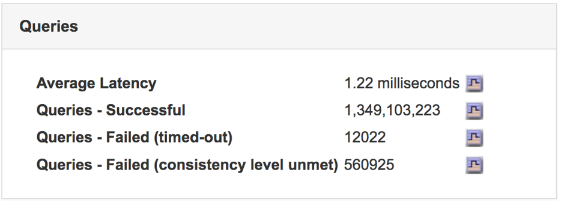

= Contrôle de la latence des requêtes
:allow-uri-read: 
:icons: font
:imagesdir: ../media/

[role="lead"]
Les actions client, telles que le stockage, la récupération ou la suppression d'objets, créent des requêtes vers la base de données distribuée de métadonnées d'objet de la grille. Vous devez surveiller les tendances de la latence des requêtes pour vous assurer que les ressources de la grille sont adaptées à la charge actuelle.

.Ce dont vous avez besoin
Vous devez être connecté à Grid Manager à l'aide d'un navigateur pris en charge.

.Description de la tâche
Les augmentations temporaires de la latence des requêtes sont normales et peuvent être dues à une augmentation soudaine des demandes d'entrée. Les requêtes en échec sont également normales et peuvent entraîner des problèmes de réseau transitoire ou des nœuds temporairement non disponibles. Cependant, si le temps moyen d'exécution d'une requête augmente, les performances globales de la grille diminuent.

Si vous remarquez que la latence des requêtes augmente au fil du temps, il est recommandé d'ajouter des nœuds de stockage supplémentaires dans une procédure d'extension afin de répondre aux futures charges de travail.

L'alerte *latence élevée pour les requêtes de métadonnées* est déclenchée si la durée moyenne des requêtes est trop longue.

.Étapes
. Sélectionnez *Nodes* > *_Storage Node_* > *objets*.
. Faites défiler jusqu'au tableau requêtes et affichez la valeur de latence moyenne.
+

. Cliquez sur l'icône du graphique image:../media/icon_chart_new.gif["Icône de graphique"] pour tracer la valeur dans le temps.
+
image::../media/average_query_latency_chart.png[Graphique de latence moyenne des requêtes]

+
L'exemple de graphique montre les pics de latence d'une requête pendant le fonctionnement normal de la grille.

.Informations associées
link:../expand/index.html["Développez votre grille"]
