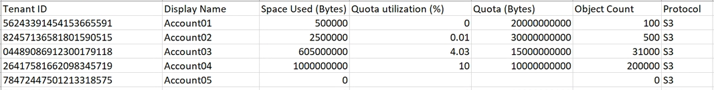
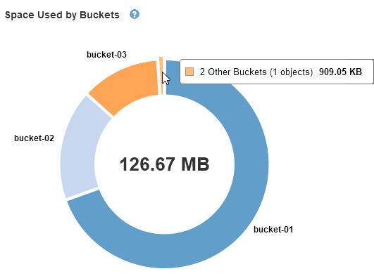

= Contrôle de l'activité des locataires
:allow-uri-read: 
:icons: font
:imagesdir: ../media/

[role="lead"]
Toute l'activité client est associée à un compte de locataire. Vous pouvez utiliser Grid Manager pour surveiller l'utilisation du stockage ou du trafic réseau d'un locataire, ou encore utiliser le journal d'audit ou les tableaux de bord Grafana pour obtenir des informations plus détaillées sur l'utilisation de StorageGRID par les locataires.

.Ce dont vous avez besoin
* Vous devez être connecté à Grid Manager à l'aide d'un navigateur pris en charge.
* Vous devez disposer de l'autorisation accès racine ou Administrateur.

.Description de la tâche

IMPORTANT: Les valeurs espace utilisé sont des estimations. Ces estimations sont affectées par le moment de l'ingestion, la connectivité réseau et l'état des nœuds.

.Étapes
. Sélectionnez *locataires* pour examiner la quantité de stockage utilisée par tous les locataires.
+
Les champs espace utilisé, quota Utilization, quota et Object Count sont répertoriés pour chaque locataire. Si un quota n'est pas défini pour un locataire, le champ quota Utilization contient un tiret (--) et le champ quota indique « Unlimited ».

+
image::../media/tenant_accounts_page.png[Page comptes de tenant]

+
Si votre système comprend plus de 20 éléments, vous pouvez spécifier le nombre de lignes affichées simultanément sur chaque page. Utilisez la zone de recherche pour rechercher un compte de tenant par nom d'affichage ou ID de tenant.

+
Vous pouvez vous connecter à un compte locataire en sélectionnant le lien dans la colonne *connexion* de la table.

. Vous pouvez également sélectionner *Exporter au format CSV* pour afficher et exporter un fichier .csv contenant les valeurs d'utilisation de tous les locataires.
+
Vous êtes invité à ouvrir ou enregistrer le `.csv` fichier.

+
Le contenu d'un fichier .csv ressemble à l'exemple suivant :

+

+
Vous pouvez ouvrir le fichier .csv dans une feuille de calcul ou l'utiliser pour l'automatisation.

. Pour afficher les détails d'un locataire spécifique, y compris les graphiques d'utilisation, sélectionnez le compte de tenant dans la page comptes de tenant, puis sélectionnez *Afficher les détails*.
+
La page Détails du compte s'affiche et affiche des informations récapitulatives, un tableau représentant la quantité de quota utilisé et restant, ainsi qu'un graphique représentant la quantité de données d'objet dans des compartiments (S3) ou des conteneurs (Swift).

+
image::../media/tenant_usage_modal.png[Modal d'utilisation des locataires]

+
** *Quota*
+
Si un quota a été fixé pour ce locataire, le graphique *quota* indique la quantité de ce quota utilisée par ce locataire et la quantité disponible. Si aucun quota n'a été défini, le locataire dispose d'un quota illimité et un message d'information s'affiche. Si le locataire a dépassé le quota de stockage de plus de 1 % et d'au moins 1 Go, le graphique indique le quota total et le montant de l'excès.

+
Vous pouvez placer le curseur sur le segment espace utilisé pour afficher le nombre d'objets stockés et le nombre total d'octets utilisés. Vous pouvez placer votre curseur sur le segment espace libre pour voir le nombre d'octets de quota de stockage disponibles.

+

IMPORTANT: L'utilisation des quotas est basée sur des estimations internes et peut être dépassée dans certains cas. Par exemple, StorageGRID vérifie le quota lorsqu'un locataire commence à charger des objets et rejette les nouvelles ingère si le locataire a dépassé le quota. Cependant, StorageGRID ne prend pas en compte la taille du téléchargement actuel lors de la détermination du dépassement du quota. Si des objets sont supprimés, un locataire peut être temporairement empêché de charger de nouveaux objets jusqu'à ce que l'utilisation des quotas soit recalculée. Le calcul de l'utilisation des quotas peut prendre au moins 10 minutes.

+

NOTE: L'utilisation des quotas d'un locataire indique la quantité totale des données d'objet que le locataire a téléchargées sur StorageGRID (taille logique). L'utilisation du quota ne représente pas l'espace utilisé pour stocker les copies de ces objets et de leurs métadonnées (taille physique).

+

NOTE: Vous pouvez activer l'alerte *tenant quota usage high* pour déterminer si les locataires consomment leurs quotas. Si elle est activée, cette alerte est déclenchée lorsqu'un locataire a utilisé 90 % de son quota. Pour plus d'informations, reportez-vous à la référence des alertes.

** *Espace utilisé*
+
Le graphique *espace utilisé par les compartiments* (S3) ou *espace utilisé par les conteneurs* (Swift) montre les plus grands compartiments pour le locataire. L'espace utilisé correspond à la quantité totale de données d'objet dans le compartiment. Cette valeur ne représente pas l'espace de stockage requis pour les copies ILM et les métadonnées d'objet.

+
Si le locataire possède plus de neuf compartiments ou conteneurs, ils sont combinés dans un segment appelé autre. Certains segments de graphique peuvent être trop petits pour inclure une étiquette. Vous pouvez placer votre curseur sur n'importe quel segment pour afficher le libellé et obtenir plus d'informations, notamment le nombre d'objets stockés et le nombre total d'octets pour chaque compartiment ou conteneur.

+

. Sélectionnez *Détails du compartiment* (S3) ou *Détails du conteneur* (Swift) pour afficher la liste des objets espacés utilisés et du nombre d'objets pour chacun des compartiments ou conteneurs du locataire.
+
image::../media/tenant_bucket_details.png[Détails du compartiment du locataire]

. Vous pouvez également sélectionner *Exporter au format CSV* pour afficher et exporter un fichier .csv contenant les valeurs d'utilisation de chaque compartiment ou conteneur.
+
Vous êtes invité à ouvrir ou enregistrer le fichier .csv.

+
Le contenu d'un fichier .csv d'un locataire S3 ressemble à l'exemple suivant :

+
image::../media/tenant_bucket_details_csv.png[Détails du compartiment locataire exemple CSV]

+
Vous pouvez ouvrir le fichier .csv dans une feuille de calcul ou l'utiliser pour l'automatisation.

. Si des stratégies de classification du trafic sont en place pour un locataire, examinez le trafic réseau de ce locataire.
+
.. Sélectionnez *Configuration* > *Paramètres réseau* > *Classification du trafic*.
+
La page règles de classification du trafic s'affiche et les stratégies existantes sont répertoriées dans le tableau.

+
image::../media/traffic_classification_policies_main_screen_w_examples.png[Politique de trafic pour un exemple de graphique]

.. Consultez la liste des politiques pour identifier celles qui s'appliquent à un locataire spécifique.
.. Pour afficher les mesures associées à une stratégie, sélectionnez le bouton radio à gauche de la stratégie, puis cliquez sur *métriques*.
.. Analysez les graphiques pour déterminer à quelle fréquence la stratégie limite le trafic et si vous devez ajuster la stratégie.
+
Pour créer, modifier ou supprimer des stratégies de classification de trafic, reportez-vous aux instructions d'administration de StorageGRID.

. Vous pouvez également utiliser le journal d'audit pour un contrôle plus granulaire des activités d'un locataire.
+
Par exemple, vous pouvez surveiller les types d'informations suivants :

+
** Des opérations client spécifiques, telles QUE METTRE, OBTENIR ou SUPPRIMER
** Tailles d'objet
** Règle ILM appliquée aux objets
** Adresse IP source des requêtes client

+
Les journaux d'audit sont écrits dans des fichiers texte que vous pouvez analyser à l'aide de l'outil d'analyse des journaux de votre choix. Vous pouvez ainsi mieux comprendre les activités des clients ou implémenter des modèles de facturation et de refacturation sophistiqués. Pour plus d'informations, reportez-vous aux instructions relatives à la compréhension des messages d'audit.

. Vous pouvez également utiliser des metrics Prometheus pour fournir des rapports sur l'activité des locataires :
+
** Dans le Gestionnaire de grille, sélectionnez *support* > *Outils* > *métriques*. Vous pouvez utiliser les tableaux de bord existants, tels que S3 Overview, pour examiner les activités des clients.
+

IMPORTANT: Les outils disponibles sur la page métriques sont principalement destinés au support technique. Certaines fonctions et options de menu de ces outils ne sont intentionnellement pas fonctionnelles.

** Sélectionnez *aide* > *Documentation API*. Vous pouvez utiliser les mesures de la section Metrics de l'API de gestion du grid pour créer des règles d'alerte et des tableaux de bord personnalisés pour l'activité des locataires.

.Informations associées
link:alerts-reference.html["Référence des alertes"]

link:../audit/index.html["Examiner les journaux d'audit"]

link:../admin/index.html["Administrer StorageGRID"]

link:reviewing-support-metrics.html["L'examen des metrics de support"]
