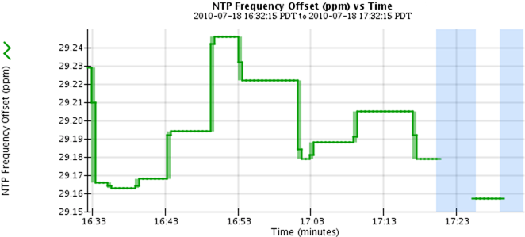

= Types de graphiques et de graphiques
:allow-uri-read: 
:icons: font
:imagesdir: ../media/

[role="lead"]
Les graphiques et les graphiques résument les valeurs des mesures et des attributs StorageGRID spécifiques.

Le tableau de bord de Grid Manager inclut des graphiques circulaires (donut) pour résumer le stockage disponible pour la grille et chaque site.

image::../media/dashboard_available_storage_panel.png[Tableau de bord disponible panneau de stockage]

Le panneau Storage usage du tableau de bord de tenant Manager affiche les éléments suivants :

* Liste des compartiments les plus grands (S3) ou des conteneurs (Swift) du locataire
* Un graphique à barres qui représente les tailles relatives des grands godets ou conteneurs
* La quantité totale d'espace utilisé et, si un quota est défini, la quantité et le pourcentage d'espace restant

image::../media/tenant_dashboard_with_buckets.png[Tableau de bord des locataires]

De plus, les graphiques qui montrent comment les métriques et les attributs StorageGRID changent au fil du temps sont disponibles à partir de la page noeuds et de la page *support* > *Outils* > *topologie de grille*.

Il existe quatre types de graphiques :

* *Graphiques Grafana* : affichés sur la page nœuds, les graphiques Grafana sont utilisés pour tracer les valeurs des metrics Prometheus dans le temps. Par exemple, l'onglet *Nodes* > *Load Balancer* d'un noeud d'administration comprend quatre graphiques Grafana.
+
image::../media/nodes_page_load_balancer_tab.png[Onglet équilibreur de la charge de la page noeuds]

+

NOTE: Les graphiques Grafana sont également inclus dans les tableaux de bord pré-construits disponibles à partir de la page *support* > *Outils* > *métriques*.

* *Graphes linéaires* : disponible à partir de la page noeuds et à partir de la page *support* > *Outils* > *topologie de grille* (cliquez sur l'icône du graphique) image:../media/icon_chart_new.gif["Graphique d'icônes (Nouveau)"] Après une valeur de données), des graphes linéaires sont utilisés pour tracer les valeurs des attributs StorageGRID qui ont une valeur unitaire (tels que le décalage de fréquence NTP, en ppm). Les modifications de la valeur sont tracées dans des intervalles de données réguliers (bacs) au fil du temps.
+

* *Graphes de zone* : disponible à partir de la page noeuds et à partir de la page *support* > *Outils* > *topologie de grille* (cliquez sur l'icône du graphique) image:../media/icon_chart_new.gif["Graphique d'icônes (Nouveau)"] après une valeur de données), les graphes de zone sont utilisés pour tracer les quantités d'attributs volumétriques, telles que les nombres d'objets ou les valeurs de charge de service. Les graphiques de zone sont similaires aux graphiques de ligne, mais incluent un ombrage marron clair en dessous de la ligne. Les modifications de la valeur sont tracées dans des intervalles de données réguliers (bacs) au fil du temps.
+
image::../media/area_graph.gif[Graphique de zone]

* Certains graphiques sont signalés par un autre type d'icône de graphique image:../media/icon_chart_new_for_11_5.png["Icône de graphique - Nouveau pour 11.5"] et ont un format différent :
+
image::../media/charts_lost_object_detected.png[Objets perdus graphiques détectés]

* *Graphique d'état* : disponible à partir de la page *support* > *Outils* > *topologie de grille* (cliquez sur l'icône du graphique) image:../media/icon_chart_new.gif["Graphique d'icônes (Nouveau)"] après une valeur de données), les graphiques d'état sont utilisés pour tracer les valeurs d'attribut représentant des états distincts tels qu'un état de service qui peut être en ligne, en attente ou hors ligne. Les graphiques d'état sont similaires aux graphiques linéaires, mais la transition est discontinue. En d'autres termes, la valeur passe d'une valeur d'état à une autre.
+
image::../media/state_graph.gif[Graphique d'état]

.Informations associées
link:viewing-nodes-page.html["Affichage de la page nœuds"]

link:viewing-grid-topology-tree.html["Affichage de l'arborescence de la grille topologique"]

link:reviewing-support-metrics.html["L'examen des metrics de support"]
