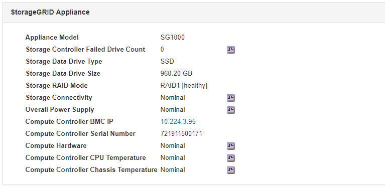

= Affichage des informations sur les nœuds d'administration de l'appliance et les nœuds de passerelle
:allow-uri-read: 
:icons: font
:imagesdir: ../media/

[role="lead"]
La page nœuds répertorie les informations relatives à l'état des services et à toutes les ressources de calcul, de périphérique de disque et de réseau pour chaque appliance de services utilisée pour un nœud d'administration ou un nœud de passerelle. Vous pouvez également afficher la mémoire, le matériel de stockage, les ressources réseau, les interfaces réseau, les adresses réseau, et recevoir et transmettre des données.

.Étapes
. Sur la page nœuds, sélectionnez un nœud d'administration d'appliance ou un nœud de passerelle d'appliance.
. Sélectionnez *vue d'ensemble*.
+
Le tableau informations sur le nœud de l'onglet vue d'ensemble affiche l'ID et le nom du nœud, le type de nœud, la version logicielle installée et les adresses IP associées au nœud. La colonne interface contient le nom de l'interface, comme suit :

+
** *Adllb* et *adlli* : affiché si la liaison actif/sauvegarde est utilisée pour l'interface réseau d'administration
** *Eth* : réseau Grid, réseau Admin ou réseau client.
** *Hic* : un des ports physiques 10, 25 ou 100 GbE de l'appareil. Ces ports peuvent être liés ensemble et connectés au réseau StorageGRID Grid Network (eth0) et au réseau client (eth2).
** *mtc* : l'un des ports physiques 1 GbE de l'appareil, qui peut être lié ou aliasé et connecté au réseau d'administration StorageGRID (eth1).image:../media/nodes_page_overview_tab_services_appliance.png["Onglet noeuds Présentation de la page pour l'appliance services"]

. Sélectionnez *matériel* pour plus d'informations sur l'appareil.
+
.. Affichez les graphiques d'utilisation de l'UC et de la mémoire pour déterminer les pourcentages d'utilisation de l'UC et de la mémoire au fil du temps. Pour afficher un intervalle de temps différent, sélectionnez l'une des commandes au-dessus du graphique ou du graphique. Vous pouvez afficher les informations disponibles pour les intervalles de 1 heure, 1 jour, 1 semaine ou 1 mois. Vous pouvez également définir un intervalle personnalisé, qui vous permet de spécifier des plages de date et d'heure.
+
image::../media/nodes_page_hardware_tab_graphs_services_appliance.png[Page noeuds onglet matériel graphiques de l'appareil de services]

.. Faites défiler vers le bas pour afficher le tableau des composants de l'appareil. Ce tableau contient des informations telles que le nom du modèle, le numéro de série, la version du micrologiciel du contrôleur et l'état de chaque composant.
+

+
|===
| Dans la table Appliance | Description 

 a| 
Modèle de type appliance
 a| 
Numéro de modèle de cette appliance StorageGRID.

 a| 
Nombre de disques défaillants du contrôleur de stockage
 a| 
Nombre de disques qui ne sont pas optimaux.

 a| 
Type de disque de données de stockage
 a| 
Type de disque dur de l'appliance, par exemple HDD (disque dur) ou SSD (disque SSD).

 a| 
Taille du disque de données de stockage
 a| 
Capacité totale comprenant tous les disques de données de l'appliance.

 a| 
Mode de stockage RAID
 a| 
Mode RAID de l'appareil.

 a| 
Bloc d'alimentation général
 a| 
L'état de toutes les alimentations de l'appareil.

 a| 
IP BMC du contrôleur de calcul
 a| 
Adresse IP du port du contrôleur de gestion de la carte mère (BMC) dans le contrôleur de calcul. Vous pouvez utiliser cette adresse IP pour vous connecter à l'interface BMC afin de surveiller et de diagnostiquer le matériel de l'appliance.

Ce champ ne s'affiche pas pour les modèles d'appliance qui ne contiennent pas de BMC.

 a| 
Numéro de série du contrôleur de calcul
 a| 
Numéro de série du contrôleur de calcul.

 a| 
Matériel de calcul
 a| 
L'état du matériel du contrôleur de calcul.

 a| 
Température du processeur du contrôleur de calcul
 a| 
L'état de température de l'UC du contrôleur de calcul.

 a| 
Température du châssis du contrôleur de calcul
 a| 
État de température du contrôleur de calcul.

|===
.. Confirmer que tous les États sont « nominaux ».
+
Si un statut n'est pas « nominal », passez en revue les alertes en cours.

. Sélectionnez *réseau* pour afficher les informations de chaque réseau.
+
Le graphique trafic réseau fournit un récapitulatif du trafic réseau global.

+
image::../media/nodes_page_network_traffic_graph.gif[Courbes de trafic réseau de la page noeuds]

+
.. Consultez la section interfaces réseau.
+
image::../media/nodes_page_hardware_tab_network_services_appliance.png[Page noeuds onglet matériel serveur de services réseau]

+
Utilisez le tableau suivant avec les valeurs de la colonne *Speed* du tableau interfaces réseau pour déterminer si les quatre ports réseau 40/100-GbE de l'appliance ont été configurés pour utiliser le mode actif/sauvegarde ou le mode LACP.

+

NOTE: Les valeurs indiquées dans le tableau supposent que les quatre liens sont utilisés.

+
|===
| Mode de liaison | Mode du lien | Vitesse de la liaison HIC individuelle (hic 1, hi2, hic 3, hic 4) | Vitesse réseau prévue pour la grille/le client (eth0, eth2) 

 a| 
Agrégat
 a| 
LACP
 a| 
100
 a| 
400

 a| 
Fixe
 a| 
LACP
 a| 
100
 a| 
200

 a| 
Fixe
 a| 
Actif/sauvegarde
 a| 
100
 a| 
100

 a| 
Agrégat
 a| 
LACP
 a| 
40
 a| 
160

 a| 
Fixe
 a| 
LACP
 a| 
40
 a| 
80

 a| 
Fixe
 a| 
Actif/sauvegarde
 a| 
40
 a| 
40

|===
.. Passez en revue la section communication réseau.
+
Les tableaux de réception et de transmission indiquent le nombre d'octets et de paquets reçus et envoyés sur chaque réseau ainsi que d'autres mesures de réception et de transmission.

+
image::../media/nodes_page_network_communication.gif[Nœuds page réseau Comm]

. Sélectionnez *Storage* pour afficher des informations sur les unités de disque et les volumes de l'appliance de services.
+
image::../media/nodes_page_storage_tab_services_appliance.png[Nœuds page stockage onglet Services Appliance]

.Informations associées
link:../sg100-1000/index.html["SG100 etamp ; appareils de services SG1000"]
