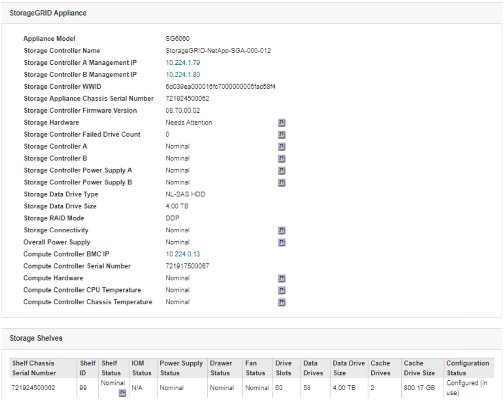

= Affichage des informations sur les nœuds de stockage de l'appliance
:allow-uri-read: 
:icons: font
:imagesdir: ../media/

[role="lead"]
La page nœuds répertorie les informations relatives à l'état des services et à toutes les ressources de calcul, de périphérique de disque et de réseau pour chaque nœud de stockage d'appliance. Vous pouvez également afficher la mémoire, le matériel de stockage, la version du firmware des contrôleurs, les ressources réseau, les interfaces réseau, les adresses réseau et de réception et de transmission des données.

.Étapes
. Sur la page nœuds, sélectionnez un nœud de stockage d'appliance.
. Sélectionnez *vue d'ensemble*.
+
Le tableau informations sur le nœud de l'onglet vue d'ensemble affiche l'ID et le nom du nœud, le type de nœud, la version logicielle installée et les adresses IP associées au nœud. La colonne interface contient le nom de l'interface, comme suit :

+
** *Eth* : réseau Grid, réseau Admin ou réseau client.
** *Hic* : un des ports physiques 10, 25 ou 100 GbE de l'appareil. Ces ports peuvent être liés ensemble et connectés au réseau StorageGRID Grid Network (eth0) et au réseau client (eth2).
** *mtc* : l'un des ports physiques 1 GbE de l'appareil, qui peut être lié ou aliasé et connecté au réseau d'administration StorageGRID (eth1).image:../media/nodes_page_overview_tab_extended.png["Vue d'ensemble de la page nœuds étendue"]

. Sélectionnez *matériel* pour plus d'informations sur l'appareil.
+
.. Affichez les graphiques d'utilisation de l'UC et de la mémoire pour déterminer les pourcentages d'utilisation de l'UC et de la mémoire au fil du temps. Pour afficher un intervalle de temps différent, sélectionnez l'une des commandes au-dessus du graphique ou du graphique. Vous pouvez afficher les informations disponibles pour les intervalles de 1 heure, 1 jour, 1 semaine ou 1 mois. Vous pouvez également définir un intervalle personnalisé, qui vous permet de spécifier des plages de date et d'heure.
+
image::../media/nodes_page_hardware_tab_graphs.png[Graphiques de matériel]

.. Faites défiler vers le bas pour afficher le tableau des composants de l'appareil. Ce tableau contient des informations telles que le nom du modèle de l'appliance, les noms des contrôleurs, les numéros de série et les adresses IP, ainsi que l'état de chaque composant.
+

NOTE: Certains champs, tels que Compute Controller BMC IP et Compute Hardware, apparaissent uniquement pour les appliances dotées de cette fonctionnalité.

+
Les composants des tiroirs de stockage et des tiroirs d'extension s'ils font partie de l'installation apparaissent dans un tableau séparé sous le tableau de l'appliance.

+

+
|===
| Dans la table Appliance | Description 

 a| 
Modèle de type appliance
 a| 
Numéro de modèle de cette appliance StorageGRID présenté dans le logiciel SANtricity.

 a| 
Nom de contrôleur de stockage
 a| 
Nom de cette appliance StorageGRID illustré dans le logiciel SANtricity.

 a| 
IP de gestion du contrôleur de stockage A
 a| 
Adresse IP du port de gestion 1 sur le contrôleur de stockage A. Cette adresse IP vous permet d'accéder au logiciel SANtricity pour résoudre les problèmes de stockage.

 a| 
IP de gestion du contrôleur de stockage B
 a| 
Adresse IP du port de gestion 1 du contrôleur de stockage B. Cette adresse IP vous permet d'accéder au logiciel SANtricity pour résoudre les problèmes de stockage.

Certains modèles d'appliance ne disposent pas d'un contrôleur de stockage B.

 a| 
WWID du contrôleur de stockage
 a| 
Identifiant international du contrôleur de stockage représenté dans le logiciel SANtricity.

 a| 
Numéro de série du châssis de l'appliance de stockage
 a| 
Numéro de série du châssis de l'appareil.

 a| 
Version du micrologiciel du contrôleur de stockage
 a| 
Version du firmware du contrôleur de stockage de cette appliance.

 a| 
Matériel de stockage
 a| 
État global du matériel du contrôleur de stockage. Si SANtricity System Manager signale un état de nécessite une intervention pour le matériel de stockage, le système StorageGRID signale également cette valeur.

Si le statut est « nécessite une attention », vérifiez d'abord le contrôleur de stockage à l'aide du logiciel SANtricity. Assurez-vous ensuite qu'aucune autre alarme ne s'applique au contrôleur de calcul.

 a| 
Nombre de disques défaillants du contrôleur de stockage
 a| 
Nombre de disques qui ne sont pas optimaux.

 a| 
Contrôleur de stockage A
 a| 
L'état du contrôleur de stockage A.

 a| 
Contrôleur de stockage B
 a| 
L'état du contrôleur de stockage B. Certains modèles d'appliance ne disposent pas d'un contrôleur de stockage B.

 a| 
Alimentation A du contrôleur de stockage
 a| 
L'état de l'alimentation A du contrôleur de stockage.

 a| 
Alimentation B du contrôleur de stockage
 a| 
L'état de l'alimentation B du contrôleur de stockage.

 a| 
Type de disque de données de stockage
 a| 
Type de disque dur de l'appliance, par exemple HDD (disque dur) ou SSD (disque SSD).

 a| 
Taille du disque de données de stockage
 a| 
Capacité totale comprenant tous les disques de données de l'appliance.

 a| 
Mode de stockage RAID
 a| 
Mode RAID configuré pour l'appliance.

 a| 
Connectivité du stockage
 a| 
État de la connectivité du stockage.

 a| 
Bloc d'alimentation général
 a| 
L'état de toutes les alimentations de l'appareil.

 a| 
IP BMC du contrôleur de calcul
 a| 
Adresse IP du port du contrôleur de gestion de la carte mère (BMC) dans le contrôleur de calcul. Vous utilisez cette adresse IP pour vous connecter à l'interface BMC afin de surveiller et de diagnostiquer le matériel de l'appliance.

Ce champ ne s'affiche pas pour les modèles d'appliance qui ne contiennent pas de BMC.

 a| 
Numéro de série du contrôleur de calcul
 a| 
Numéro de série du contrôleur de calcul.

 a| 
Matériel de calcul
 a| 
L'état du matériel du contrôleur de calcul. Ce champ ne s'affiche pas pour les modèles d'appliance ne disposant pas de matériel de calcul et de stockage séparé.

 a| 
Température du processeur du contrôleur de calcul
 a| 
L'état de température de l'UC du contrôleur de calcul.

 a| 
Température du châssis du contrôleur de calcul
 a| 
État de température du contrôleur de calcul.

|===
+
|===
| Dans le tableau tiroirs de stockage | Description 

 a| 
Numéro de série du châssis du tiroir
 a| 
Numéro de série du châssis du tiroir de stockage.

 a| 
ID du tiroir
 a| 
Identificateur numérique du tiroir de stockage.

*** 99 : tiroir contrôleur de stockage
*** 0 : premier tiroir d'extension
*** 1 : second tiroir d'extension

*Remarque :* les étagères d'extension s'appliquent uniquement au SG6060.

 a| 
État du tiroir
 a| 
État global du shelf de stockage.

 a| 
État du module d'E/S.
 a| 
L'état des modules d'entrée/sortie (IOM) de tous les tiroirs d'extension. S/O s'il ne s'agit pas d'un tiroir d'extension.

 a| 
État de l'alimentation électrique
 a| 
État global des alimentations du tiroir de stockage.

 a| 
Etat du tiroir
 a| 
L'état des tiroirs dans le tiroir de rangement. N/A si la tablette ne contient pas de tiroirs.

 a| 
État du ventilateur
 a| 
État général des ventilateurs dans le shelf de stockage.

 a| 
Emplacements d'entraînement
 a| 
Nombre total de slots de disque dans le shelf de stockage.

 a| 
Disques de données
 a| 
Nombre de disques du tiroir de stockage utilisés pour le stockage de données.

 a| 
Taille du lecteur de données
 a| 
Taille effective d'un disque de données dans le tiroir de stockage.

 a| 
Lecteurs de cache
 a| 
Nombre de disques du tiroir de stockage utilisés comme cache.

 a| 
Taille du lecteur de cache
 a| 
La taille du plus petit lecteur de cache dans le tiroir de stockage. En principe, les disques en cache sont de la même taille.

 a| 
État de la configuration
 a| 
L'état de configuration du tiroir de stockage.

|===

. Confirmer que tous les États sont « nominaux ».
+
Si un statut n'est pas « nominal », passez en revue les alertes en cours. Vous pouvez également utiliser SANtricity System Manager pour en savoir plus sur certaines de ces valeurs matérielles. Reportez-vous aux instructions d'installation et d'entretien de votre appareil.

. Sélectionnez *réseau* pour afficher les informations de chaque réseau.
+
Le graphique trafic réseau fournit un récapitulatif du trafic réseau global.

+
image::../media/nodes_page_network_traffic_graph.gif[Courbes de trafic réseau de la page noeuds]

+
.. Consultez la section interfaces réseau.
+
image::../media/nodes_page_network_interfaces.gif[Nœuds page interfaces réseau]

+
Utilisez le tableau suivant avec les valeurs de la colonne *Speed* du tableau interfaces réseau pour déterminer si les ports réseau 10/25-GbE de l'appliance ont été configurés pour utiliser le mode actif/sauvegarde ou le mode LACP.

+

NOTE: Les valeurs indiquées dans le tableau supposent que les quatre liens sont utilisés.

+
|===
| Mode de liaison | Mode du lien | Vitesse de la liaison HIC individuelle (hic 1, hi2, hic 3, hic 4) | Vitesse réseau prévue pour la grille/le client (eth0, eth2) 

 a| 
Agrégat
 a| 
LACP
 a| 
25
 a| 
100

 a| 
Fixe
 a| 
LACP
 a| 
25
 a| 
50

 a| 
Fixe
 a| 
Actif/sauvegarde
 a| 
25
 a| 
25

 a| 
Agrégat
 a| 
LACP
 a| 
10
 a| 
40

 a| 
Fixe
 a| 
LACP
 a| 
10
 a| 
20

 a| 
Fixe
 a| 
Actif/sauvegarde
 a| 
10
 a| 
10

|===
+
Pour plus d'informations sur la configuration des ports 10/25-GbE, reportez-vous aux instructions d'installation et de maintenance de votre appareil.

.. Passez en revue la section communication réseau.
+
Les tableaux de réception et de transmission indiquent le nombre d'octets et de paquets reçus et envoyés sur chaque réseau ainsi que d'autres mesures de réception et de transmission.

+
image::../media/nodes_page_network_communication.gif[Nœuds page réseau Comm]

. Sélectionnez *Storage* pour afficher les graphiques qui affichent les pourcentages de stockage utilisés dans le temps pour les données d'objet et les métadonnées d'objet, ainsi que des informations sur les unités de disque, les volumes et les magasins d'objets.
+
image::../media/nodes_page_storage_used_object_data.png[Stockage utilisé : données d'objet]

+
image::../media/storage_used_object_metadata.png[Stockage utilisé : métadonnées d'objet]

+
.. Faites défiler vers le bas pour afficher les quantités de stockage disponibles pour chaque volume et magasin d'objets.
+
Le nom mondial de chaque disque correspond à l'identifiant WWID (World-Wide identifier) du volume qui s'affiche lorsque vous affichez les propriétés des volumes standard dans le logiciel SANtricity (le logiciel de gestion connecté au contrôleur de stockage de l'appliance).

+
Pour vous aider à interpréter les statistiques de lecture et d'écriture du disque relatives aux points de montage du volume, la première partie du nom affichée dans la colonne *Name* de la table Disk Devices (c'est-à-dire _sdc_, _sdd_, _sde_, etc.) correspond à la valeur indiquée dans la colonne *Device* de la table volumes.

+
image::../media/nodes_page_storage_tables.png[Nœuds tables de stockage des pages]

.Informations associées
link:../sg6000/index.html["Dispositifs de stockage SG6000"]

link:../sg5700/index.html["Appliances de stockage SG5700"]

link:../sg5600/index.html["Appliances de stockage SG5600"]
