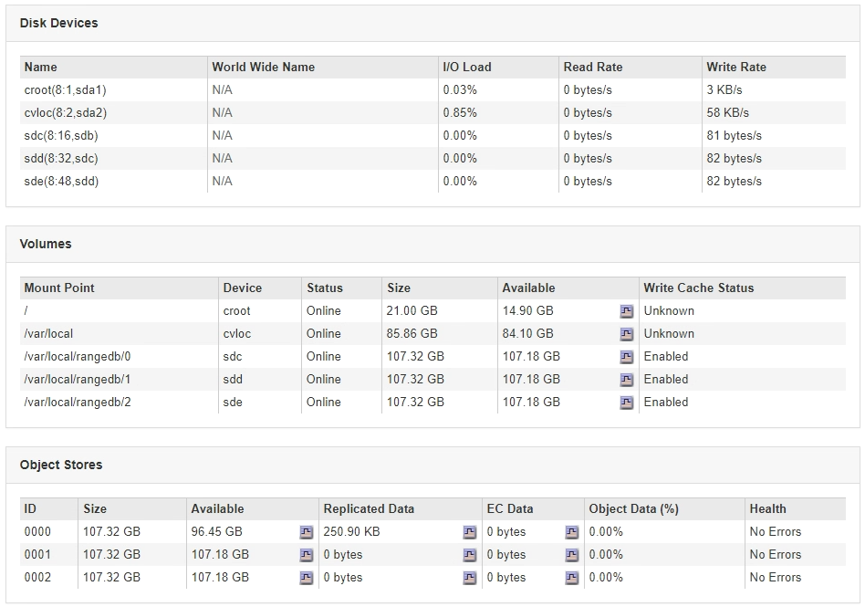

= Affichage de l'onglet stockage
:allow-uri-read: 
:icons: font
:imagesdir: ../media/

[role="lead"]
L'onglet stockage récapitule la disponibilité du stockage et d'autres mesures de stockage.

L'onglet stockage s'affiche pour tous les nœuds, chaque site et la grille complète.

== Graphiques utilisés pour le stockage

Pour les nœuds de stockage, chaque site et la grille dans son intégralité, l'onglet stockage contient des graphiques indiquant la quantité de stockage utilisée par les données d'objet et les métadonnées d'objet au fil du temps.

NOTE: Les valeurs totales d'un site ou de la grille n'incluent pas les nœuds qui n'ont pas signalé de mesures pendant au moins cinq minutes, comme les nœuds hors ligne.

image::../media/nodes_storage_node_storage_tab.png[Onglet nœuds > nœud de stockage > stockage]

== Unités de disque, volumes et tables de stockage d'objets

Pour tous les nœuds, l'onglet stockage contient des détails sur les unités de disque et les volumes du nœud. Pour les nœuds de stockage, le tableau magasins d'objets fournit des informations sur chaque volume de stockage.

.Informations associées
link:monitoring-storage-capacity-for-entire-grid.html["Surveillance de la capacité de stockage pour l'ensemble de la grille"]

link:monitoring-storage-capacity-for-each-storage-node.html["Contrôle de la capacité de stockage pour chaque nœud de stockage"]

link:monitoring-object-metadata-capacity-for-each-storage-node.html["Surveillance de la capacité des métadonnées d'objet pour chaque nœud de stockage"]
