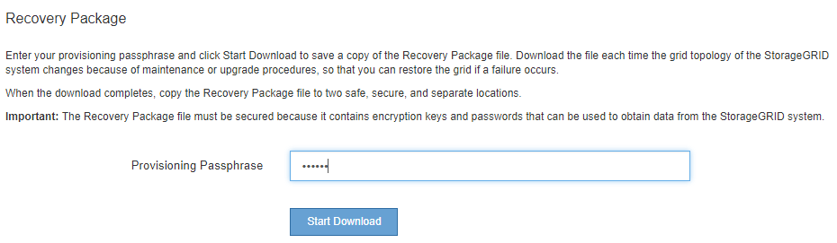

= Téléchargement du progiciel de restauration
:allow-uri-read: 
:icons: font
:imagesdir: ../media/

[role="lead"]
Le progiciel de restauration est un fichier .zip téléchargeable contenant des fichiers et logiciels spécifiques au déploiement nécessaires pour installer, développer, mettre à niveau et entretenir un système StorageGRID.

Le fichier Recovery Package contient également des informations de configuration et d'intégration spécifiques au système, y compris les noms d'hôtes de serveur et les adresses IP, ainsi que des mots de passe hautement confidentiels nécessaires lors de la maintenance, de la mise à niveau et de l'extension du système. Le progiciel de restauration est requis pour effectuer une restauration suite à la défaillance du nœud d'administration principal.

Lors de l'installation d'un système StorageGRID, vous devez télécharger le fichier du progiciel de récupération et confirmer que vous pouvez accéder correctement au contenu de ce fichier. Vous devez également télécharger ce fichier à chaque modification de la topologie grid du système StorageGRID suite aux procédures de maintenance ou de mise à niveau.

Après avoir téléchargé le fichier du progiciel de récupération et confirmé que vous pouvez extraire le contenu, copiez le fichier du progiciel de récupération dans deux emplacements sûrs, sécurisés et séparés.

IMPORTANT: Le fichier du progiciel de récupération doit être sécurisé car il contient des clés de cryptage et des mots de passe qui peuvent être utilisés pour obtenir des données du système StorageGRID.

.Informations associées
link:../upgrade/index.html["Mise à niveau du logiciel"]

link:../expand/index.html["Développez votre grille"]

link:../maintain/index.html["Maintenance et récupération"]
