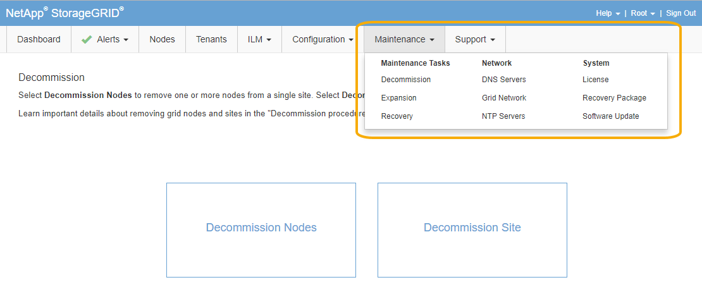

= Exploration du Grid Manager
:allow-uri-read: 
:icons: font
:imagesdir: ../media/

[role="lead"]
L'interface graphique Web du gestionnaire de grid permet de configurer, de gérer et de surveiller votre système StorageGRID.

Lorsque vous vous connectez à Grid Manager, vous vous connectez à un noeud d'administration. Chaque système StorageGRID comprend un nœud d'administration principal et un nombre quelconque de nœuds d'administration non primaires. Vous pouvez vous connecter à n'importe quel nœud d'administration et chaque nœud d'administration affiche une vue similaire du système StorageGRID.

Vous pouvez accéder au Gestionnaire de grille à l'aide d'un navigateur Web pris en charge.

== Navigateurs Web pris en charge

Vous devez utiliser un navigateur Web pris en charge.

[cols="1a,1a"]
|===
| Navigateur Web | Version minimale prise en charge 

 a| 
Google Chrome
 a| 
87

 a| 
Microsoft Edge
 a| 
87

 a| 
Mozilla Firefox
 a| 
84

|===
Vous devez régler la fenêtre du navigateur sur une largeur recommandée.

[cols="1a,1a"]
|===
| Largeur du navigateur | Pixels 

 a| 
Minimum
 a| 
1024

 a| 
Optimale
 a| 
1280

|===

== Tableau de bord de Grid Manager

Lorsque vous vous connectez à Grid Manager pour la première fois, vous pouvez utiliser le tableau de bord pour surveiller en un coup d'œil les activités du système.

Le tableau de bord inclut un résumé des informations sur l'état du système, l'utilisation du stockage, les processus ILM et les opérations S3 et Swift.

image::../media/grid_manager_dashboard.png[Tableau de bord dans Grid Manager]

Pour obtenir une explication des informations de chaque panneau, cliquez sur l'icône aide image:../media/icon_nms_question.gif["icône point d'interrogation"] pour ce panneau.

.Informations associées
link:../monitor/index.html["Moniteur et amp ; dépannage"]

== Menu alertes

Le menu alertes offre une interface facile à utiliser pour détecter, évaluer et résoudre les problèmes susceptibles de se produire lors du fonctionnement de StorageGRID.

image::../media/alerts_menu.png[Menu alertes]

Dans le menu alertes, vous pouvez effectuer les opérations suivantes :

* Examiner les alertes en cours
* Examiner les alertes résolues
* Configurez les silences pour supprimer les notifications d'alerte
* Configurez le serveur de messagerie pour les notifications d'alerte
* Définissez des règles d'alerte pour les conditions qui déclenchent des alertes

.Informations associées
link:monitoring-and-managing-alerts.html["Surveillance et gestion des alertes"]

link:../monitor/index.html["Moniteur et amp ; dépannage"]

== Page nœuds

La page nœuds affiche des informations sur l'ensemble de la grille, sur chaque site de la grille et sur chaque nœud d'un site.

La page d'accueil nœuds affiche des mesures combinées pour l'ensemble de la grille. Pour afficher les informations d'un site ou nœud particulier, cliquez sur le lien approprié à gauche.

image::../media/nodes_menu.png[page principale des nœuds]

.Informations associées
link:viewing-nodes-page.html["Affichage de la page nœuds"]

link:../monitor/index.html["Moniteur et amp ; dépannage"]

== Page comptes de tenant

La page comptes de locataires vous permet de créer et de surveiller les comptes de locataires pour votre système StorageGRID. Vous devez créer au moins un compte de tenant pour spécifier qui peut stocker et récupérer des objets et la fonctionnalité qui leur est disponible.

La page comptes de tenant fournit également des détails d'utilisation pour chaque locataire, y compris la quantité de stockage utilisée et le nombre d'objets. Si vous définissez un quota lors de la création du locataire, vous pouvez voir la part utilisée de ce quota.

image::../media/tenants_menu_and_page.png[Menu et page locataires]

.Informations associées
link:managing-tenants-and-client-connections.html["Gestion des locataires et des connexions client"]

link:../admin/index.html["Administrer StorageGRID"]

link:../tenant/index.html["Utilisez un compte de locataire"]

== Menu ILM

Le menu ILM vous permet de configurer les règles et règles de gestion du cycle de vie des informations (ILM) qui régissent la durabilité et la disponibilité des données. Vous pouvez également saisir un identifiant d'objet pour afficher les métadonnées de cet objet.

image::../media/ilm_menu_and_page.png[Menu et page ILM]

.Informations associées
link:using-information-lifecycle-management.html["Utilisation de la gestion du cycle de vie des informations"]

link:../ilm/index.html["Gestion des objets avec ILM"]

== Menu Configuration

Le menu Configuration vous permet de spécifier les paramètres réseau, les paramètres système, les options de surveillance et les options de contrôle d'accès.

image::../media/configuration_menu.png[Menu Configuration]

.Informations associées
link:configuring-network-settings.html["Configuration des paramètres réseau"]

link:managing-tenants-and-client-connections.html["Gestion des locataires et des connexions client"]

link:reviewing-audit-messages.html["Vérification des messages d'audit"]

link:controlling-storagegrid-access.html["Contrôle de l'accès StorageGRID"]

link:../admin/index.html["Administrer StorageGRID"]

link:../monitor/index.html["Moniteur et amp ; dépannage"]

link:../audit/index.html["Examiner les journaux d'audit"]

== Menu Maintenance

Le menu Maintenance vous permet d'effectuer des tâches de maintenance, des tâches réseau et des tâches système.

=== Tâches de maintenance

Les tâches de maintenance sont les suivantes :

* Déclassez les opérations pour supprimer les nœuds et sites grid inutilisés.
* Étendez vos opérations pour ajouter des nœuds et des sites grid.
* Opérations de récupération pour le remplacement d'un nœud défaillant et la restauration des données.

=== Le réseau

Les tâches réseau que vous pouvez effectuer à partir du menu Maintenance sont les suivantes :

* Modification des informations relatives aux serveurs DNS.
* Configuration des sous-réseaux utilisés sur le réseau grille.
* Modification des informations relatives aux serveurs NTP.

=== Système

Les tâches système que vous pouvez effectuer à partir du menu Maintenance sont les suivantes :

* Vérification des détails de la licence StorageGRID actuelle ou téléchargement d'une nouvelle licence.
* Génération d'un progiciel de restauration.
* Effectuer des mises à jour logicielles StorageGRID, y compris les mises à niveau logicielles, les correctifs et les mises à jour du logiciel SANtricity OS sur les appliances sélectionnées

.Informations associées
link:performing-maintenance-procedures.html["Exécution des procédures de maintenance"]

link:downloading-recovery-package.html["Téléchargement du progiciel de restauration"]

link:../expand/index.html["Développez votre grille"]

link:../upgrade/index.html["Mise à niveau du logiciel"]

link:../maintain/index.html["Maintenance et récupération"]

link:../sg6000/index.html["Dispositifs de stockage SG6000"]

link:../sg5700/index.html["Appliances de stockage SG5700"]

link:../sg5600/index.html["Appliances de stockage SG5600"]

== Menu support

Le menu support fournit des options qui vous aident à analyser et à dépanner votre système. Le menu support comprend deux parties : Outils et alarmes (hérité).

image::../media/support_menu.png[Menu support]

=== Outils

À partir de la section Outils du menu support, vous pouvez :

* Activez AutoSupport.
* Effectuer un ensemble de contrôles de diagnostic sur l'état actuel de la grille.
* Accédez à l'arborescence de la grille topologique pour afficher des informations détaillées sur les nœuds de la grille, les services et les attributs.
* Récupère les fichiers journaux et les données système.
* Examiner les indicateurs et les graphiques détaillés
+

IMPORTANT: Les outils disponibles dans l'option *Metrics* sont destinés à être utilisés par le support technique. Certaines fonctions et options de menu de ces outils ne sont intentionnellement pas fonctionnelles.

=== Alarmes (existantes)

Dans la section alarmes (anciennes) du menu support, vous pouvez consulter les alarmes actuelles, historiques et globales et configurer les notifications par e-mail pour les alarmes héritées et AutoSupport.

.Informations associées
link:storagegrid-architecture-and-network-topology.html["Architecture StorageGRID et topologie réseau"]

link:storagegrid-attributes.html["Attributs des StorageGRID"]

link:using-storagegrid-support-options.html["Utilisation des options de prise en charge de StorageGRID"]

link:../admin/index.html["Administrer StorageGRID"]

link:../monitor/index.html["Moniteur et amp ; dépannage"]

== Menu aide

L'option aide permet d'accéder au Centre de documentation StorageGRID pour la version actuelle et à la documentation de l'API. Vous pouvez également déterminer la version de StorageGRID actuellement installée.

image::../media/help_menu.png[Menu d'aide]

.Informations associées
link:../admin/index.html["Administrer StorageGRID"]
