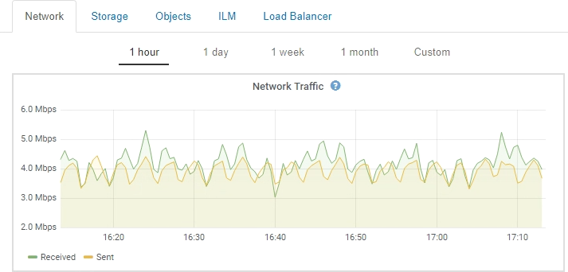

= Metrics Prometheus
:allow-uri-read: 
:icons: font
:imagesdir: ../media/

[role="lead"]
Le service Prometheus sur les nœuds d'administration recueille les metrics de série chronologique des services sur tous les nœuds.

Les metrics collectées par Prometheus sont utilisés à plusieurs endroits dans Grid Manager :

* *Page noeuds* : les graphiques et graphiques des onglets disponibles sur la page noeuds utilisent l'outil de visualisation Grafana pour afficher les metrics de séries chronologiques recueillies par Prometheus. Grafana affiche les données de séries chronologiques aux formats graphique et graphique, tandis que Prometheus sert de source de données back-end.
+

* *Alertes* : les alertes sont déclenchées à des niveaux de gravité spécifiques lorsque les conditions de règle d'alerte qui utilisent des metrics Prometheus sont définies comme vraies.
* *Grid Management API* : vous pouvez utiliser des metrics Prometheus dans des règles d'alerte personnalisées ou avec des outils d'automatisation externes pour surveiller votre système StorageGRID. Une liste complète des metrics de Prometheus est disponible dans l'API Grid Management (*aide* *Documentation API* *Metrics*). Bien que plus d'un millier de mesures soient disponibles, seul un nombre relativement faible est requis pour surveiller les opérations StorageGRID les plus stratégiques.
+

NOTE: Les indicateurs qui incluent _private_ dans leurs noms sont destinés à un usage interne uniquement et peuvent être modifiés sans préavis entre les versions de StorageGRID.

* La page *support* *Outils* *Diagnostics* et la page *support* *Outils* *mesures* : ces pages, qui sont principalement destinées à être utilisées par le support technique, fournissent un certain nombre d'outils et de graphiques qui utilisent les valeurs des mesures Prometheus.
+

NOTE: Certaines fonctions et options de menu de la page métriques sont intentionnellement non fonctionnelles et peuvent faire l'objet de modifications.

.Informations associées
link:monitoring-and-managing-alerts.html["Surveillance et gestion des alertes"]

link:using-storagegrid-support-options.html["Utilisation des options de prise en charge de StorageGRID"]

link:../monitor/index.html["Moniteur et amp ; dépannage"]
