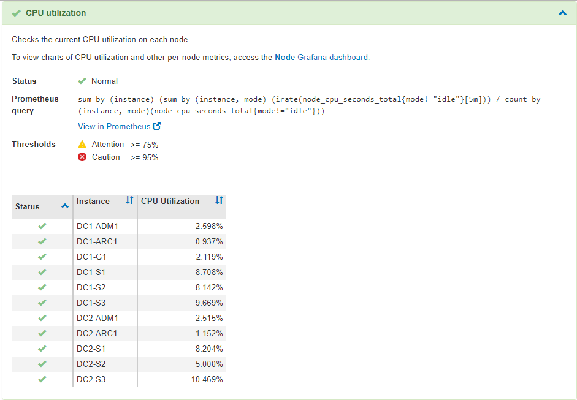

= Utilisation des options de prise en charge de StorageGRID
:allow-uri-read: 
:icons: font
:imagesdir: ../media/

[role="lead"]
Grid Manager propose différentes options vous aidant à travailler avec un support technique en cas de problème survenant dans votre système StorageGRID.

== Configuration d'AutoSupport en cours

La fonctionnalité AutoSupport permet à votre système StorageGRID d'envoyer des messages d'état et d'état au support technique. L'utilisation de AutoSupport peut considérablement accélérer l'identification et la résolution des problèmes. Le support technique peut également surveiller les besoins en stockage de votre système et vous aider à déterminer si vous devez ajouter de nouveaux nœuds ou sites. Vous pouvez également configurer l'envoi des messages AutoSupport à une destination supplémentaire.

=== Informations incluses dans les messages AutoSupport

Les messages AutoSupport incluent des informations telles que :

* Version du logiciel StorageGRID
* Version du système d'exploitation
* Informations sur les attributs au niveau du système et de l'emplacement
* Alertes et alarmes récentes (système hérité)
* État actuel de toutes les tâches de la grille, y compris les données historiques
* Informations sur les événements répertoriées sur la page *Nodes* *_node_* *Events*
* Utilisation de la base de données du nœud d'administration
* Nombre d'objets perdus ou manquants
* Paramètres de configuration de la grille
* Entités NMS
* Règle ILM active
* Fichier de spécification de grille provisionné
* Les mesures de diagnostic

Vous pouvez activer la fonctionnalité AutoSupport et les options AutoSupport individuelles lors de la première installation de StorageGRID, ou vous pouvez les activer ultérieurement. Si AutoSupport n'est pas activé, un message s'affiche dans le tableau de bord du gestionnaire de grille. Le message inclut un lien vers la page de configuration de AutoSupport.

image::../media/autosupport_disabled_message.png[Message AutoSupport désactivé]

Vous pouvez sélectionner le symbole « x » image:../media/autosupport_close_message.png[""] pour fermer le message. Le message ne s'affichera plus tant que le cache de votre navigateur n'aura pas été effacé, même si AutoSupport reste désactivé.

=== Utilisation de Active IQ

Active IQ est un conseiller digital basé dans le cloud qui exploite l'analytique prédictive et les connaissances de la communauté issues de la base installée de NetApp. Les évaluations continues des risques, les alertes prédictives, les conseils normatifs et les actions automatisées vous aident à anticiper les problèmes, ce qui permet d'améliorer l'état et la disponibilité du système.

Vous devez activer AutoSupport si vous souhaitez utiliser les tableaux de bord et la fonctionnalité Active IQ sur le site de support NetApp.

https://docs.netapp.com/us-en/active-iq/index.html["Documentation Active IQ sur le conseiller digital"^]

=== Accès aux paramètres AutoSupport

Vous configurez AutoSupport à l'aide du Gestionnaire de grille (*support* *Outils* *AutoSupport*). La page *AutoSupport* comporte deux onglets : *Paramètres* et *Résultats*.

image::../media/autosupport_accessing_settings.png[Accès aux paramètres AutoSupport]

=== Protocoles pour l'envoi des messages AutoSupport

Vous pouvez choisir l'un des trois protocoles pour l'envoi des messages AutoSupport :

* HTTPS
* HTTP
* SMTP

Si vous envoyez des messages AutoSupport via HTTPS ou HTTP, vous pouvez configurer un serveur proxy non transparent entre les nœuds d'administration et le support technique.

Si vous utilisez SMTP comme protocole pour les messages AutoSupport, vous devez configurer un serveur de messagerie SMTP.

=== Options AutoSupport

Toutes les combinaisons d'options suivantes vous permettent d'envoyer des messages AutoSupport au support technique :

* *Hebdomadaire*: Envoyer automatiquement des messages AutoSupport une fois par semaine. Paramètre par défaut : activé.
* *Event-déclenché* : envoie automatiquement des messages AutoSupport toutes les heures ou lorsque des événements système importants se produisent. Paramètre par défaut : activé.
* *On Demand*: Laissez le support technique demander à votre système StorageGRID d'envoyer automatiquement des messages AutoSupport, ce qui est utile lorsqu'ils travaillent activement en cas de problème (nécessite le protocole de transmission HTTPS AutoSupport). Paramètre par défaut : Désactivé.
* *Déclenché par l'utilisateur* : envoyez manuellement des messages AutoSupport à tout moment.

.Informations associées
link:../admin/index.html["Administrer StorageGRID"]

link:configuring-network-settings.html["Configuration des paramètres réseau"]

== Collecte des journaux StorageGRID

Pour résoudre un problème, vous devrez peut-être collecter des fichiers journaux et les transférer au support technique.

StorageGRID utilise des fichiers journaux pour capturer les événements, les messages de diagnostic et les conditions d'erreur. Le fichier bycast.log est conservé pour chaque nœud de la grille et est le fichier de dépannage principal. StorageGRID crée également des fichiers journaux pour les services StorageGRID individuels, les fichiers journaux relatifs aux activités de déploiement et de maintenance, ainsi que les fichiers journaux associés aux applications tierces.

Les utilisateurs qui disposent des autorisations appropriées et qui connaissent la phrase de passe de provisionnement de votre système StorageGRID peuvent utiliser la page journaux du Gestionnaire de grille pour collecter les fichiers journaux, les données système et les données de configuration. Lorsque vous collectez des journaux, vous sélectionnez un ou plusieurs nœuds et spécifiez une période. Les données sont collectées et archivées dans un `.tar.gz` fichier que vous pouvez télécharger sur un ordinateur local. Dans ce fichier, il y a une archive de fichier journal pour chaque nœud de la grille.

image::../media/support_logs_select_nodes.gif[Capture d'écran de l'interface de collecte de journaux]

.Informations associées
link:../monitor/index.html["Moniteur et amp ; dépannage"]

link:../admin/index.html["Administrer StorageGRID"]

== Utilisation de metrics et exécution des diagnostics

Lorsque vous dépannez un problème, vous pouvez consulter les graphiques et les metrics détaillés de votre système StorageGRID en collaboration avec le support technique. Vous pouvez également exécuter des requêtes de diagnostic prédéfinies afin d'évaluer de manière proactive les valeurs clés de votre système StorageGRID.

=== Page métriques

La page Metrics permet d'accéder aux interfaces utilisateur de Prometheus et Grafana. Prometheus est un logiciel open source qui permet de collecter des metrics. Grafana est un logiciel open source permettant de visualiser les metrics.

IMPORTANT: Les outils disponibles sur la page métriques sont destinés au support technique. Certaines fonctions et options de menu de ces outils sont intentionnellement non fonctionnelles et peuvent faire l'objet de modifications.

image::../media/metrics_page.png[Page mesures]

Le lien de la section Prometheus de la page Metrics vous permet d'interroger les valeurs actuelles des metrics StorageGRID et d'afficher les graphiques des valeurs dans le temps.

image::../media/metrics_page_prometheus.png[Page de metrics Prometheus]

NOTE: Les indicateurs qui incluent _private_ dans leurs noms sont destinés à un usage interne uniquement et peuvent être modifiés sans préavis entre les versions de StorageGRID.

Les liens de la section Grafana de la page Metrics vous permettent d'accéder aux tableaux de bord pré-construits contenant des graphiques des metrics StorageGRID au fil du temps.

image::../media/metrics_page_grafana.png[Metrics page Grafana]

=== Page de diagnostic

La page Diagnostics effectue un ensemble de vérifications de diagnostic pré-construites sur l'état actuel de la grille. Dans l'exemple, tous les diagnostics ont un état Normal.

image::../media/support_diagnostics_page.png[Page support Diagnostics]

En cliquant sur un diagnostic spécifique, vous pouvez afficher des détails sur le diagnostic et ses résultats actuels.

Dans cet exemple, l'utilisation actuelle du processeur pour chaque nœud d'un système StorageGRID est indiquée. Toutes les valeurs de nœud sont inférieures aux seuils attention et mise en garde, de sorte que l'état général du diagnostic est Normal.

.Informations associées
link:../monitor/index.html["Moniteur et amp ; dépannage"]
