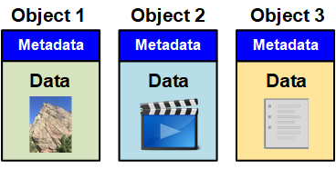

= Qu'est-ce qu'un objet
:allow-uri-read: 
:icons: font
:imagesdir: ../media/

[role="lead"]
Avec le stockage objet, l'unité de stockage est un objet, et non un fichier ou un bloc. Contrairement à la hiérarchie de type arborescence d'un système de fichiers ou stockage en blocs, le stockage objet organise les données dans une disposition plate et non structurée. Le stockage objet dissocie l'emplacement physique des données de la méthode de stockage et de récupération utilisée.

Chaque objet d'un système de stockage basé sur les objets comporte deux parties : les données d'objet et les métadonnées d'objet.

== Données d'objet

Les données d'objet peuvent être quoi que ce soit ; par exemple, une photographie, un film ou un dossier médical.

== Métadonnées d'objet

Les métadonnées d'objet constituent toutes les informations qui décrivent un objet. StorageGRID utilise les métadonnées d'objet pour suivre l'emplacement de tous les objets de la grille, et pour gérer le cycle de vie de chaque objet au fil du temps.

Les métadonnées de l'objet incluent les informations suivantes :

* Les métadonnées du système, y compris un ID unique pour chaque objet (UUID), le nom de l'objet, le nom du compartiment S3 ou du conteneur Swift, le nom ou l'ID du compte du locataire, la taille logique de l'objet, la date et l'heure de la première création de l'objet, et la date et l'heure de la dernière modification de l'objet.
* Emplacement de stockage actuel de chaque copie d'objet ou fragment codé d'effacement.
* Toutes les métadonnées utilisateur associées à l'objet.

Les métadonnées de l'objet sont personnalisables et extensibles, ce qui rend la possibilité d'utiliser les applications.

Pour plus d'informations sur la façon et l'emplacement StorageGRID de stockage des métadonnées d'objet, accédez à link:../admin/managing-object-metadata-storage.html["Gestion du stockage des métadonnées d'objet"].
