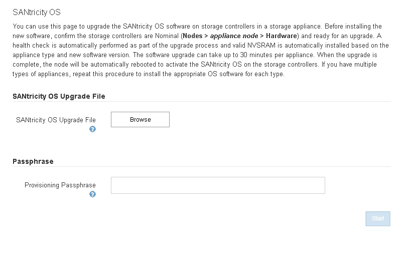

= Mise à niveau de SANtricity OS sur les contrôleurs de stockage à l'aide de Grid Manager
:allow-uri-read: 
:icons: font
:imagesdir: ../media/

[role="lead"]
Pour les contrôleurs de stockage qui utilisent actuellement SANtricity OS 08.42.20.00 (11.42) ou version ultérieure, vous devez utiliser le gestionnaire grid pour appliquer une mise à niveau.

.Ce dont vous avez besoin
* Vous avez consulté la matrice d'interopérabilité (IMT) de NetApp afin de vérifier que la version de SANtricity OS que vous utilisez pour la mise à niveau est compatible avec votre appliance.
* Vous devez disposer de l'autorisation Maintenance.
* Vous devez être connecté à Grid Manager à l'aide d'un navigateur pris en charge.
* Vous devez disposer de la phrase secrète pour le provisionnement.
* Vous devez avoir accès à la page de téléchargements NetApp pour SANtricity OS.

.Description de la tâche
Vous ne pouvez pas effectuer d'autres mises à jour logicielles (mise à niveau du logiciel StorageGRID ou correctif) tant que vous n'avez pas terminé le processus de mise à niveau de SANtricity OS. Si vous tentez de lancer un correctif ou une mise à niveau du logiciel StorageGRID avant la fin du processus de mise à niveau de SANtricity OS, vous êtes redirigé vers la page de mise à niveau de SANtricity OS.

La procédure ne sera terminée qu'une fois la mise à niveau de SANtricity OS appliquée avec succès à tous les nœuds applicables. Il peut prendre plus de 30 minutes pour charger le système d'exploitation SANtricity sur chaque nœud et jusqu'à 90 minutes pour redémarrer chaque appliance de stockage StorageGRID.

CAUTION: Les étapes suivantes s'appliquent uniquement lorsque vous utilisez le gestionnaire de grille pour effectuer la mise à niveau. Les contrôleurs de stockage des appliances SG6000 ne peuvent pas être mis à niveau avec Grid Manager lorsque les contrôleurs utilisent un système d'exploitation SANtricity antérieur à 08.42.20.00 (11.42).

NOTE: Cette procédure met automatiquement à niveau la NVSRAM vers la version la plus récente associée à la mise à niveau du système d'exploitation SANtricity. Vous n'avez pas besoin d'appliquer un fichier de mise à niveau NVSRAM distinct.

.Étapes
. Depuis un ordinateur portable de service, téléchargez le nouveau fichier logiciel SANtricity OS sur le site du support NetApp.
+
Veillez à choisir la version de SANtricity OS adaptée aux contrôleurs de stockage de votre appliance. SG6060 utilise le contrôleur E2800 et le SGF6024 utilise le contrôleur EF570.

+
https://mysupport.netapp.com/site/products/all/details/eseries-santricityos/downloads-tab["Téléchargements NetApp pour SANtricity OS"^]

. Connectez-vous au Grid Manager à l'aide d'un navigateur pris en charge.
. Sélectionnez *Maintenance*. Ensuite, dans la section système du menu, sélectionnez *mise à jour du logiciel*.
+
La page mise à jour du logiciel s'affiche.

+
image::../media/software_update_landing.png[Page d'accueil de mise à jour de logiciels]

. Cliquez sur *SANtricity OS*.
+
La page SANtricity OS s'affiche.

+

. Sélectionnez le fichier de mise à niveau de système d'exploitation SANtricity que vous avez téléchargé depuis le site du support NetApp.
+
.. Cliquez sur *Parcourir*.
.. Localisez et sélectionnez le fichier.
.. Cliquez sur *Ouvrir*.
+
Le fichier est téléchargé et validé. Une fois le processus de validation terminé, le nom du fichier s'affiche dans le champ Détails.

+

NOTE: Ne modifiez pas le nom du fichier car il fait partie du processus de vérification.

+
image::../media/santricity_upgrade_os_file_validated.png[Mise à niveau de SANtricity OS, fichier valide]

. Saisissez la phrase secrète pour le provisionnement.
+
Le bouton *Démarrer* est activé.

+
image::../media/santricity_start_button.png[Capture d'écran affichant la première page de SANtricity OS de StorageGRID]

. Cliquez sur *Démarrer*.
+
Un message d'avertissement s'affiche indiquant que la connexion de votre navigateur peut être perdue temporairement car les services sur les nœuds mis à niveau sont redémarrés.

+
image::../media/santricity_upgrade_warning.png[la capture d'écran montrant la connexion sera temporairement perdue]

. Cliquez sur *OK* pour faire passer le fichier de mise à niveau de SANtricity OS au nœud d'administration principal.
+
Lorsque la mise à niveau de SANtricity OS démarre :

+
.. Le contrôle de l'état est exécuté. Ce processus vérifie qu'aucun nœud ne présente l'état nécessite une intervention.
+

NOTE: Si des erreurs sont signalées, résolvez-les et cliquez à nouveau sur *Démarrer*.

.. Le tableau de progression de la mise à niveau de SANtricity OS s'affiche. Ce tableau affiche tous les nœuds de stockage de votre grille ainsi que l'étape actuelle de la mise à niveau de chaque nœud.
+

NOTE: Le tableau affiche tous les nœuds de stockage, y compris les nœuds de stockage Software-Based. Vous devez approuver la mise à niveau pour tous les nœuds de stockage, même si la mise à niveau de SANtricity OS n'a pas d'incidence sur les nœuds de stockage logiciels. Le message de mise à niveau renvoyé pour les nœuds de stockage basés sur logiciel est « la mise à niveau du système d'exploitation SANtricity n'est pas applicable à ce nœud ».

+
image::../media/santricity_upgrade_progress_table.png[Capture d'écran affichant la partie progression de la mise à niveau de SANtricity OS de la page mise à niveau de SANtricity OS]

. Vous pouvez également trier la liste des nœuds par ordre croissant ou décroissant en fonction de *site*, *Nom*, *progression*, *étape* ou *Détails*. Vous pouvez également saisir un terme dans la zone *Rechercher* pour rechercher des nœuds spécifiques.
+
Vous pouvez faire défiler la liste des nœuds à l'aide des flèches gauche et droite dans le coin inférieur droit de la section.

. Approuver les nœuds de grille que vous êtes prêt à ajouter à la file d'attente de mise à niveau. Les nœuds approuvés du même type sont mis à niveau un par un.
+

IMPORTANT: N'approuvez pas la mise à niveau de SANtricity OS pour un nœud de stockage de l'appliance, sauf si vous êtes sûr que le nœud est prêt à être arrêté et à redémarrer.lorsque la mise à niveau de SANtricity OS est approuvée sur un nœud, les services associés à ce nœud sont arrêtés. Ultérieurement, lors de la mise à niveau du nœud, le nœud d'appliance est redémarré. Ces opérations peuvent entraîner des interruptions de service pour les clients qui communiquent avec le nœud.

+
** Cliquez sur l'un des boutons *approuver tout* pour ajouter tous les nœuds de stockage à la file d'attente de mise à niveau de SANtricity OS.
+

NOTE: Si l'ordre dans lequel les nœuds sont mis à niveau est important, approuvez les nœuds ou les groupes de nœuds un par un et attendez que la mise à niveau soit terminée sur chaque nœud avant d'approuver le ou les nœuds suivants.

** Cliquez sur un ou plusieurs boutons *Approve* pour ajouter un ou plusieurs nœuds à la file d'attente de mise à niveau de SANtricity OS.
+

NOTE: Vous pouvez retarder l'application d'une mise à niveau de SANtricity OS vers un nœud, mais le processus de mise à niveau de SANtricity OS n'est pas terminé tant que vous n'aurez pas approuvé la mise à niveau de SANtricity OS sur tous les nœuds de stockage répertoriés.

+
Après avoir cliqué sur *Approve*, le processus de mise à niveau détermine si le noeud peut être mis à niveau. Si un nœud peut être mis à niveau, il est ajouté à la file d'attente de mise à niveau. +

+
Pour certains noeuds, le fichier de mise à niveau sélectionné n'est pas appliqué intentionnellement et vous pouvez terminer le processus de mise à niveau sans mettre à niveau ces noeuds spécifiques. Pour les nœuds qui ne sont pas mis à niveau intentionnellement, le processus affiche l'étape terminée avec l'un des messages suivants dans la colonne Détails :

+
*** Le nœud de stockage a déjà été mis à niveau.
*** La mise à niveau de SANtricity OS n'est pas applicable à ce nœud.
*** SANtricity OS fichier n'est pas compatible avec ce nœud.

+
Le message « la mise à niveau de SANtricity OS n'est pas applicable à ce nœud » indique que ce nœud ne dispose pas de contrôleur de stockage pouvant être géré par le système StorageGRID. Ce message s'affiche pour les nœuds de stockage non-appliance. Vous pouvez terminer le processus de mise à niveau de SANtricity OS sans mettre à niveau le nœud affichant ce message. + le message « le fichier SANtricity OS n'est pas compatible avec ce noeud » indique que le nœud requiert un fichier SANtricity OS différent de celui que le processus tente d'installer. Une fois la SANtricity mise à niveau terminée, téléchargez le système d'exploitation SANtricity approprié pour le nœud et répétez le processus de mise à niveau.

. Si vous devez supprimer un nœud ou tous les nœuds de la file d'attente de mise à niveau de SANtricity OS, cliquez sur *Supprimer* ou *tout supprimer*.
+
Comme indiqué dans l'exemple, lorsque l'étape dépasse la file d'attente, le bouton *Remove* est masqué et vous ne pouvez plus supprimer le nœud du processus de mise à niveau de SANtricity OS.

+
image::../media/approve_all_progresstable.png[Bouton de suppression de la mise à niveau SANtricity]

. Attendez que la mise à niveau de SANtricity OS soit appliquée à chaque nœud de grid approuvé.
+

IMPORTANT: Si un nœud affiche le stade d'erreur lors de l'application de la mise à niveau du système d'exploitation SANtricity, la mise à niveau a échoué pour ce nœud. L'appliance peut avoir à être placée en mode de maintenance pour être reconfigurée après la panne. Contactez le support technique avant de continuer.

+
Si le micrologiciel du nœud est trop ancien pour être mis à niveau avec Grid Manager, le nœud affiche une étape d'erreur avec les détails suivants : « vous devez utiliser le mode de maintenance pour mettre à niveau SANtricity OS sur ce nœud. Consultez les instructions d'installation et de maintenance de votre appareil. Après la mise à niveau, vous pouvez utiliser cet utilitaire pour les mises à niveau futures.» Pour résoudre l'erreur, procédez comme suit :

+
.. Utilisez le mode de maintenance pour mettre à niveau SANtricity OS sur le nœud qui affiche une étape d'erreur.
.. Utilisez Grid Manager pour redémarrer et terminer la mise à niveau de SANtricity OS.
+
Une fois la mise à niveau de SANtricity OS terminée sur tous les nœuds approuvés, le tableau des progrès de la mise à niveau de SANtricity OS se ferme et une bannière verte indique la date et l'heure de la mise à niveau de SANtricity OS.

+
image::../media/santricity_upgrade_finish_banner.png[Capture d'écran de la page de mise à niveau de SANtricity OS une fois la mise à niveau terminée]

. Répétez cette procédure de mise à niveau pour tous les nœuds dont la procédure de fin nécessite un fichier de mise à niveau SANtricity OS différent.
+

NOTE: Pour les nœuds avec un état de nécessite une intervention, utilisez le mode maintenance pour effectuer la mise à niveau.

.Informations associées
https://mysupport.netapp.com/matrix["Matrice d'interopérabilité NetApp"^]

link:upgrading-santricity-os-on-storage-controllers-using-maintenance-mode-sg6000.html["Mise à niveau de SANtricity OS sur les contrôleurs de stockage via le mode de maintenance"]
