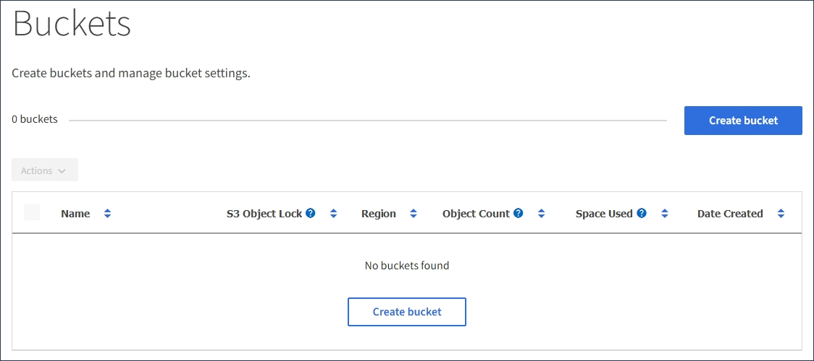
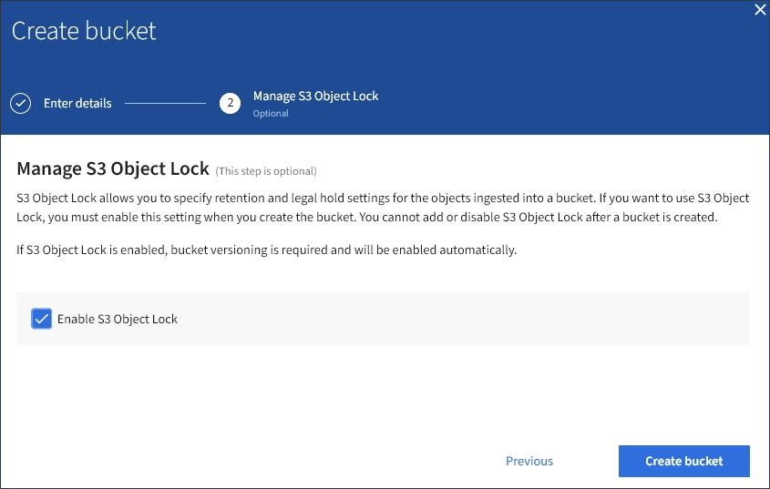

= Création d'un compartiment S3
:allow-uri-read: 
:icons: font
:imagesdir: ../media/

[role="lead"]
Vous pouvez utiliser le Gestionnaire des locataires pour créer des compartiments S3 pour les données d'objet. Lorsque vous créez un compartiment, vous devez spécifier son nom et sa région. Si le paramètre global de verrouillage d'objet S3 est activé pour le système StorageGRID, vous pouvez activer le verrouillage d'objet S3 pour le compartiment.

.Ce dont vous avez besoin
* Vous devez être connecté au Gestionnaire de locataires à l'aide d'un navigateur pris en charge.
* Vous devez appartenir à un groupe d'utilisateurs possédant l'autorisation gérer toutes les rubriques ou accès racine. Ces autorisations remplacent les paramètres d'autorisations des stratégies de groupes ou de compartiments.
* Si vous prévoyez de créer un compartiment avec le verrouillage d'objet S3, le paramètre verrouillage d'objet S3 global doit avoir été activé pour le système StorageGRID et vous devez avoir vérifié les exigences relatives aux compartiments et objets de verrouillage d'objet S3.
+
link:using-s3-object-lock.html["Utilisation du verrouillage d'objet S3"]

.Étapes
. Sélectionnez *STOCKAGE (S3)* > *seaux*.
+
La page rubriques s'affiche et répertorie les rubriques qui ont déjà été créées.

+

. Sélectionnez *Créer un compartiment*.
+
L'assistant Créer un compartiment s'affiche.

+
image::../media/bucket_create_compliance_disabled.png[Conformité de l'option Créer un compartiment désactivée]

+

NOTE: Si le paramètre global S3 Object Lock est activé, Create bucket inclut une deuxième étape de gestion du verrouillage d'objet S3 pour le compartiment.

. Entrer un nom unique pour le compartiment.
+

IMPORTANT: Vous ne pouvez pas modifier le nom d'un compartiment après sa création.

+
Les noms de compartiment doivent être conformes aux règles suivantes :

+
** Il doit être unique sur chaque système StorageGRID (et pas seulement au sein du compte du locataire).
** Doit être conforme DNS.
** Doit contenir au moins 3 caractères et pas plus de 63 caractères.
** Peut être une série d'une ou plusieurs étiquettes, avec des étiquettes adjacentes séparées par un point. Chaque étiquette doit commencer et se terminer par une lettre ou un chiffre en minuscules et ne peut utiliser que des lettres minuscules, des chiffres et des tirets.
** Ne doit pas ressembler à une adresse IP au format texte.
** Ne doit pas utiliser de périodes dans des demandes de type hébergement virtuel. Les périodes provoquera des problèmes avec la vérification du certificat générique du serveur.

+

NOTE: Consultez la documentation Amazon Web Services (AWS) pour en savoir plus.

. Sélectionnez la région de ce compartiment.
+
L'administrateur StorageGRID gère les régions disponibles. Ce compartiment peut affecter la règle de protection des données appliquée aux objets. Par défaut, tous les compartiments sont créés dans le `us-east-1` région.

+

IMPORTANT: Vous ne pouvez pas modifier la région après avoir créé le compartiment.

. Sélectionnez *Créer un compartiment* ou *Continuer*.
+
** Si le paramètre de verrouillage d'objet S3 global n'est pas activé, sélectionnez *Créer un compartiment*. Le godet est créé et ajouté au tableau sur la page godets.
** Si le paramètre global de verrouillage d'objet S3 est activé, sélectionnez *Continuer*. L'étape 2, gérer le verrouillage d'objet S3 s'affiche.
+

. Vous pouvez également cocher la case pour activer le verrouillage d'objet S3 pour ce compartiment.
+
Le verrouillage objet S3 doit être activé pour le compartiment avant qu'une application client S3 puisse spécifier des paramètres de conservation à une date et de conservation légale pour les objets ajoutés au compartiment.

+

IMPORTANT: Vous ne pouvez pas activer ou désactiver le verrouillage d'objet S3 après la création du compartiment.

+

NOTE: Si vous activez le verrouillage des objets S3 pour un compartiment, le contrôle de version des compartiments est automatiquement activé.

. Sélectionnez *Créer un compartiment*.
+
Le godet est créé et ajouté au tableau sur la page godets.

.Informations associées
link:../ilm/index.html["Gestion des objets avec ILM"]

link:understanding-tenant-management-api.html["Présentation de l'API de gestion des locataires"]

link:../s3/index.html["Utilisation de S3"]
