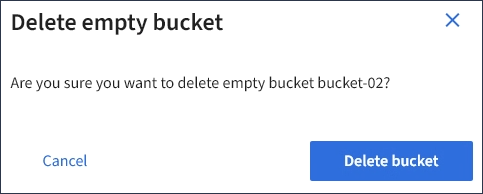

= Suppression d'un compartiment S3
:allow-uri-read: 
:icons: font
:imagesdir: ../media/

[role="lead"]
Vous pouvez utiliser le Gestionnaire de locataires pour supprimer un compartiment S3 vide.

.Ce dont vous avez besoin
* Vous devez être connecté au Gestionnaire de locataires à l'aide d'un navigateur pris en charge.
* Vous devez appartenir à un groupe d'utilisateurs possédant l'autorisation gérer toutes les rubriques ou accès racine. Ces autorisations remplacent les paramètres d'autorisations des stratégies de groupes ou de compartiments.

.Description de la tâche
Ces instructions expliquent comment supprimer un compartiment S3 à l'aide du Gestionnaire des locataires. Vous pouvez également supprimer des compartiments S3 à l'aide de l'API de gestion des locataires ou de l'API REST S3.

Si ce compartiment contient des objets ou des versions d'objet non actuelles, vous ne pouvez pas le supprimer. Pour plus d'informations sur la suppression des objets avec version S3, consultez les instructions de gestion des objets avec la gestion du cycle de vie des informations.

.Étapes
. Sélectionnez *STOCKAGE (S3)* > *seaux*.
+
La page compartiments s'affiche et affiche tous les compartiments S3 existants.

+
image::../media/buckets_table.png[Tableau des compartiments]

. Cochez la case du compartiment vide que vous souhaitez supprimer.
+
Le menu actions est activé.

. Dans le menu actions, sélectionnez *Supprimer un compartiment vide*.
+
image::../media/delete_bucket_button.png[Bouton Supprimer les rubriques]

+
Un message de confirmation s'affiche.

+

. Si vous êtes sûr de vouloir supprimer le compartiment, sélectionnez *Supprimer le compartiment*.
+
L'StorageGRID confirme que le compartiment est vide avant de le supprimer. Cette opération peut prendre quelques minutes.

+
Si le godet n'est pas vide, un message d'erreur s'affiche. Vous devez supprimer tous les objets avant de pouvoir supprimer le compartiment.

+
image::../media/delete_bucket_not_empty_message.png[Supprimer le message du compartiment non vide]

.Informations associées
link:../ilm/index.html["Gestion des objets avec ILM"]
