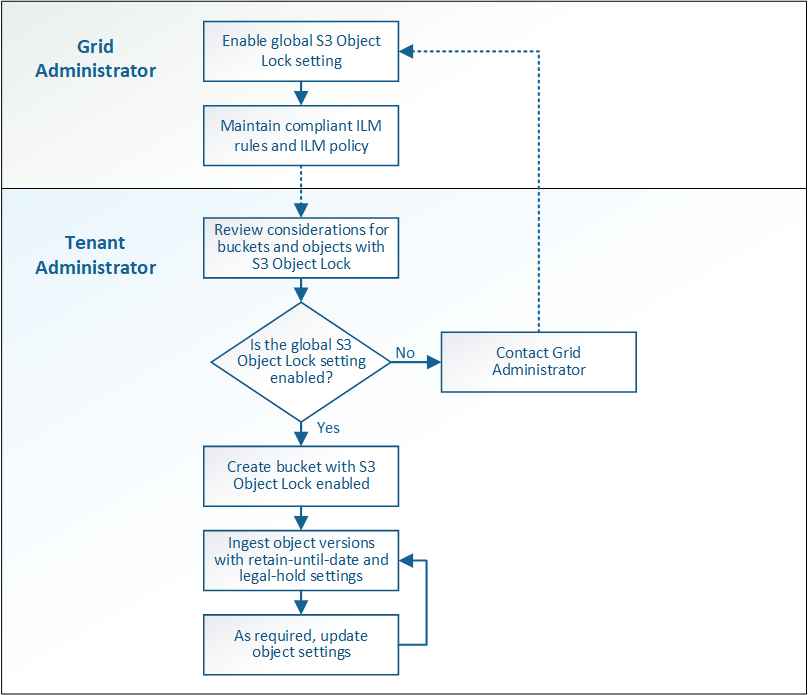

= Workflow de verrouillage d'objet S3
:allow-uri-read: 
:icons: font
:imagesdir: ../media/

[role="lead"]
Le schéma de workflow montre les étapes générales d'utilisation de la fonction de verrouillage d'objet S3 dans StorageGRID.

Avant de créer des compartiments avec le verrouillage d'objet S3 activé, l'administrateur de la grille doit activer le paramètre de verrouillage d'objet S3 global pour l'ensemble du système StorageGRID. L'administrateur du grid doit également s'assurer que la politique de gestion du cycle de vie de l'information est « conforme ». Elle doit répondre aux exigences des compartiments lorsque le verrouillage objet S3 est activé. Pour plus d'informations, contactez votre administrateur de la grille ou consultez les instructions relatives à la gestion des objets avec la gestion du cycle de vie des informations.

Une fois que le paramètre de verrouillage d'objet S3 global a été activé, vous pouvez créer des compartiments avec le verrouillage d'objet S3 activé. Vous pouvez ensuite utiliser l'application client S3 pour spécifier les paramètres de conservation pour chaque version d'objet.

.Informations associées
link:../ilm/index.html["Gestion des objets avec ILM"]
