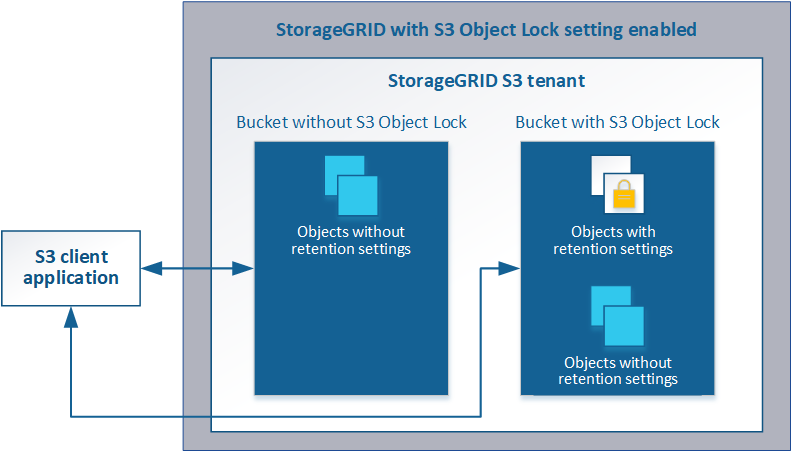

= Utilisation du verrouillage d'objet S3
:allow-uri-read: 
:icons: font
:imagesdir: ../media/

[role="lead"]
Vous pouvez utiliser la fonctionnalité de verrouillage d'objet S3 dans StorageGRID si vos objets doivent être conformes aux exigences réglementaires en matière de conservation.

== Qu'est-ce que le verrouillage objet S3 ?

La fonctionnalité de verrouillage objet StorageGRID S3 est une solution de protection des objets équivalente au verrouillage objet S3 dans Amazon simple Storage Service (Amazon S3).

Comme illustré dans la figure, lorsque le paramètre global de verrouillage d'objet S3 est activé pour un système StorageGRID, un compte de locataire S3 peut créer des compartiments avec ou sans verrouillage d'objet S3 activé. Si un compartiment est doté du verrouillage objet S3 activé, les applications client S3 peuvent éventuellement spécifier des paramètres de conservation pour toute version d'objet dans ce compartiment. Des paramètres de conservation doivent être spécifiés pour être protégés par le verrouillage d'objet S3.

La fonctionnalité de verrouillage d'objet StorageGRID S3 fournit un mode de conservation unique équivalent au mode de conformité Amazon S3. Par défaut, une version d'objet protégé ne peut être écrasée ou supprimée par aucun utilisateur. La fonction de verrouillage d'objet StorageGRID S3 ne prend pas en charge un mode de gouvernance et n'autorise pas les utilisateurs disposant d'autorisations spéciales à contourner les paramètres de rétention ou à supprimer des objets protégés.

Si un compartiment est doté de l'option de verrouillage des objets S3, l'application client S3 peut spécifier la ou les deux paramètres de conservation de niveau objet suivants lors de la création ou de la mise à jour d'un objet :

* *Conserver-jusqu'à-date* : si la date-à-jour d'une version d'objet est à l'avenir, l'objet peut être récupéré, mais ne peut pas être modifié ou supprimé. Si nécessaire, la date de conservation d'un objet peut être augmentée, mais cette date ne peut pas être réduite.
* *Mise en garde légale* : l'application d'une mise en garde légale à une version d'objet verrouille immédiatement cet objet. Par exemple, vous devrez peut-être mettre une obligation légale sur un objet lié à une enquête ou à un litige juridique. Une obligation légale n'a pas de date d'expiration, mais reste en place jusqu'à ce qu'elle soit explicitement supprimée. Les dispositions légales sont indépendantes de la date de conservation.

Pour plus d'informations sur ces paramètres, consultez la section « utilisation du verrouillage d'objet S3 » dans link:../s3/s3-rest-api-supported-operations-and-limitations.html["Opérations et limites prises en charge par l'API REST S3"].

== Gestion des compartiments conformes existants

La fonction de verrouillage d'objet S3 remplace la fonction de conformité disponible dans les versions StorageGRID précédentes. Si vous avez créé des compartiments conformes à l'aide d'une version précédente de StorageGRID, vous pouvez continuer à gérer les paramètres de ces compartiments. Toutefois, vous ne pouvez plus créer de compartiments conformes. Pour en savoir plus, consultez l'article de la base de connaissance NetApp.

https://["Base de connaissances NetApp : comment gérer des compartiments conformes aux ancienne génération dans StorageGRID 11.5"]
