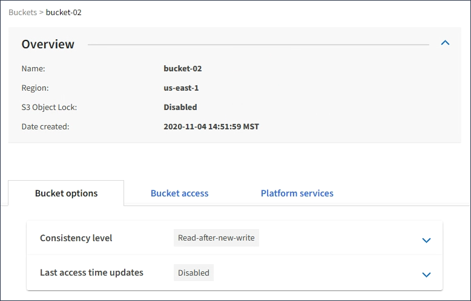

= Affichage des détails du compartiment S3
:allow-uri-read: 
:icons: font
:imagesdir: ../media/

[role="lead"]
Vous pouvez afficher la liste des compartiments et des paramètres de compartiment dans votre compte de locataire.

.Ce dont vous avez besoin
* Vous devez être connecté au Gestionnaire de locataires à l'aide d'un navigateur pris en charge.

.Étapes
. Sélectionnez *STOCKAGE (S3)* > *seaux*.
+
La page rubriques s'affiche et répertorie toutes les rubriques du compte locataire.

+
image::../media/buckets_table.png[Tableau des compartiments]

. Passer en revue les informations relatives à chaque godet.
+
Si nécessaire, vous pouvez trier les informations par colonne, ou vous pouvez avancer et revenir à la liste.

+
** Nom : nom unique du compartiment, qui ne peut pas être modifié.
** Verrouillage de l'objet S3 : indique si le verrouillage de l'objet S3 est activé pour ce compartiment.
+
Cette colonne n'est pas affichée si le paramètre de verrouillage d'objet S3 global est désactivé. Cette colonne affiche également des informations pour tous les compartiments conformes existants.

** Région : région du godet, qui ne peut pas être modifiée.
** Nombre d'objets : nombre d'objets dans ce compartiment.
** Espace utilisé : taille logique de tous les objets de ce compartiment. La taille logique n'inclut pas l'espace réel requis pour les copies répliquées ou avec code d'effacement, ni pour les métadonnées d'objet.
** Date de création : date et heure de création du compartiment.

+

IMPORTANT: Les valeurs nombre d'objets et espace utilisé affichées sont des estimations. Ces estimations sont affectées par le moment de l'ingestion, la connectivité réseau et l'état des nœuds.

. Pour afficher et gérer les paramètres d'un compartiment, sélectionnez le nom du compartiment.
+
La page des détails du compartiment s'affiche.

+
Cette page vous permet d'afficher et de modifier les paramètres des options de compartiment, de l'accès au compartiment et des services de plateforme.

+
Reportez-vous aux instructions de configuration de chaque paramètre ou service de plate-forme.

+

.Informations associées
link:changing-consistency-level.html["Modification du niveau de cohérence"]

link:enabling-or-disabling-last-access-time-updates.html["Activation ou désactivation des mises à jour de l'heure du dernier accès"]

link:configuring-cross-origin-resource-sharing-cors.html["Configuration du partage de ressources inter-origine (CORS)"]

link:configuring-cloudmirror-replication.html["Configuration de la réplication CloudMirror"]

link:configuring-event-notifications.html["Configuration des notifications d'événements"]

link:configuring-search-integration-service.html["Configuration du service d'intégration de la recherche"]
