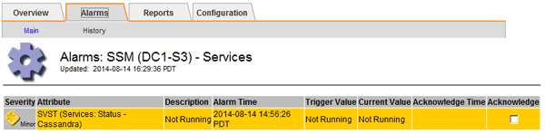

= Résolution des problèmes de métadonnées
:allow-uri-read: 
:icons: font
:imagesdir: ../media/

[role="lead"]
Vous pouvez effectuer plusieurs tâches pour déterminer la source des problèmes de métadonnées.

== Dépannage de l'alerte de stockage de métadonnées faible

Si l'alerte *stockage de métadonnées faible* est déclenchée, vous devez ajouter de nouveaux nœuds de stockage.

.Ce dont vous avez besoin
* Vous devez être connecté à Grid Manager à l'aide d'un navigateur pris en charge.

.Description de la tâche
StorageGRID réserve un certain espace sur le volume 0 de chaque nœud de stockage pour les métadonnées de l'objet. Cet espace est appelé espace réservé réel, et il est divisé en l'espace autorisé pour les métadonnées d'objet (espace de métadonnées autorisé) et l'espace requis pour les opérations essentielles de base de données, telles que la compaction et la réparation. L'espace de métadonnées autorisé régit la capacité globale des objets.

image::../media/metadata_allowed_space_volume_0.png[Espace autorisé pour les métadonnées Volume 0]

Si la quantité d'espace autorisée pour les métadonnées est supérieure à 100 %, les opérations de la base de données ne peuvent pas fonctionner efficacement et des erreurs surviennent.

StorageGRID utilise la métrique Prometheus suivante pour mesurer la totalité de l'espace de métadonnées autorisé :

[listing]
----
storagegrid_storage_utilization_metadata_bytes/storagegrid_storage_utilization_metadata_allowed_bytes
----
Lorsque cette expression Prometheus atteint certains seuils, l'alerte *stockage de métadonnées faible* est déclenchée.

* *Mineure* : les métadonnées d'objet utilisent au moins 70 % de l'espace autorisé pour les métadonnées. Vous devez ajouter des nœuds de stockage dès que possible.
* *Majeur* : les métadonnées d'objet utilisent au moins 90 % de l'espace autorisé pour les métadonnées. Vous devez immédiatement ajouter de nouveaux nœuds de stockage.
+

IMPORTANT: Lorsque les métadonnées de l'objet utilisent au moins 90 % de l'espace de métadonnées autorisé, un avertissement s'affiche dans le Tableau de bord. Si cet avertissement s'affiche, vous devez immédiatement ajouter de nouveaux nœuds de stockage. Vous ne devez jamais autoriser les métadonnées objet à utiliser plus de 100 % de l'espace autorisé.

* *Critique* : les métadonnées d'objet utilisent au moins 100 % de l'espace de métadonnées autorisé et commencent à consommer l'espace requis pour les opérations essentielles de la base de données. Vous devez arrêter l'ingestion des nouveaux objets et vous devez immédiatement ajouter de nouveaux nœuds de stockage.

Dans l'exemple suivant, les métadonnées d'objet utilisent plus de 100 % de l'espace autorisé pour les métadonnées. Cette situation est critique, ce qui entraîne un fonctionnement inefficace de la base de données et des erreurs.

image::../media/cdlp_dashboard_alarm.gif[Alarme du tableau de bord des métadonnées]

IMPORTANT: Si la taille du volume 0 est inférieure à celle de l'option de stockage de l'espace réservé aux métadonnées (par exemple, dans un environnement non productif), le calcul de l'alerte *stockage de métadonnées faible* peut être inexact.

.Étapes
. Sélectionnez *alertes* > *actuel*.
. Dans le tableau des alertes, développez le groupe d'alertes *stockage de métadonnées faible*, si nécessaire, et sélectionnez l'alerte spécifique que vous souhaitez afficher.
. Vérifiez les détails dans la boîte de dialogue d'alerte.
. Si une alerte majeure ou critique *stockage de métadonnées faible* a été déclenchée, effectuez immédiatement une extension pour ajouter des nœuds de stockage.
+

NOTE: Dans la mesure où StorageGRID conserve des copies complètes de toutes les métadonnées d'objet sur chaque site, la capacité de métadonnées de l'ensemble de la grille est limitée par la capacité des métadonnées du site le plus petit. Si vous devez ajouter de la capacité des métadonnées à un site, vous devez également étendre tous les autres sites jusqu'au même nombre de nœuds de stockage.

+
Une fois l'extension effectuée, StorageGRID redistribue les métadonnées de l'objet existantes vers les nouveaux nœuds, qui augmentent la capacité globale des métadonnées de la grille. Aucune action de l'utilisateur n'est requise. L'alerte *stockage de métadonnées faible* est effacée.

.Informations associées
link:../monitor/monitoring-object-metadata-capacity-for-each-storage-node.html["Surveillance de la capacité des métadonnées d'objet pour chaque nœud de stockage"]

link:../expand/index.html["Développez votre grille"]

== Dépannage de l'alarme Services : état - Cassandra (SVST)

L'alarme Services : Status - Cassandra (SVST) indique que vous devrez peut-être reconstruire la base de données Cassandra pour un nœud de stockage. Cassandra est utilisée comme magasin de métadonnées pour StorageGRID.

.Ce dont vous avez besoin
* Vous devez être connecté à Grid Manager à l'aide d'un navigateur pris en charge.
* Vous devez disposer d'autorisations d'accès spécifiques.
* Vous devez avoir le `Passwords.txt` fichier.

.Description de la tâche
Si Cassandra est arrêtée pendant plus de 15 jours (par exemple, le nœud de stockage est mis hors tension), Cassandra ne démarre pas lorsque le nœud est remis en ligne. Vous devez reconstruire la base de données Cassandra pour le service DDS affecté.

Vous pouvez utiliser la page Diagnostics pour obtenir des informations supplémentaires sur l'état actuel de votre grille.

link:../monitor/running-diagnostics.html["Exécution des diagnostics"]

IMPORTANT: Si au moins deux des services de base de données Cassandra sont en panne pendant plus de 15 jours, contactez le support technique et ne suivez pas les étapes ci-dessous.

.Étapes
. Sélectionnez *support* > *Outils* > *topologie de grille*.
. Sélectionnez *_site > nœud de stockage_* > *SSM* > *Services* > *alarmes* > *main* pour afficher les alarmes.
+
Cet exemple montre que l'alarme SVST a été déclenchée.

+

+
La page principale des services SSM indique également que Cassandra n'est pas en cours d'exécution.

+
image::../media/cassandra_not_running.gif[Présentation : page SSM : services]

[[restart_Cassandra_from_the_Storage_Node]]
. Essayez de redémarrer Cassandra depuis le nœud de stockage :
+
.. Connectez-vous au nœud grid :
+
... Saisissez la commande suivante : `ssh admin@grid_node_IP`
... Entrez le mot de passe indiqué dans le `Passwords.txt` fichier.
... Entrez la commande suivante pour passer à la racine : `su -`
... Entrez le mot de passe indiqué dans le `Passwords.txt` fichier. Lorsque vous êtes connecté en tant que root, l'invite passe de `$` à `#`.

.. Entrez : `/etc/init.d/cassandra status`
.. Si Cassandra n'est pas en cours d'exécution, redémarrez-le : `/etc/init.d/cassandra restart`

. Si Cassandra ne redémarre pas, déterminez la durée de sa panne. Si Cassandra a été indisponible pendant plus de 15 jours, il vous faut reconstruire la base de données Cassandra.
+

IMPORTANT: Si deux services de base de données Cassandra ou plus sont en panne, contactez le support technique et ne procédez pas aux étapes ci-dessous.

+
Vous pouvez déterminer la durée d'interruption de Cassandra en la transcritant ou en consultant le fichier servermanager.log.

. Pour le tableau Cassandra :
+
.. Sélectionnez *support* > *Outils* > *topologie de grille*. Sélectionnez ensuite *_site > Storage Node_* > *SSM* > *Services* > *Rapports* > *diagrammes*.
.. Sélectionnez *attribut* > *Service : état - Cassandra*.
.. Pour *Date de début*, entrez une date qui est au moins 16 jours avant la date du jour. Pour *Date de fin*, saisissez la date actuelle.
.. Cliquez sur *mettre à jour*.
.. Si Cassandra est indisponible durant plus de 15 jours, reconstruisez la base de données Cassandra.

L'exemple de tableau suivant montre que Cassandra a été indisponible pendant au moins 17 jours.

image::../media/cassandra_not_running_chart.png[Présentation : page SSM : services]

. Pour consulter le fichier servermanager.log sur le nœud de stockage :
+
.. Connectez-vous au nœud grid :
+
... Saisissez la commande suivante : `ssh admin@grid_node_IP`
... Entrez le mot de passe indiqué dans le `Passwords.txt` fichier.
... Entrez la commande suivante pour passer à la racine : `su -`
... Entrez le mot de passe indiqué dans le `Passwords.txt` fichier. Lorsque vous êtes connecté en tant que root, l'invite passe de `$` à `#`.

.. Entrez : `cat /var/local/log/servermanager.log`
+
Le contenu du fichier servermanager.log s'affiche.

+
Si Cassandra a été indisponible pendant plus de 15 jours, le message suivant s'affiche dans le fichier servermanager.log :

+
[listing]
----
"2014-08-14 21:01:35 +0000 | cassandra | cassandra not
started because it has been offline for longer than
its 15 day grace period - rebuild cassandra
----
.. Assurez-vous que l'horodatage de ce message correspond à l'heure à laquelle vous avez tenté de redémarrer Cassandra, comme indiqué à l'étape <<restart_Cassandra_from_the_Storage_Node,Redémarrez Cassandra à partir du nœud de stockage>>.
+
Il peut y avoir plusieurs entrées pour Cassandra ; vous devez trouver l'entrée la plus récente.

.. Si Cassandra a été indisponible pendant plus de 15 jours, il vous faut reconstruire la base de données Cassandra.
+
Pour obtenir des instructions, reportez-vous à la section « récupération à partir d'un seul nœud de stockage en panne pendant plus de 15 jours » dans les instructions de restauration et de maintenance.

.. Contactez le support technique si les alarmes ne sont pas claires après la reconstruction de Cassandra.

.Informations associées
link:../maintain/index.html["Maintenance et récupération"]

== Dépannage des erreurs de mémoire Cassandra (alarme SMTT)

Une alarme Total Events (SMTT) est déclenchée lorsque la base de données Cassandra a une erreur de mémoire insuffisante. Si cette erreur se produit, contactez le support technique pour résoudre le problème.

.Description de la tâche
Si une erreur de mémoire insuffisante se produit pour la base de données Cassandra, un vidage de mémoire est créé, une alarme Total Events (SMTT) est déclenchée et le nombre d'erreurs de mémoire de Cassandra est incrémenté d'un.

.Étapes
. Pour afficher l'événement, sélectionnez *noeuds* > *_grid node_* > *Events*.
. Vérifiez que le nombre d'erreurs de mémoire du tas Cassandra est égal ou supérieur à 1.
+
Vous pouvez utiliser la page Diagnostics pour obtenir des informations supplémentaires sur l'état actuel de votre grille.

+
link:../monitor/running-diagnostics.html["Exécution des diagnostics"]

. Accédez à `/var/local/core/`, comprimer le `Cassandra.hprof` dossier et envoyez-le au support technique.
. Faire une sauvegarde du `Cassandra.hprof` et supprimez-le de la `/var/local/core/ directory`.
+
Ce fichier peut contenir jusqu'à 24 Go. Vous devez donc le supprimer pour libérer de l'espace.

. Une fois le problème résolu, cliquez sur *Réinitialiser le nombre d'événements*.
+

NOTE: Pour réinitialiser le nombre d'événements, vous devez disposer de l'autorisation Configuration de la page de topologie de la grille.

.Informations associées
link:../monitor/resetting-event-counts.html["Réinitialisation du nombre d'événements"]
