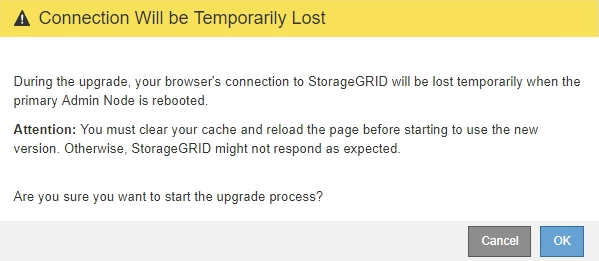

= Démarrage de la mise à niveau
:allow-uri-read: 
:icons: font
:imagesdir: ../media/

[role="lead"]
Lorsque vous êtes prêt à effectuer la mise à niveau, sélectionnez le fichier téléchargé et saisissez le mot de passe de provisionnement. En tant qu'option, vous pouvez exécuter les contrôles préalables à la mise à niveau avant d'effectuer la véritable mise à niveau.

.Ce dont vous avez besoin
Vous avez passé en revue toutes les considérations et réalisé toutes les étapes de la section link:upgrade-planning-and-preparation.html["Planification et préparation de la mise à niveau"].

.Étapes
. Connectez-vous au Grid Manager à l'aide d'un navigateur pris en charge.
. Sélectionnez *Maintenance* *système* *mise à jour du logiciel*.
+
La page mise à jour du logiciel s'affiche.

. Sélectionnez *mise à niveau StorageGRID*.
+
La page mise à niveau de StorageGRID s'affiche et indique la date et l'heure de la dernière mise à niveau effectuée, sauf si le nœud d'administration principal a été redémarré ou si l'API de gestion a redémarré depuis la mise à niveau.

. Sélectionner `.upgrade` fichier que vous avez téléchargé.
+
.. Sélectionnez *Parcourir*.
.. Localisez et sélectionnez le fichier : `NetApp_StorageGRID_version_Software_uniqueID.upgrade`
.. Sélectionnez *Ouvrir*.
+
Le fichier est téléchargé et validé. Une fois le processus de validation terminé, une coche verte s'affiche en regard du nom du fichier de mise à niveau.

. Entrez la phrase de passe de provisionnement dans la zone de texte.
+
Les boutons *Exécuter les contrôles préalables* et *Démarrer la mise à niveau* deviennent activés.

+
image::../media/storagegrid_upgrade_buttons_enabled.png[Boutons de mise à niveau StorageGRID activés]

. Si vous souhaitez valider l'état de votre système avant de démarrer la mise à niveau réelle, sélectionnez *Exécuter les contrôles préalables*. Ensuite, résolvez toutes les erreurs de vérification préalable qui sont signalées.
+

IMPORTANT: Si vous avez ouvert des ports de pare-feu personnalisés, vous êtes averti lors de la validation de contrôle préalable. Vous devez contacter le support technique avant de procéder à la mise à niveau.

+

NOTE: Les mêmes contrôles préalables sont effectués lorsque vous sélectionnez *Démarrer la mise à niveau*. La sélection de *Exécuter les contrôles préalables* vous permet de détecter et de résoudre les problèmes avant de démarrer la mise à niveau.

. Lorsque vous êtes prêt à effectuer la mise à niveau, sélectionnez *Démarrer la mise à niveau*.
+
Un avertissement apparaît pour vous rappeler que la connexion de votre navigateur sera perdue lors du redémarrage du nœud d'administration principal. Lorsque le nœud d'administration principal est à nouveau disponible, vous devez effacer le cache de votre navigateur Web et recharger la page mise à niveau du logiciel.

+

. Sélectionnez *OK* pour accuser réception de l'avertissement et lancer le processus de mise à niveau.
+
Au démarrage de la mise à niveau :

+
.. Les contrôles préalables à la mise à niveau sont exécutés.
+

NOTE: Si des erreurs de contrôle préalable sont signalées, résolvez-les et sélectionnez à nouveau *Démarrer la mise à niveau*.

.. Le nœud d'administration principal est mis à niveau, ce qui inclut l'arrêt des services, la mise à niveau du logiciel et le redémarrage des services. Vous ne pourrez pas accéder au Grid Manager pendant la mise à niveau du nœud d'administration principal. Les journaux d'audit seront également indisponibles. Cette mise à niveau peut prendre jusqu'à 30 minutes.
+

NOTE: Pendant la mise à niveau du nœud d'administration principal, plusieurs copies des messages d'erreur suivants s'affichent, que vous pouvez ignorer.

+
image::../media/software_upgrade_problem_connecting_error.png[Problème de mise à niveau du logiciel erreur de connexion]

+
image::../media/software_upgrade_503_error.png[Erreur de mise à niveau du logiciel 503]

+
image::../media/software_upgrade_400_error.png[Erreur de mise à niveau du logiciel 400]

. Une fois le nœud d'administration principal mis à niveau, effacez le cache de votre navigateur Web, reconnectez-vous et rechargez la page mise à niveau logicielle.
+
Pour obtenir des instructions, reportez-vous à la documentation de votre navigateur Web.

+

IMPORTANT: Vous devez effacer le cache du navigateur Web pour supprimer les ressources obsolètes utilisées par la version précédente du logiciel.

.Informations associées
link:upgrade-planning-and-preparation.html["Planification et préparation de la mise à niveau"]
