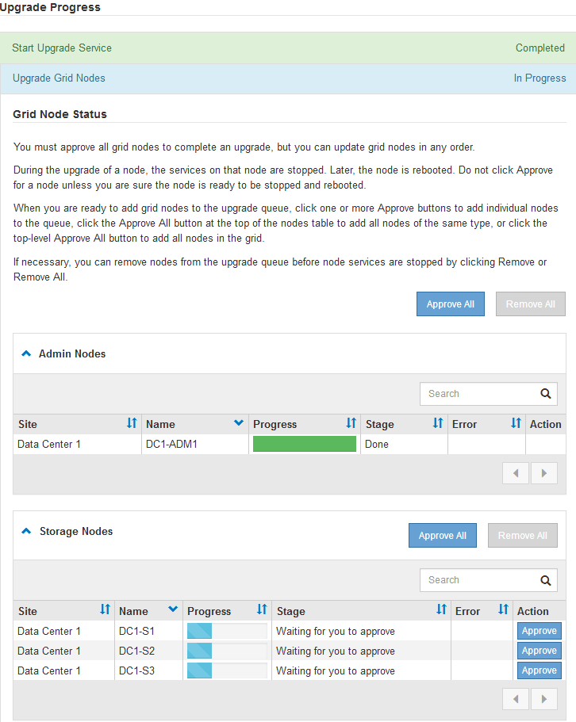

= Mise à niveau des nœuds du grid et fin de la mise à niveau
:allow-uri-read: 
:icons: font
:imagesdir: ../media/

[role="lead"]
Une fois le nœud d'administration principal mis à niveau, vous devez mettre à niveau tous les autres nœuds de la grille de votre système StorageGRID. Vous pouvez personnaliser la séquence de mise à niveau en sélectionnant pour mettre à niveau des nœuds de grille individuels, des groupes de nœuds de grille ou tous les nœuds de la grille.

.Étapes
. Consultez la section progression de la mise à niveau sur la page mise à niveau logicielle, qui fournit des informations sur chaque tâche majeure de mise à niveau.
+
.. *Start Upgrade Service* est la première tâche de mise à niveau. Au cours de cette tâche, le fichier logiciel est distribué aux nœuds de la grille et le service de mise à niveau est démarré.
.. Lorsque la tâche *Start Upgrade Service* est terminée, la tâche *Upgrade Grid Nodes* démarre.
.. Pendant que la tâche *Upgrade Grid Nodes* est en cours, la table Grid Node Status (État du nœud de la grille) s'affiche et affiche l'étape de mise à niveau de chaque nœud de la grille de votre système.

. Une fois que les nœuds de la grille apparaissent dans le tableau État du nœud de la grille, mais avant d'approuver les nœuds de la grille, téléchargez une nouvelle copie du progiciel de récupération.
+

IMPORTANT: Vous devez télécharger une nouvelle copie du fichier du progiciel de restauration après avoir mis à niveau la version du logiciel sur le nœud d'administration principal. Le fichier du progiciel de récupération vous permet de restaurer le système en cas de défaillance.

. Vérifiez les informations dans le tableau État du nœud de la grille. Les nœuds de la grille sont organisés en sections par type : nœuds d'administration, nœuds de passerelle d'API, nœuds de stockage et nœuds d'archivage.
+

+
Un nœud de grille peut se trouver dans l'une des étapes suivantes lorsque cette page s'affiche en premier :

+
** Effectué (nœud d'administration principal uniquement)
** Préparation de la mise à niveau
** Téléchargement de logiciel en file d'attente
** Téléchargement
** En attente de votre approbation

. Approuver les nœuds de grille que vous êtes prêt à ajouter à la file d'attente de mise à niveau. Les nœuds approuvés du même type sont mis à niveau un par un.
+
Si l'ordre de mise à niveau des nœuds est important, approuvez les nœuds ou les groupes de nœuds un par un et attendez que la mise à niveau soit terminée sur chaque nœud avant d'approuver le prochain nœud ou groupe de nœuds.

+

IMPORTANT: Lorsque la mise à niveau démarre sur un nœud de la grille, les services de ce nœud sont arrêtés. Plus tard, le nœud de la grille est redémarré. Ces opérations peuvent entraîner des interruptions de service pour les clients qui communiquent avec le nœud. N'approuvez pas la mise à niveau d'un nœud sauf si vous êtes sûr que ce nœud est prêt à être arrêté et redémarré.

+
** Sélectionnez un ou plusieurs boutons *Approve* pour ajouter un ou plusieurs nœuds individuels à la file d'attente de mise à niveau.
** Sélectionnez le bouton *approuver tout* dans chaque section pour ajouter tous les nœuds du même type à la file d'attente de mise à niveau.
** Sélectionnez le bouton de niveau supérieur *approuver tout* pour ajouter tous les nœuds de la grille à la file d'attente de mise à niveau.

. Si vous devez supprimer un noeud ou tous les noeuds de la file d'attente de mise à niveau, sélectionnez *Supprimer* ou *tout supprimer*.
+
Comme indiqué dans l'exemple, lorsque la scène atteint *arrêter services*, le bouton *Supprimer* est masqué et vous ne pouvez plus supprimer le noeud.

+
image::../media/software_upgrade_two_nodes_queued.gif[Capture d'écran montrant que la scène arrête les services]

. Attendez que chaque nœud procède aux étapes de mise à niveau, qui incluent la mise en file d'attente, l'arrêt des services, l'arrêt du conteneur, le nettoyage des images Docker, la mise à niveau des packages du système d'exploitation de base, le redémarrage et le démarrage des services.
+

NOTE: Lorsqu'un nœud d'appliance atteint l'étape mise à niveau des packages du système d'exploitation de base, le logiciel StorageGRID Appliance installer sur l'appliance est mis à jour. Ce processus automatisé garantit que la version du programme d'installation de l'appliance StorageGRID reste synchronisée avec la version du logiciel StorageGRID.

+
Lorsque tous les nœuds de la grille ont été mis à niveau, la tâche *mettre à niveau les nœuds de la grille* s'affiche comme étant terminée. Les autres tâches de mise à niveau s'effectuent automatiquement et en arrière-plan.

. Dès que la tâche *Activer les fonctionnalités* est terminée (ce qui se produit rapidement), vous pouvez commencer à utiliser les nouvelles fonctionnalités de la version mise à niveau de StorageGRID.
+
Par exemple, si vous effectuez une mise à niveau vers StorageGRID 11.5, vous pouvez maintenant activer le verrouillage d'objet S3, configurer un serveur de gestion de clés ou augmenter le paramètre espace réservé aux métadonnées.

+
link:increasing-metadata-reserved-space-setting.html["Augmentation du paramètre Metadata Reserved Space"]

. Surveillez périodiquement la progression de la tâche *Upgrade Database*.
+
Au cours de cette tâche, la base de données Cassandra est mise à niveau sur chaque nœud de stockage.

+

NOTE: La tâche *Upgrade Database* peut prendre plusieurs jours. Lorsque cette tâche d'arrière-plan s'exécute, vous pouvez appliquer des correctifs ou récupérer des nœuds. Cependant, vous devez attendre que la tâche *étapes de mise à niveau finales* se termine avant d'effectuer une procédure d'extension ou de mise hors service.

+
Vous pouvez consulter le graphique pour contrôler la progression de chaque nœud de stockage.

+
image::../media/software_upgrade_upgrade_database.png[Base de données de mise à niveau logicielle]

. Une fois la tâche *Upgrade Database* terminée, attendez quelques minutes pour que la tâche *final Upgrade Steps* se termine.
+
image::../media/software_upgrade_final_upgrade_steps.png[Dernières étapes de mise à niveau]

+
Une fois la tâche d'étape de mise à niveau finale terminée, la mise à niveau est effectuée.

. Vérifiez que la mise à niveau a bien été effectuée.
+
.. Connectez-vous au Grid Manager à l'aide d'un navigateur pris en charge.
.. Sélectionnez *aide* > *à propos*.
.. Vérifiez que la version affichée est bien ce à quoi vous attendre.
.. Sélectionnez *Maintenance* > *système* > *mise à jour du logiciel*. Sélectionnez ensuite *mise à niveau StorageGRID*.
.. Vérifiez que la bannière verte indique que la mise à niveau du logiciel a été effectuée à la date et à l'heure prévues.
+
image::../media/software_upgrade_done.png[Mise à niveau logicielle effectuée]

. Vérifiez que les opérations de la grille sont à nouveau normales :
+
.. Vérifiez que les services fonctionnent normalement et qu'il n'y a pas d'alerte inattendue.
.. Vérifiez que les connexions client au système StorageGRID fonctionnent comme prévu.

. Consultez la page Downloads NetApp pour StorageGRID et vérifiez si les correctifs sont disponibles pour la version StorageGRID que vous venez d'installer.
+
https://mysupport.netapp.com/site/products/all/details/storagegrid/downloads-tab["Téléchargement NetApp : StorageGRID"^]

+
Dans le numéro de version de StorageGRID 11.5._x.y_ :

+
** La version majeure a une valeur _x_ de 0 (11.5.0).
** Une version mineure, si disponible, a une valeur _x_ autre que 0 (par exemple, 11.5.1).
** Un correctif, si disponible, a une valeur _y_ (par exemple, 11.5.0.1).

. Le cas échéant, téléchargez et appliquez le dernier correctif pour votre version de StorageGRID.
+
Pour plus d'informations sur l'application des correctifs, reportez-vous aux instructions de récupération et de maintenance.

.Informations associées
link:downloading-recovery-package.html["Téléchargement du progiciel de restauration"]

link:../maintain/index.html["Maintenance et récupération"]
